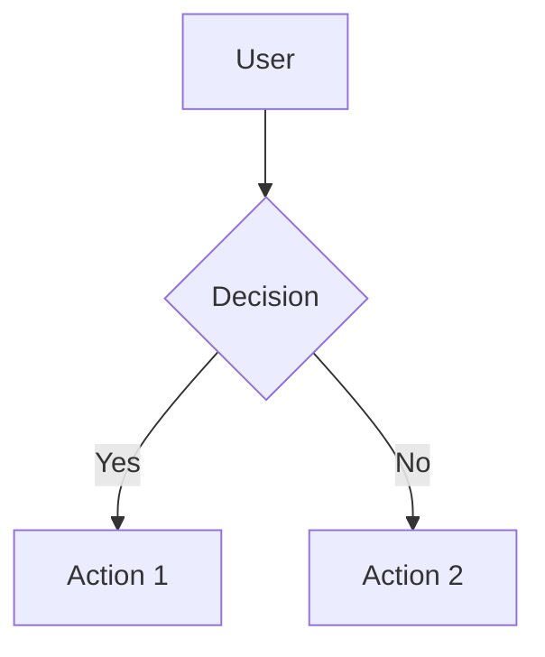
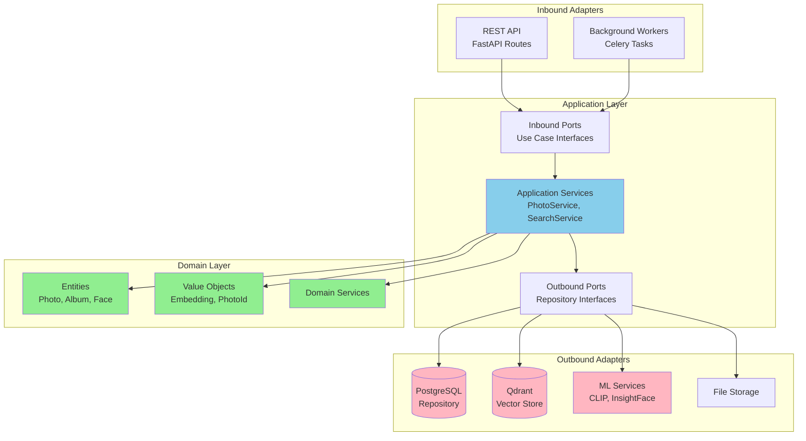
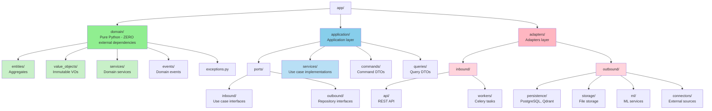
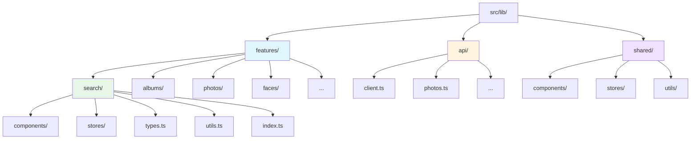
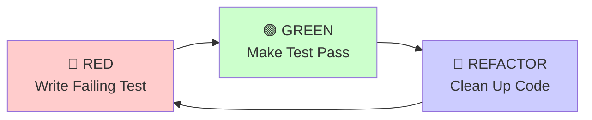
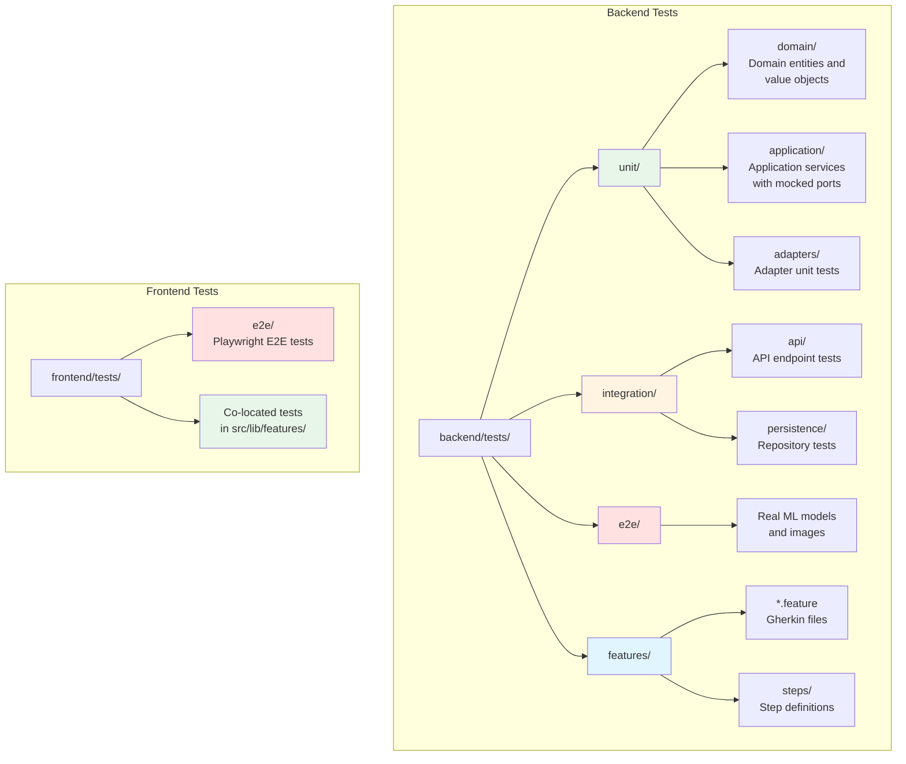
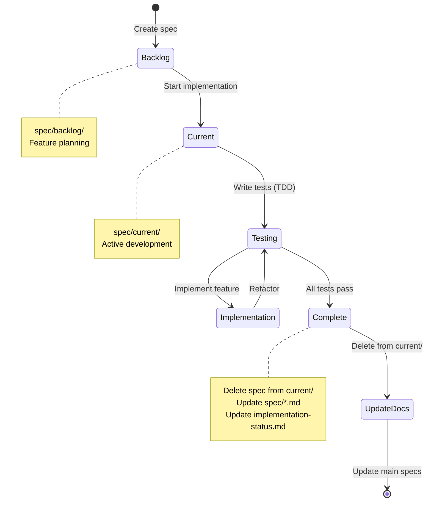
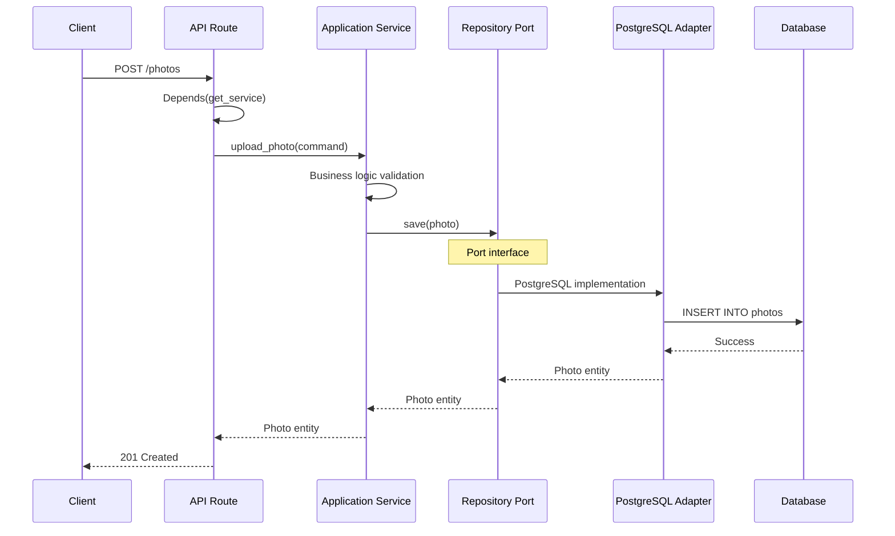

# Photo Explorer - Development Guidelines

This document contains coding standards, architecture patterns, and workflows for developing the Photo Explorer application.

## Environment

**You are in a NixOS environment**. When creating scripts or running commands:
- For general scripts: Use `#!/usr/bin/env bash`
- For scripts with custom dependencies: Use `#!/usr/bin/env nix-shell` with directives like `#!nix-shell -i bash -p curl jq`
- Always remind sub-agents (Task, Explore, python-pro, debugger, ai-engineer, etc.) that they are in NixOS with nix-shell available

## Diagrams

**ALWAYS use Mermaid for diagrams**. All architecture diagrams, sequence diagrams, flowcharts, and state diagrams MUST be created using Mermaid syntax.

**Why Mermaid?**
- Version-controllable (text-based, not binary images)
- Renders directly in GitHub, GitLab, and most markdown viewers
- Easy to update and maintain
- Consistent styling

**When to use Mermaid**:
- Architecture diagrams (component relationships, layers)
- Sequence diagrams (API flows, service interactions)
- Flowcharts (workflows, decision trees)
- State diagrams (entity lifecycles)
- ER diagrams (database relationships)

**Do NOT use Mermaid for**:
- Terminal output (use code blocks)
- Code examples (use syntax-highlighted code blocks)
- Configuration files (use code blocks)

**Example**:


## Architecture

### Backend: Hexagonal Architecture + Domain-Driven Design

The backend follows **strict hexagonal architecture** (ports & adapters) with DDD principles.

#### Hexagonal Architecture Diagram



#### Layer Structure


#### Critical Rules

**1. Dependency Rule**: Dependencies ALWAYS point inward
   - Domain layer: NO imports from application, adapters, or infrastructure
   - Application layer: Can import domain, but NOT adapters
   - Adapters: Can import both domain and application

**2. Domain Purity**
   - Domain entities use ONLY Python stdlib and domain imports
   - NO SQLAlchemy, NO Pydantic, NO FastAPI in domain layer
   - Rich domain models with behavior, not anemic data bags

**3. Three Model Types**
   - **Domain Entities**: Pure Python dataclasses in `domain/entities/`
   - **API Schemas**: Pydantic models in `adapters/inbound/api/schemas/`
   - **Database Models**: SQLAlchemy models in `adapters/outbound/persistence/postgres/models.py`
   - Use **mappers** to convert between layers

**4. Ports Define Contracts**
   - Ports are ABC interfaces that define WHAT is needed, not HOW
   - Application layer depends on port interfaces
   - Adapters implement the ports

### Frontend: Feature-Based Architecture


#### Feature Module Requirements

1. **Co-located Tests**: Tests MUST be next to the code they test
   - `SearchBar.svelte` � `SearchBar.test.ts` in same directory
   - `search.ts` store � `search.test.ts` in same directory

2. **Public Exports**: Each feature has `index.ts` that exports public API

3. **Type Safety**: All TypeScript interfaces in `types.ts`

4. **Store Pattern**: **MUST use Svelte 5 runes** (see Svelte 5 Patterns section below)

### Svelte 5 Patterns (MANDATORY)

**THIS PROJECT USES SVELTE 5 EXCLUSIVELY**. All code MUST follow Svelte 5 patterns. Svelte 4 patterns are NOT allowed.

#### 1. Reactive State: Use $state() Rune

```svelte
<script lang="ts">
  // ✅ CORRECT - Svelte 5
  let count = $state(0);
  let user = $state<User | null>(null);
  let items = $state<Item[]>([]);

  // ❌ WRONG - Svelte 4 (DO NOT USE)
  let count = 0;  // Not reactive
  import { writable } from 'svelte/store';  // Don't use stores
</script>
```

#### 2. Derived State: Use $derived() Rune

```svelte
<script lang="ts">
  let count = $state(0);

  // ✅ CORRECT - Svelte 5
  const doubled = $derived(count * 2);
  const isEven = $derived(count % 2 === 0);

  // For complex derivations
  const expensive = $derived.by(() => {
    return items.filter(i => i.active).map(i => i.value);
  });

  // ❌ WRONG - Svelte 4 (DO NOT USE)
  import { derived } from 'svelte/store';
  $: doubled = count * 2;  // Don't use reactive statements
</script>
```

#### 3. Side Effects: Use $effect() Rune

```svelte
<script lang="ts">
  let count = $state(0);

  // ✅ CORRECT - Svelte 5
  $effect(() => {
    console.log(`Count changed to ${count}`);
    // Cleanup function (optional)
    return () => {
      console.log('Cleanup');
    };
  });

  // ❌ WRONG - Svelte 4 (DO NOT USE)
  import { onMount } from 'svelte';
  $: console.log(count);  // Don't use reactive statements
</script>
```

#### 4. Props: Use $props() Rune

```svelte
<script lang="ts">
  interface Props {
    title: string;
    count?: number;
    onSubmit?: (value: string) => void;
    children?: Snippet;
  }

  // ✅ CORRECT - Svelte 5
  const { title, count = 0, onSubmit, children }: Props = $props();

  // ❌ WRONG - Svelte 4 (DO NOT USE)
  export let title: string;  // Don't use export let
  export let count = 0;
</script>
```

#### 5. Snippets: Replace Slots

```svelte
<script lang="ts">
  import type { Snippet } from 'svelte';

  interface Props {
    header?: Snippet;
    children?: Snippet;
    footer?: Snippet<[{ count: number }]>;  // Snippet with parameters
  }

  const { header, children, footer }: Props = $props();
</script>

<!-- ✅ CORRECT - Svelte 5 -->
{#if header}
  {@render header()}
{/if}

<div class="content">
  {@render children?.()}
</div>

{#if footer}
  {@render footer({ count: 42 })}
{/if}

<!-- ❌ WRONG - Svelte 4 (DO NOT USE) -->
<!-- <slot name="header" /> -->
<!-- <slot /> -->
<!-- <slot name="footer" {count} /> -->
```

#### 6. Event Handlers: Callback Props Instead of Dispatch

```svelte
<script lang="ts">
  interface Props {
    value: string;
    onchange?: (value: string) => void;
    onclick?: (event: MouseEvent) => void;
  }

  const { value, onchange, onclick }: Props = $props();

  function handleInput(event: Event): void {
    const target = event.target as HTMLInputElement;
    onchange?.(target.value);
  }
</script>

<!-- ✅ CORRECT - Svelte 5 -->
<input {value} oninput={handleInput} />
<button {onclick}>Click</button>

<!-- ❌ WRONG - Svelte 4 (DO NOT USE) -->
<!--
import { createEventDispatcher } from 'svelte';
const dispatch = createEventDispatcher();
<input on:input={(e) => dispatch('change', e.target.value)} />
-->
```

#### 7. Stores: Class-Based with Runes

```typescript
// ✅ CORRECT - Svelte 5 Store Pattern
class SearchStore {
  // State
  query = $state('');
  results = $state<SearchResult[]>([]);
  loading = $state(false);
  error = $state<string | null>(null);

  // Derived
  hasResults = $derived(this.results.length > 0);
  resultCount = $derived(this.results.length);

  // Actions
  async search(query: string): Promise<void> {
    this.loading = true;
    this.error = null;

    try {
      const response = await fetch(`/api/search?q=${query}`);
      const data = await response.json();
      this.results = SearchResultsSchema.parse(data);
    } catch (err) {
      this.error = err instanceof Error ? err.message : 'Search failed';
    } finally {
      this.loading = false;
    }
  }

  reset(): void {
    this.query = '';
    this.results = [];
    this.loading = false;
    this.error = null;
  }
}

export const searchStore = new SearchStore();
```

```svelte
<!-- Using the store in components -->
<script lang="ts">
  import { searchStore } from './stores/search.svelte';

  // ✅ CORRECT - Access directly, no $ needed for runes
  const query = $derived(searchStore.query);
  const results = $derived(searchStore.results);

  // ❌ WRONG - Don't use Svelte 4 store syntax
  // $: query = $searchStore.query;
</script>
```

#### 8. Bindings: Same Syntax

```svelte
<script lang="ts">
  let value = $state('');
  let checked = $state(false);
  let inputElement = $state<HTMLInputElement | null>(null);
</script>

<!-- ✅ Bindings work the same in Svelte 5 -->
<input bind:value />
<input type="checkbox" bind:checked />
<input bind:this={inputElement} />
```

#### 9. Complete Component Example

```svelte
<script lang="ts">
  import type { Snippet } from 'svelte';
  import { client } from '$lib/api/client';

  interface Props {
    initialCount?: number;
    onUpdate?: (count: number) => void;
    children?: Snippet;
    footer?: Snippet<[{ count: number }]>;
  }

  const { initialCount = 0, onUpdate, children, footer }: Props = $props();

  // State
  let count = $state(initialCount);
  let loading = $state(false);

  // Derived
  const doubled = $derived(count * 2);
  const message = $derived(`Count is ${count}`);

  // Effects
  $effect(() => {
    console.log('Count changed:', count);
    onUpdate?.(count);
  });

  // Actions
  function increment(): void {
    count++;
  }

  async function save(): Promise<void> {
    loading = true;
    try {
      await client.post('/api/count', { count });
    } finally {
      loading = false;
    }
  }
</script>

<div class="counter">
  <h2>{message}</h2>
  <p>Doubled: {doubled}</p>

  {@render children?.()}

  <button onclick={increment} disabled={loading}>
    Increment
  </button>

  <button onclick={save} disabled={loading}>
    {loading ? 'Saving...' : 'Save'}
  </button>

  {#if footer}
    {@render footer({ count })}
  {/if}
</div>
```

**Svelte 5 Migration Checklist:**
- [ ] Replace `export let` with `$props()`
- [ ] Replace `let var = value` with `let var = $state(value)` for reactive state
- [ ] Replace `$: derived = ...` with `const derived = $derived(...)`
- [ ] Replace `<slot>` with `{@render children?.()}`
- [ ] Replace named `<slot name="foo">` with `{@render foo?.()}`
- [ ] Replace `createEventDispatcher()` with callback props
- [ ] Replace `on:event` with `onevent` (e.g., `on:click` → `onclick`)
- [ ] Replace Svelte 4 stores with class-based rune stores
- [ ] Replace `onMount` side effects with `$effect()` when appropriate

## Type Safety

### Backend (Python)

**mypy configuration is STRICT**. All code must pass:
- `strict = true`
- `disallow_untyped_defs = true`
- `warn_return_any = true`

**Requirements**:
- Every function MUST have type hints for parameters and return type
- Use generics where appropriate: `list[Photo]`, `dict[str, Any]`, `Optional[str]`
- Use modern Python 3.12+ syntax: `str | None` instead of `Optional[str]`
- No `Any` types unless absolutely necessary (document why)

**Example**:
```python
# GOOD
async def find_by_id(self, photo_id: UUID) -> Photo | None:
    """Find a photo by ID."""
    pass

# L BAD - missing return type
async def find_by_id(self, photo_id: UUID):
    pass
```

### Frontend (TypeScript)

**tsconfig.json is EXTREMELY STRICT**:
- `strict: true`
- `noImplicitAny: true`
- `strictNullChecks: true`
- `noUncheckedIndexedAccess: true`
- `exactOptionalPropertyTypes: true`

**Critical Requirements**:
1. **All functions MUST have explicit return types**
2. **All parameters MUST be typed**
3. **NO `any` types** - use `unknown` and type guards instead
4. **System boundaries MUST use Zod for runtime validation**
5. **Use type guards for runtime checks**

#### ESLint Rules (MANDATORY)

**The following ESLint rules are STRICTLY ENFORCED in this project:**

##### Type Safety Rules

1. **@typescript-eslint/explicit-function-return-type**
   - ALL functions MUST have explicit return types
   - Prevents accidental `any` returns

   ```typescript
   // ✅ GOOD
   function getPhoto(id: string): Promise<Photo> {
     return apiClient.get(`/photos/${id}`);
   }

   // ❌ BAD - missing return type
   function getPhoto(id: string) {
     return apiClient.get(`/photos/${id}`);
   }
   ```

2. **@typescript-eslint/no-explicit-any**
   - NO `any` types allowed
   - Use `unknown` with type guards instead

   ```typescript
   // ✅ GOOD
   function processData(data: unknown): Photo {
     const PhotoSchema = z.object({ id: z.string(), filename: z.string() });
     return PhotoSchema.parse(data);
   }

   // ❌ BAD - using any
   function processData(data: any): Photo {
     return data as Photo;
   }
   ```

3. **@typescript-eslint/no-unsafe-assignment**
   - Prevents assigning `any` to typed variables
   - Catches implicit any from JSON.parse, third-party libs

   ```typescript
   // ✅ GOOD
   const response = await fetch('/api/photos');
   const data = await response.json() as unknown;
   const photos = PhotoArraySchema.parse(data);

   // ❌ BAD - unsafe any from json()
   const response = await fetch('/api/photos');
   const photos: Photo[] = await response.json();
   ```

4. **@typescript-eslint/no-unsafe-member-access**
   - Prevents accessing properties on `any` types

   ```typescript
   // ✅ GOOD
   function getName(obj: unknown): string {
     if (typeof obj === 'object' && obj !== null && 'name' in obj) {
       return String(obj.name);
     }
     return 'Unknown';
   }

   // ❌ BAD - accessing any
   function getName(obj: any): string {
     return obj.name;
   }
   ```

5. **@typescript-eslint/no-unsafe-call**
   - Prevents calling `any` as a function

   ```typescript
   // ✅ GOOD
   function callFn(fn: unknown): void {
     if (typeof fn === 'function') {
       fn();
     }
   }

   // ❌ BAD - calling any
   function callFn(fn: any): void {
     fn();
   }
   ```

##### Code Quality Rules

6. **@typescript-eslint/no-unused-vars**
   - No unused variables, parameters, or imports
   - Use `_` prefix for intentionally unused params

   ```typescript
   // ✅ GOOD
   function handleEvent(_event: Event, data: string): void {
     console.log(data);
   }

   // ❌ BAD - unused variable
   function handleEvent(event: Event, data: string): void {
     console.log(data);
   }
   ```

7. **@typescript-eslint/strict-boolean-expressions**
   - Boolean contexts must be explicitly boolean
   - Prevents truthy/falsy bugs

   ```typescript
   // ✅ GOOD
   if (value !== null && value !== undefined) {
     console.log(value);
   }

   // ❌ BAD - truthy check
   if (value) {
     console.log(value);
   }
   ```

8. **@typescript-eslint/no-floating-promises**
   - All promises must be awaited or explicitly handled

   ```typescript
   // ✅ GOOD
   await uploadPhoto(file);
   // or
   uploadPhoto(file).catch(error => console.error(error));

   // ❌ BAD - floating promise
   uploadPhoto(file);
   ```

9. **@typescript-eslint/require-await**
   - Functions marked async MUST use await

   ```typescript
   // ✅ GOOD
   async function loadPhoto(): Promise<Photo> {
     const response = await fetch('/api/photos/1');
     return PhotoSchema.parse(await response.json());
   }

   // ❌ BAD - unnecessary async
   async function loadPhoto(): Promise<Photo> {
     return { id: '1', filename: 'photo.jpg' };
   }
   ```

10. **@typescript-eslint/naming-convention**
    - Types/Interfaces: PascalCase
    - Variables/Functions: camelCase
    - Constants: UPPER_SNAKE_CASE
    - Private fields: _camelCase

    ```typescript
    // ✅ GOOD
    interface PhotoMetadata { }
    type SearchResult = { };
    const API_BASE_URL = 'http://api.example.com';
    let photoCount = 0;

    class PhotoService {
      private _cache: Map<string, Photo>;
    }

    // ❌ BAD
    interface photoMetadata { }
    type search_result = { };
    const apiBaseUrl = 'http://api.example.com';
    let PhotoCount = 0;
    ```

##### Svelte-Specific Rules

11. **svelte/valid-compile**
    - Svelte templates MUST compile without errors
    - Enforces proper Svelte syntax

12. **svelte/no-unused-svelte-ignore**
    - Remove unnecessary svelte-ignore comments

13. **svelte/button-has-type**
    - All `<button>` elements MUST have explicit `type` attribute

    ```svelte
    <!-- ✅ GOOD -->
    <button type="button" onclick={handleClick}>Click</button>

    <!-- ❌ BAD - missing type -->
    <button onclick={handleClick}>Click</button>
    ```

##### Import/Export Rules

14. **import/no-duplicates**
    - No duplicate imports from same module
    - Combine into single import statement

15. **import/order**
    - Imports MUST be ordered:
      1. Svelte imports (`import { onMount } from 'svelte'`)
      2. External dependencies (`import type { Photo } from '@/types'`)
      3. Internal imports (`import { apiClient } from '$lib/api'`)
      4. Relative imports (`import Button from './Button.svelte'`)

#### Running ESLint

```bash
# Check for errors
npm run lint

# Fix auto-fixable issues
npm run lint:fix

# Check specific file
npx eslint src/lib/api/client.ts
```

**Pre-commit Hook**: ESLint runs automatically on staged files. Fix all errors before committing.

#### Runtime Validation with Zod

**MANDATORY: All system boundaries MUST use Zod validation**

System boundaries include:
- API responses from external services
- User input from forms
- Data from localStorage/sessionStorage
- URL parameters and query strings
- WebSocket messages
- File uploads

**Example - API Client:**
```typescript
import { z } from 'zod';

// Define schema first
const PhotoSchema = z.object({
  id: z.string().uuid(),
  filename: z.string().min(1),
  created_at: z.string().datetime(),
  metadata: z.object({
    width: z.number().int().positive(),
    height: z.number().int().positive()
  }).nullable()
});

type Photo = z.infer<typeof PhotoSchema>;

// Validate at system boundary
async function getPhoto(id: string): Promise<Photo> {
  const response = await fetch(`/api/photos/${id}`);
  const data = await response.json(); // This is 'any' from network

  // REQUIRED: Validate before using
  return PhotoSchema.parse(data); // Throws if invalid
}
```

**Example - Form Input:**
```typescript
const FormDataSchema = z.object({
  name: z.string().min(1).max(100),
  email: z.string().email(),
  age: z.number().int().min(0).max(150).optional()
});

function handleSubmit(formData: unknown): void {
  // REQUIRED: Validate user input
  const validated = FormDataSchema.safeParse(formData);

  if (!validated.success) {
    console.error('Validation errors:', validated.error.format());
    return;
  }

  // Now safe to use validated.data
  processForm(validated.data);
}
```

**Example - URL Parameters:**
```typescript
const SearchParamsSchema = z.object({
  q: z.string().optional(),
  page: z.coerce.number().int().positive().default(1),
  per_page: z.coerce.number().int().min(10).max(100).default(30)
});

function parseSearchParams(url: URL): z.infer<typeof SearchParamsSchema> {
  const params = Object.fromEntries(url.searchParams.entries());
  return SearchParamsSchema.parse(params);
}
```

#### TypeScript Best Practices

**Example - Full Type Safety:**
```typescript
// GOOD - Explicit types everywhere
interface SearchResult {
  photo: Photo;
  score: number;
}

async function search(query: string): Promise<SearchResult[]> {
  const response = await fetch(`/api/search?q=${query}`);
  const data = await response.json();

  // REQUIRED: Validate at boundary
  const SearchResultsSchema = z.array(z.object({
    photo: PhotoSchema,
    score: z.number().min(0).max(1)
  }));

  return SearchResultsSchema.parse(data);
}

// BAD - Missing types
async function search(query) {  // ❌ No types
  const data = await response.json();  // ❌ Returns any
  return data;  // ❌ No validation
}

// BAD - Using 'any'
async function search(query: string): Promise<any> {  // ❌ any return type
  // ...
}
```

**Type Guards for Runtime Checks:**
```typescript
// Use type guards instead of 'any'
function isPhoto(value: unknown): value is Photo {
  return PhotoSchema.safeParse(value).success;
}

function processData(data: unknown): void {
  if (isPhoto(data)) {
    // TypeScript knows data is Photo here
    console.log(data.filename);
  }
}
```

## Test-Driven Development (TDD)

### Red-Green-Refactor Cycle

**ALWAYS** follow this workflow:



1. **RED**: Write a failing test that defines expected behavior
2. **GREEN**: Write minimal code to make the test pass
3. **REFACTOR**: Clean up code while keeping tests green

### Behavior-Focused Tests

Tests should describe **WHAT** the system does, not **HOW**:

```python
# GOOD - Behavior-focused
def test_uploaded_photo_becomes_searchable():
    """When a photo is uploaded, it should be indexed for semantic search."""
    # Test the observable behavior

# BAD - Implementation-focused
def test_photo_service_calls_qdrant_insert():
    """Test that service calls qdrant insert method."""
    # Tests internal implementation details
```

### Test Organization


### Test Requirements

**Backend**:
- **Unit tests**: 80% coverage minimum for services
- **Integration tests**: 90% coverage for API routes
- **BDD tests**: ALL critical user flows MUST have `.feature` files
- **E2E tests**: 100% coverage for critical paths

**Frontend**:
- **Component tests**: 70% coverage (co-located with components)
- **Store tests**: 80% coverage (co-located with stores)
- **E2E tests (Playwright)**: 100% coverage for critical flows

### Critical User Flows (MUST have 100% E2E coverage)

1. Photo upload flow
2. Semantic search flow
3. Face tagging flow (detection � clustering � naming � search)
4. Album creation and management
5. Folder registration and sync

### Test Infrastructure

**Backend**:
- Use `docker-compose.test.yml` for test infrastructure (PostgreSQL, Qdrant, Redis)
- Tests automatically start/stop Docker services via `conftest.py`
- Each test gets isolated database and Qdrant collections

**Frontend**:
- Use Playwright for E2E tests
- Mock API responses in E2E tests (route interception)
- Test accessibility (WCAG compliance)
- Test responsive design (mobile viewports)

### Running Tests

```bash
# Backend
cd backend
task test              # All tests
task test:unit         # Unit tests only
task test:integration  # Integration tests
task test:e2e          # End-to-end tests
task test:coverage     # With coverage report

# Frontend
cd frontend
npm test               # Unit tests (Vitest)
npm run test:e2e       # E2E tests (Playwright)
npm run test:e2e:ui    # Playwright UI mode
```

### Behavior-Driven Development (BDD) with Gherkin

**Frontend E2E tests use Gherkin feature files** via `playwright-bdd` to describe user behaviors in plain English.

#### Why BDD/Gherkin for Frontend?

✅ **Plain English**: Non-technical stakeholders can read and understand tests
✅ **Living Documentation**: Feature files document what the system does
✅ **Reusable Steps**: Step definitions can be shared across multiple features
✅ **Consistency**: Matches backend testing approach (pytest-bdd)

#### Writing Feature Files

Feature files go in `tests/e2e/features/` and use Gherkin syntax:

```gherkin
Feature: Photo Search
  As a user
  I want to search for photos using text queries
  So that I can quickly find relevant photos in my collection

  Background:
    Given I am on the search page

  Scenario: Search returns matching photos
    When I enter "sunset" in the search field
    And I click the search button
    And I wait for the search to complete
    Then I should see either photo results or a no results message
    And I should not see any server errors
```

#### Step Definitions

Step definitions go in `tests/e2e/steps/` and implement the Gherkin steps:

```typescript
// tests/e2e/steps/search.steps.ts
import { Given, When, Then } from '@cucumber/cucumber';
import { expect } from '@playwright/test';

When('I enter {string} in the search field', async ({ page }, query: string) => {
  await page.fill('[data-testid="search-input"]', query);
});

Then('I should see either photo results or a no results message', async ({ page }) => {
  const hasResults = (await page.locator('[data-testid="photo-card"]').count()) > 0;
  const hasNoResults = await page.getByTestId('no-results').isVisible().catch(() => false);

  // Test user-observable outcome
  expect(hasResults || hasNoResults).toBe(true);
});
```

#### Best Practices for BDD Tests

**DO**:
- ✅ Describe user behavior: "When user does X, expect Y"
- ✅ Test observable outcomes, not implementation details
- ✅ Reuse common steps across features
- ✅ Use Background for common setup
- ✅ Keep scenarios focused (one behavior per scenario)

**DON'T**:
- ❌ Test implementation details (API calls, internal state)
- ❌ Make tests brittle with CSS selectors (use test IDs)
- ❌ Duplicate step definitions (use `common.steps.ts`)
- ❌ Write overly complex scenarios (split into multiple scenarios)

#### Example: Good vs Bad BDD

**❌ BAD** (implementation-focused):
```gherkin
Scenario: API returns 200 status
  When I call GET /api/photos
  Then the response status should be 200
  And the response should have a photos array
```

**✅ GOOD** (behavior-focused):
```gherkin
Scenario: User can view their photo collection
  Given I am on the photos page
  Then I should see my uploaded photos displayed as cards
  And each photo card should show a thumbnail
```

#### Running BDD Tests

```bash
# Run all BDD features
npm run test:e2e

# Run specific feature
npm run test:e2e -- photo-search.feature

# Debug mode
npm run test:e2e:debug

# UI mode (interactive)
npm run test:e2e:ui
```

For more details, see `frontend/tests/e2e/README.md`.

## Specification Workflow

The `spec/` directory contains the authoritative design documents.

### Directory Structure

- `spec/*.md`: Main specification documents (architecture, API, features, testing strategy)
- `spec/current/`: Features currently being implemented
- `spec/backlog/`: Features planned for future implementation

### Workflow



**1. Planning a New Feature**:
   - Create a specification document in `spec/backlog/`
   - Document requirements, API contracts, domain models, test scenarios

**2. Starting Implementation**:
   - Move spec from `spec/backlog/` to `spec/current/`
   - This signals active development
   - Write tests FIRST based on spec (TDD)

**3. Completing Implementation**:
   - Delete spec from `spec/current/`
   - Update main `spec/*.md` documents with implemented feature
   - Update `spec/09-implementation-status.md`

**Example**:

```bash
# Planning face tagging UI
echo "Feature spec..." > spec/backlog/face-tagging-ui.md

# Starting implementation
mv spec/backlog/face-tagging-ui.md spec/current/

# After completion
rm spec/current/face-tagging-ui.md
# Update spec/04-features.md with implemented details
```

### Spec Document Format

Each spec should include:
1. **Overview**: What problem does this solve?
2. **User Stories**: As a [role], I want [goal] so that [benefit]
3. **API Contracts**: Endpoints, request/response schemas
4. **Domain Models**: Entities, value objects, aggregates
5. **Test Scenarios**: BDD scenarios in Gherkin format
6. **Implementation Notes**: Technical considerations

## Code Quality

### Linting

**Backend** (ruff):
- Line length: 100 characters
- Enabled rules: E, W, F, I, B, C4, UP, S, N, PL, PERF, and more
- Run: `task backend:lint` or `poetry run ruff check .`

**Frontend** (ESLint + Prettier):
- TypeScript strict mode
- Svelte plugin enabled
- Run: `task frontend:lint` or `npm run lint`

### Security

**Backend**:
- NO SQL injection: Use SQLAlchemy query builders, not raw SQL
- NO path traversal: Validate all file paths against allowed directories
- NO secrets in code: Use environment variables
- Token encryption: All OAuth tokens encrypted at rest (Fernet)
- Input validation: Use Pydantic validators in API schemas
- Rate limiting: Apply `@limiter.limit()` to expensive endpoints

**Frontend**:
- XSS prevention: Svelte auto-escapes by default
- CORS: Backend configured with allowed origins
- Token storage: Use secure httpOnly cookies (when implemented)

## Git Workflow

### Commit Messages

- Use conventional commits: `feat:`, `fix:`, `refactor:`, `test:`, `docs:`
- Keep first line under 72 characters
- Reference issues: `feat: add face clustering (#123)`

### Branch Naming

- Features: `feature/face-clustering`
- Fixes: `fix/n-plus-one-queries`
- Refactoring: `refactor/extract-service-layer`

## Performance

### Backend

- **N+1 Queries**: Use `selectinload()` for eager loading relationships
- **Bulk Operations**: Use `session.execute()` with bulk insert/update
- **Indexes**: Add database indexes for frequently queried fields
- **Caching**: Use Redis for expensive computations
- **Async I/O**: All I/O operations MUST be async

### Frontend

- **Lazy Loading**: Use Svelte's lazy loading for images
- **Virtual Lists**: Use virtual scrolling for large lists
- **Debouncing**: Debounce search inputs (300ms minimum)
- **Code Splitting**: Route-based code splitting (automatic with SvelteKit)
- **Svelte 5 Runes Pattern**:: When using class-based stores with $state, mutable data structures like Set and Map don't trigger reactivity properly. Use arrays/objects and expose them via getters, with components tracking via $derived.


## Documentation

### Code Comments

- **When to comment**: Explain WHY, not WHAT
- **Docstrings**: Required for all public functions/classes
- **Type hints replace comments**: Don't comment types if type hints exist

**Example**:
```python
# GOOD
async def merge_clusters(self, source_id: UUID, target_id: UUID) -> FaceCluster:
    """Merge source cluster into target cluster.

    This operation is irreversible. All faces from source cluster
    are moved to target, and source cluster is deleted.
    """
    pass

# L BAD - comments repeat type hints
async def merge_clusters(self, source_id: UUID, target_id: UUID) -> FaceCluster:
    """Merge clusters.

    Args:
        source_id: UUID of source cluster
        target_id: UUID of target cluster
    Returns:
        FaceCluster: The target cluster
    """
    pass
```

### API Documentation

- All endpoints documented with OpenAPI/Swagger
- Include examples in Pydantic schemas: `Field(..., example="beach.jpg")`
- Document error responses
- Interactive docs at `/docs`

## Common Patterns

### Backend: Dependency Injection Flow



Use FastAPI's DI system:

```python
from fastapi import Depends

async def get_photo_repo(
    session: AsyncSession = Depends(get_session)
) -> PhotoRepository:
    return PhotoRepositoryPostgres(session)

@router.post("/photos")
async def create_photo(
    photo_repo: PhotoRepository = Depends(get_photo_repo)
):
    # Use photo_repo
    pass
```

### Frontend: Store Subscriptions

```typescript
import { searchStore } from '$lib/features/search';

// Subscribe in component
$: results = $searchStore.results;

// Call methods
await searchStore.search('beach sunset');
```

## Anti-Patterns to Avoid

### Backend

L **Anemic Domain Models**
```python
# BAD - entity with no behavior
@dataclass
class Photo:
    id: UUID
    filename: str
```

**Rich Domain Models**
```python
# GOOD - entity with behavior
@dataclass
class Photo:
    id: UUID
    filename: str

    def add_to_album(self, album_id: UUID) -> None:
        if album_id in self.album_ids:
            return  # Idempotent
        self.album_ids.append(album_id)
```

L **Service Layer Bypassing**
```python
# BAD - route directly uses repository
@router.post("/photos")
async def upload(repo: PhotoRepository = Depends(get_repo)):
    await repo.save(photo)  # Missing business logic!
```

**Service Layer Orchestration**
```python
# GOOD - route delegates to service
@router.post("/photos")
async def upload(service: PhotoService = Depends(get_service)):
    await service.upload_photo(command)  # Service handles business logic
```

L **Mixing Layers**
```python
# BAD - domain entity imports FastAPI
from fastapi import HTTPException

class Photo:
    def validate(self):
        raise HTTPException(400, "Invalid")  # Domain knows about HTTP!
```

### Frontend

L **Direct API Calls in Components**
```svelte
<!-- BAD -->
<script>
  async function search() {
    const res = await fetch('/api/search');  // Tight coupling!
    results = await res.json();
  }
</script>
```

**Use API Layer and Stores**
```svelte
<!-- GOOD -->
<script>
  import { searchStore } from '$lib/features/search';

  async function search() {
    await searchStore.search(query);  // Clean separation
  }
</script>
```

## References

- **Architecture**: See `spec/06-architecture-patterns.md`
- **API Spec**: See `spec/03-api-specification.md`
- **Testing Strategy**: See `spec/05-testing-strategy.md`
- **Features**: See `spec/04-features.md`
- **Implementation Status**: See `spec/09-implementation-status.md`
