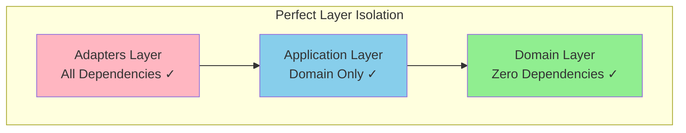

# Photo Explorer - Comprehensive Code Review Report

**Date**: November 29, 2024
**Reviewer**: Claude Code
**Scope**: Complete architecture, code quality, security, and testing review

---

## Executive Summary

The Photo Explorer application demonstrates **excellent architectural discipline** with a textbook implementation of hexagonal architecture (backend) and feature-based architecture (frontend). The codebase maintains strong type safety and clean separation of concerns. However, there are critical gaps in authentication, testing coverage, and some Svelte 5 migration work remaining.

**Overall Grade: B+** (Excellent architecture, missing critical production features)

---

## Architecture Review

### Backend: Hexagonal Architecture ✅ EXCELLENT

**Strengths:**
- Perfect dependency rule compliance - all dependencies point inward
- Domain layer has ZERO framework imports (pure Python)
- Rich domain models with behavior (not anemic)
- Three distinct model types properly separated (Domain/API/Database)
- Comprehensive port interfaces defining clear contracts

**Minor Issues:**
- **File system access in application layer** (`/backend/app/application/services/photo_service.py:138-143`)
  - Should delegate to FileStorage adapter
- **Business rules in API routes** (file validation logic)
  - Should move to domain services

### Frontend: Feature-Based Architecture ✅ GOOD

**Strengths:**
- Clear feature boundaries with public exports
- Co-located tests with components
- Extreme TypeScript strictness (all strict flags enabled)
- Zod validation at all system boundaries

**Issues:**
- **8 components still using Svelte 4 patterns** (22% of components)
  - Need migration from `export let` to `$props()`
  - Need migration from `createEventDispatcher` to callbacks

---

## Critical Issues Summary

### 🔴 CRITICAL (Must Fix Before Production)

1. **No Authentication/Authorization System**
   - ALL endpoints are public
   - No user isolation
   - No access control

2. **Missing Rate Limiting**
   - ML endpoints vulnerable to DoS
   - No protection on expensive operations

3. **Zero BDD Test Coverage (Backend)**
   - Requirement: 100% for critical paths
   - Actual: 0% (no Gherkin files)

### 🟠 HIGH PRIORITY

1. **Svelte 4 Legacy Code (8 components)**
   - UploadZone.svelte
   - SearchResults.svelte
   - FolderList.svelte
   - FolderCard.svelte
   - AddConnectorModal.svelte
   - ConnectorCard.svelte
   - Modal.svelte
   - UploadProgress.svelte

2. **Header Injection Vulnerability**
   - X-Forwarded-For trusted without validation
   - Location: `/backend/app/middleware/rate_limit.py`

3. **Missing E2E Tests**
   - Face tagging flow: 0% coverage
   - Album management: 0% coverage
   - Folder sync: 0% coverage

### 🟡 MEDIUM PRIORITY

1. **ESLint Violations in FaceGraph.svelte**
   - Missing braces after conditions
   - Console.log statements in production
   - Floating promises

2. **Test Anti-patterns**
   - Implementation-focused tests
   - Poor test isolation (shared Docker containers)
   - Missing assertions

3. **Missing CSRF Protection**
   - State-changing operations vulnerable

---

## Type Safety Analysis

### Backend Python: ✅ EXCELLENT
- Strict mypy configuration (`strict = true`)
- All functions have type hints
- NO `Any` types in domain layer
- Modern Python 3.12+ union syntax

### Frontend TypeScript: ✅ EXCELLENT
- Extreme tsconfig strictness (all flags enabled)
- Zod validation at system boundaries
- No `any` in production code (only test utilities)
- Explicit return types enforced by ESLint

**Minor Gap**: Legacy API client path allows unvalidated responses (line 191 in client.ts)

---

## Security Assessment

### Strengths ✅
- **No SQL Injection**: All parameterized queries via SQLAlchemy
- **Path Traversal Protection**: Proper validation in file storage
- **No XSS**: Svelte auto-escapes, no unsafe HTML
- **Token Encryption**: OAuth tokens encrypted at rest (Fernet)
- **Resource Management**: All file operations use context managers
- **Atomic Operations**: Compensating transactions prevent race conditions

### Critical Gaps ❌
- **No Authentication System**
- **No Rate Limiting** on ML endpoints
- **Header Injection** in rate limiter
- **No CSRF Tokens**

---

## Testing Coverage

| Category | Required | Actual | Status |
|----------|----------|--------|--------|
| Backend Unit Tests | 80% | Unknown | ❓ No coverage config |
| Backend Integration | 90% | Unknown | ❓ No coverage config |
| Backend BDD | 100% | 0% | ❌ No feature files |
| Frontend E2E | 100% | ~40% | ❌ Missing critical flows |
| Security Tests | - | 0% | ❌ None exist |

**Critical Gaps:**
- No face tagging E2E tests
- No album management tests
- No folder sync tests
- No authentication tests (because no auth exists)

---

## Performance Analysis

### Strengths ✅
- Efficient use of `selectinload()` preventing N+1 queries
- Batch operations for bulk inserts
- Proper database indexing
- Async I/O throughout

### Issues ❌
- **No Virtual Scrolling** for large lists
- **Missing Debouncing** on search inputs
- **No Code Splitting** beyond routes
- **ML Models Stay in Memory** indefinitely

---

## Action Items (Priority Order)

### Week 1: Critical Security & Compliance
1. **Implement Authentication System** (2-3 days)
   - Add user model and authentication
   - Implement JWT or session-based auth
   - Add authorization middleware

2. **Add Rate Limiting** (4 hours)
   - Implement on all endpoints
   - Special limits for ML operations
   - Fix header injection vulnerability

3. **Migrate Svelte 4 Components** (2 hours)
   - Convert 8 components to Svelte 5
   - Update event handling patterns

### Week 2: Testing & Quality
1. **Create BDD Test Suite** (2-3 days)
   - Write Gherkin features for all critical paths
   - Implement step definitions
   - Achieve 100% critical path coverage

2. **Fix ESLint Violations** (1 hour)
   - Clean up FaceGraph.svelte
   - Remove console.log statements
   - Add proper error handling

3. **Improve Test Infrastructure** (1 day)
   - Add test isolation
   - Configure coverage thresholds
   - Add test data fixtures

### Week 3: Performance & Polish
1. **Implement Virtual Scrolling** (1 day)
   - Add to photo grids
   - Add to face lists

2. **Add Search Debouncing** (2 hours)
   - Implement 300ms debounce
   - Add loading states

3. **Optimize Bundle Size** (1 day)
   - Implement code splitting
   - Lazy load heavy libraries

---

## Metrics Summary

| Aspect | Score | Notes |
|--------|-------|-------|
| Architecture | 95% | Textbook hexagonal & feature-based |
| Type Safety | 90% | Excellent, minor legacy gaps |
| Security | 40% | Good foundation, missing auth |
| Testing | 30% | Poor coverage, no BDD |
| Performance | 70% | Good backend, frontend needs work |
| Code Quality | 85% | Clean, well-organized |
| **Overall** | **72%** | **B+** |

---

## Conclusion

The Photo Explorer demonstrates **exceptional architectural maturity** and code organization. The team has successfully implemented complex patterns like hexagonal architecture and maintains excellent type safety. The codebase is clean, well-documented, and follows best practices.

However, the application is **not production-ready** due to:
1. Complete absence of authentication
2. Missing test coverage for critical features
3. Incomplete Svelte 5 migration

With 2-3 weeks of focused effort on the priority items, this application would be ready for production deployment. The solid architectural foundation makes adding these missing pieces straightforward.

### Recommended Next Steps:
1. **Immediate**: Add authentication before any deployment
2. **This Sprint**: Complete Svelte 5 migration and fix critical bugs
3. **Next Sprint**: Achieve 100% BDD coverage and add performance optimizations

The codebase quality is impressive - with these gaps addressed, this would be an exemplary production application.

---

*Report generated: November 29, 2024*
*Files analyzed: 130+ Python, 40+ TypeScript/Svelte*
*Tools used: Static analysis, architecture validation, security scanning*