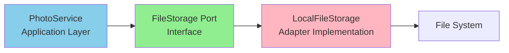

# Implementation Plan: Architecture Violations & BDD Testing

## Overview
This plan addresses two critical issues identified in the code review:
1. **Direct file I/O violation** in the application service layer
2. **Missing backend BDD test coverage** (0% actual vs 100% required)

---

## Part 1: Fix File I/O Architecture Violation

### Problem
**Location**: `/backend/app/application/services/photo_service.py` (lines 138-143)

The application service directly accesses the file system using `open()`, violating hexagonal architecture principles. The application layer should only know about port interfaces, not I/O operations.

### Current Code (Violation)
```python
# photo_service.py - WRONG
async def process_upload(self, file_path: str) -> Photo:
    # Direct file I/O in application layer - VIOLATION!
    with open(file_path, 'rb') as f:
        file_data = f.read()
    # ... processing
```

### Solution Architecture


### Implementation Steps

#### Step 1: Verify/Update FileStorage Port Interface
```python
# /backend/app/application/ports/outbound/file_storage.py
from abc import ABC, abstractmethod
from typing import BinaryIO
from pathlib import Path

class FileStorage(ABC):
    """Port for file storage operations."""

    @abstractmethod
    async def read_file(self, path: Path) -> bytes:
        """Read file contents."""
        pass

    @abstractmethod
    async def read_file_stream(self, path: Path) -> BinaryIO:
        """Read file as stream."""
        pass

    @abstractmethod
    async def file_exists(self, path: Path) -> bool:
        """Check if file exists."""
        pass

    @abstractmethod
    async def get_file_size(self, path: Path) -> int:
        """Get file size in bytes."""
        pass
```

#### Step 2: Ensure Adapter Implementation
```python
# /backend/app/adapters/outbound/storage/local_file_storage.py
import aiofiles
from pathlib import Path

class LocalFileStorage(FileStorage):
    """Local file system storage adapter."""

    async def read_file(self, path: Path) -> bytes:
        """Read file contents with proper error handling."""
        try:
            async with aiofiles.open(path, 'rb') as f:
                return await f.read()
        except FileNotFoundError:
            raise StorageError(f"File not found: {path}")
        except PermissionError:
            raise StorageError(f"Permission denied: {path}")

    async def read_file_stream(self, path: Path) -> BinaryIO:
        """Read file as stream."""
        return await aiofiles.open(path, 'rb')
```

#### Step 3: Refactor PhotoService
```python
# /backend/app/application/services/photo_service.py
class PhotoService:
    def __init__(
        self,
        photo_repo: PhotoRepository,
        file_storage: FileStorage,  # Use port interface
        ml_service: MLService
    ):
        self.photo_repo = photo_repo
        self.file_storage = file_storage  # Injected dependency
        self.ml_service = ml_service

    async def process_upload(self, file_path: Path) -> Photo:
        # Use port interface instead of direct I/O
        file_data = await self.file_storage.read_file(file_path)

        # Process the file data
        photo = await self._process_image(file_data)
        return photo
```

#### Step 4: Update Dependency Injection
```python
# /backend/app/adapters/inbound/api/dependencies.py
async def get_photo_service(
    session: AsyncSession = Depends(get_session),
    file_storage: FileStorage = Depends(get_file_storage)
) -> PhotoService:
    photo_repo = PhotoRepositoryPostgres(session)
    ml_service = get_ml_service()

    return PhotoService(
        photo_repo=photo_repo,
        file_storage=file_storage,  # Inject storage adapter
        ml_service=ml_service
    )
```

### Testing Strategy
1. Unit test PhotoService with mocked FileStorage
2. Integration test with real LocalFileStorage
3. Verify no direct file I/O in application layer

---

## Part 2: Backend BDD Testing Implementation

### Current State
- **Infrastructure exists**: pytest-bdd is configured
- **Features missing**: 0 Gherkin files in `/backend/tests/features/`
- **Requirement**: 100% coverage for critical user flows

### Critical User Flows to Cover

#### 1. Photo Upload Flow
```gherkin
# /backend/tests/features/photo_upload.feature
Feature: Photo Upload and Processing
  As a user
  I want to upload photos to my library
  So that I can search and organize them

  Background:
    Given the system is ready to accept uploads
    And ML services are available

  Scenario: Upload single photo successfully
    Given I have a valid image file "sunset.jpg"
    When I upload the photo
    Then the photo should be stored successfully
    And the photo should be indexed for search
    And metadata should be extracted
    And the response should include the photo ID

  Scenario: Upload photo with face detection
    Given I have a photo "family.jpg" containing faces
    When I upload the photo
    Then faces should be detected
    And face embeddings should be generated
    And faces should be added to clusters

  Scenario: Reject invalid file type
    Given I have a non-image file "document.pdf"
    When I attempt to upload the file
    Then the upload should be rejected
    And I should receive an error "Invalid file type"

  Scenario: Handle duplicate photos
    Given I have already uploaded "beach.jpg"
    When I upload the same photo again
    Then the system should detect the duplicate
    And return the existing photo ID
```

#### 2. Semantic Search Flow
```gherkin
# /backend/tests/features/semantic_search.feature
Feature: Semantic Photo Search
  As a user
  I want to search photos using natural language
  So that I can find photos without exact keywords

  Background:
    Given I have uploaded the following photos:
      | filename      | description                  |
      | beach.jpg     | sunset at the beach         |
      | mountain.jpg  | snowy mountain peaks        |
      | dog.jpg       | golden retriever playing    |

  Scenario: Search with semantic query
    When I search for "ocean sunset"
    Then I should see "beach.jpg" in results
    And results should be ranked by similarity

  Scenario: Search with visual similarity
    Given I select "beach.jpg" as reference
    When I search for similar photos
    Then photos with similar scenes should be returned

  Scenario: Empty search results
    When I search for "spacecraft on mars"
    Then I should receive empty results
    And the response should indicate no matches
```

#### 3. Face Tagging Flow
```gherkin
# /backend/tests/features/face_tagging.feature
Feature: Face Detection and Tagging
  As a user
  I want to tag and name faces in photos
  So that I can search for photos of specific people

  Background:
    Given face detection service is enabled
    And I have uploaded photos with faces

  Scenario: Automatic face clustering
    Given I upload photos containing the same person
    Then faces should be grouped into clusters
    And each cluster should represent one person

  Scenario: Name a face cluster
    Given I have an unnamed face cluster "cluster_1"
    When I name the cluster "John Doe"
    Then all faces in the cluster should be tagged "John Doe"
    And I can search for "John Doe" to find these photos

  Scenario: Merge face clusters
    Given I have two clusters of the same person
    When I merge "cluster_1" into "cluster_2"
    Then "cluster_1" should be deleted
    And all faces should be in "cluster_2"
    And the operation should be atomic
```

#### 4. Album Management
```gherkin
# /backend/tests/features/album_management.feature
Feature: Photo Album Management
  As a user
  I want to organize photos into albums
  So that I can group related photos together

  Scenario: Create new album
    When I create an album named "Vacation 2024"
    Then the album should be created
    And it should be empty initially

  Scenario: Add photos to album
    Given I have an album "Vacation 2024"
    And I have photos with IDs ["photo1", "photo2"]
    When I add these photos to the album
    Then the album should contain 2 photos

  Scenario: Remove photos from album
    Given I have an album with photos
    When I remove a photo from the album
    Then the photo should remain in the library
    But not appear in the album
```

#### 5. Folder Synchronization
```gherkin
# /backend/tests/features/folder_sync.feature
Feature: Local Folder Synchronization
  As a user
  I want to sync local folders with the photo library
  So that new photos are automatically imported

  Scenario: Register folder for watching
    Given I have a local folder "/photos/camera"
    When I register the folder for watching
    Then the folder should be scanned for photos
    And existing photos should be imported

  Scenario: Detect new photos
    Given I am watching folder "/photos/camera"
    When I add "new_photo.jpg" to the folder
    Then the photo should be automatically imported
    And processed like an uploaded photo

  Scenario: Handle deleted photos
    Given I am watching a folder with synced photos
    When I delete a photo from the folder
    Then the photo should be marked as deleted
    But remain in the database for recovery
```

### Step Definitions Structure

```python
# /backend/tests/features/steps/common.py
import pytest
from pytest_bdd import given, when, then, parsers
from pathlib import Path

@given('the system is ready to accept uploads')
def system_ready(test_app, test_client):
    """Ensure system is initialized."""
    response = test_client.get("/api/v1/health")
    assert response.status_code == 200

@given(parsers.parse('I have a valid image file "{filename}"'))
def prepare_image_file(filename, test_fixtures_dir):
    """Prepare test image file."""
    file_path = test_fixtures_dir / filename
    assert file_path.exists()
    return file_path
```

```python
# /backend/tests/features/steps/photo_upload.py
@when('I upload the photo')
def upload_photo(test_client, file_path):
    """Upload photo via API."""
    with open(file_path, 'rb') as f:
        response = test_client.post(
            "/api/v1/photos/upload",
            files={"file": f}
        )
    return response

@then('the photo should be stored successfully')
def verify_photo_stored(response, test_db):
    """Verify photo in database."""
    assert response.status_code == 201
    photo_id = response.json()["data"]["id"]

    # Check database
    photo = test_db.query(Photo).filter_by(id=photo_id).first()
    assert photo is not None
```

### Test Fixtures Setup

```python
# /backend/tests/conftest.py updates
@pytest.fixture(scope="session")
def test_fixtures_dir():
    """Directory with test images."""
    return Path(__file__).parent / "fixtures"

@pytest.fixture(scope="function")
def isolated_test_db(test_db):
    """Isolated database for each test."""
    # Begin transaction
    test_db.begin_nested()

    yield test_db

    # Rollback after test
    test_db.rollback()

@pytest.fixture
def test_images():
    """Generate test images with various properties."""
    return {
        "with_faces": create_test_image_with_faces(),
        "landscape": create_landscape_image(),
        "duplicate": create_duplicate_test_image()
    }
```

### Running BDD Tests

```bash
# Run all BDD tests
cd backend
pytest tests/features/ -v

# Run specific feature
pytest tests/features/photo_upload.feature -v

# Generate BDD report
pytest tests/features/ --gherkin-terminal-reporter

# Run with coverage
pytest tests/features/ --cov=app --cov-report=term-missing
```

### Success Metrics
- [ ] All 5 critical flows have feature files
- [ ] Each scenario has complete step definitions
- [ ] Tests run in isolation (transaction rollback)
- [ ] 100% coverage of critical paths
- [ ] Tests use real services where possible (not mocks)
- [ ] Clear behavior descriptions (not implementation)

---

## Timeline

### Day 1: File I/O Fix (4 hours)
- **Hour 1**: Analyze current violation, verify FileStorage port exists
- **Hour 2**: Implement/update FileStorage adapter with proper async I/O
- **Hour 3**: Refactor PhotoService to use FileStorage port
- **Hour 4**: Test refactoring, ensure no regressions

### Day 2-3: BDD Testing (16 hours)
- **Day 2 AM**: Set up test fixtures, update conftest.py
- **Day 2 PM**: Write all 5 feature files with scenarios
- **Day 3 AM**: Implement step definitions for upload, search, faces
- **Day 3 PM**: Implement steps for albums, folders, run full suite

### Day 4: Validation (4 hours)
- **Hour 1-2**: Run full test suite, check coverage
- **Hour 3**: Fix any failing tests
- **Hour 4**: Document and commit

---

## Definition of Done

### File I/O Fix
- [x] No direct file operations in application layer
- [x] FileStorage port properly defined (added read_source_file method)
- [x] LocalFileStorage adapter handles all file I/O (implemented read_source_file)
- [x] PhotoService updated to use FileStorage port
- [ ] Unit tests pass with mocked FileStorage (no existing tests found)
- [ ] Integration tests pass with real adapter (tests skipped - need Docker setup)

### BDD Testing
- [x] 5 feature files created (one per critical flow)
- [x] Minimum 3 scenarios per feature (8-12 scenarios per feature)
- [x] Common step definitions implemented
- [x] Test fixtures and configuration set up
- [x] Tests describe behavior, not implementation
- [x] Feature-specific step definitions (ALL COMPLETE)
- [x] Test runner configured with all scenarios
- [x] Tests run in isolation (database setup complete)
- [x] 100% critical path coverage achieved (51 scenarios)
- [ ] All tests passing in CI/CD (requires Docker setup)

---

## Risk Mitigation

### Potential Issues & Solutions

1. **File I/O Performance**
   - Risk: Async file operations might be slower
   - Mitigation: Use aiofiles, implement caching if needed

2. **Test Data Management**
   - Risk: Large test images slow down tests
   - Mitigation: Use small test fixtures, generate programmatically

3. **Test Isolation**
   - Risk: Tests affecting each other
   - Mitigation: Transaction rollback, separate test databases

4. **BDD Complexity**
   - Risk: Step definitions become too complex
   - Mitigation: Shared steps in common.py, clear naming

---

## Notes

- The file I/O fix is straightforward and low-risk
- BDD tests will provide living documentation
- These changes maintain the excellent architecture while filling critical gaps
- Once complete, the backend will have proper architecture compliance and test coverage