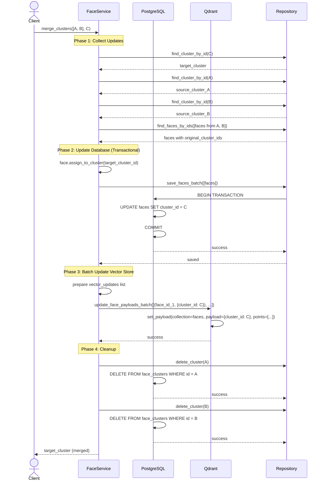
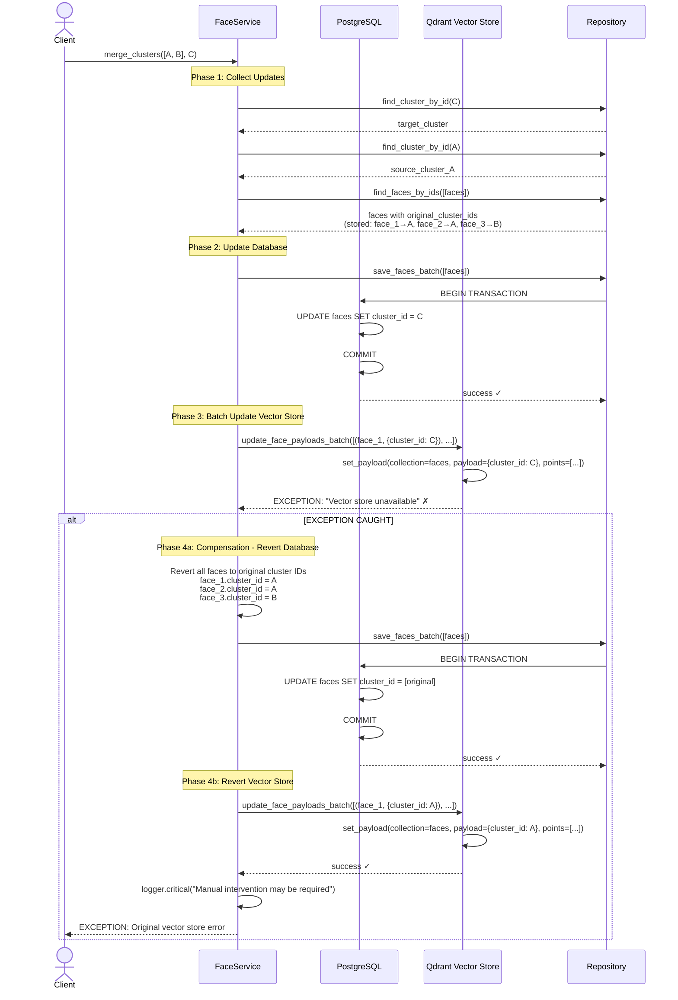
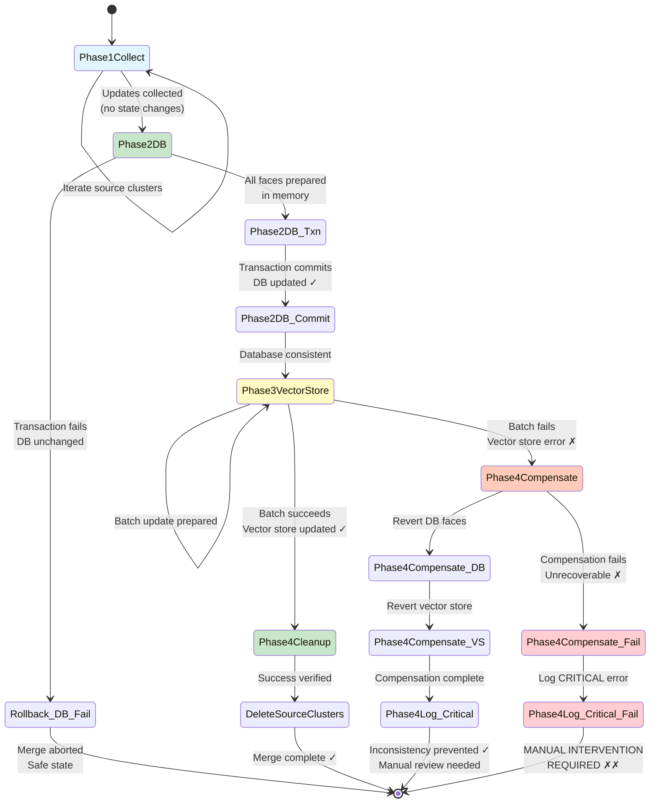
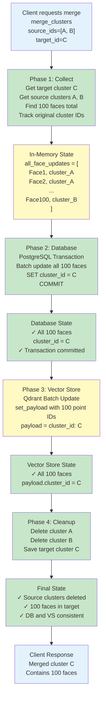
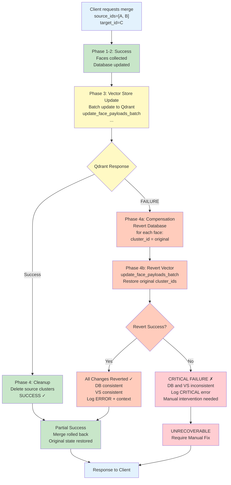
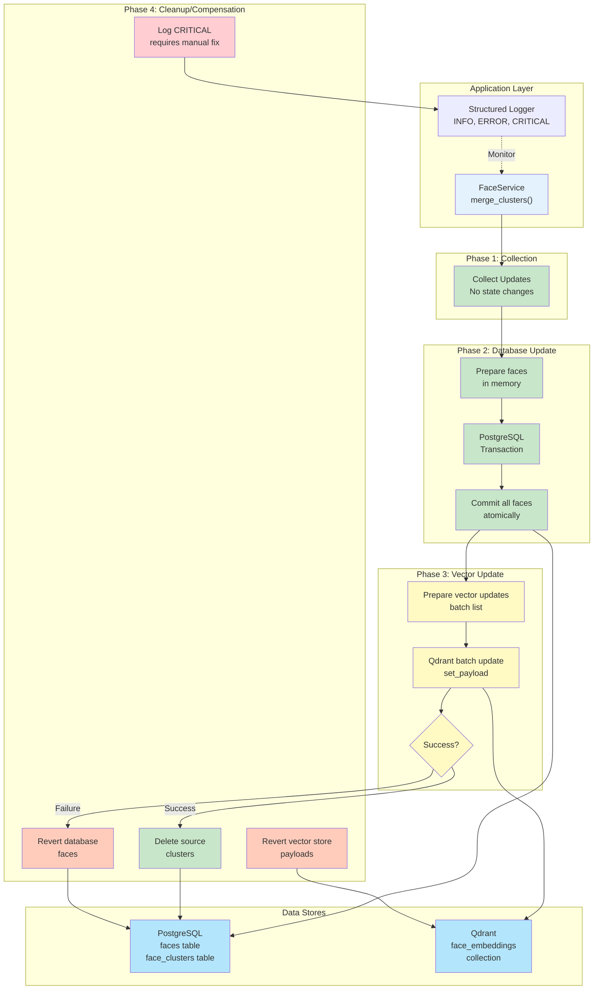
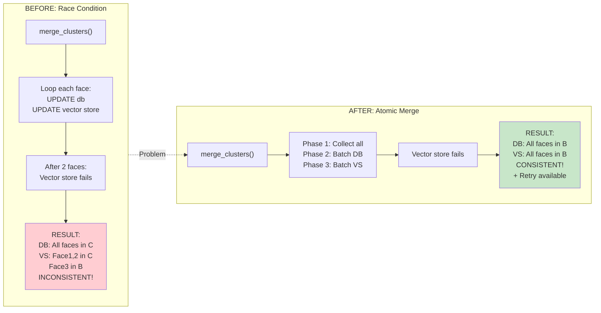
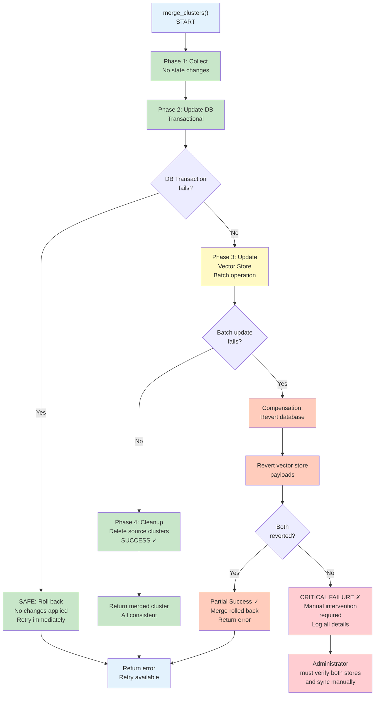

# Atomic Face Cluster Merge - Architecture Diagrams

## Sequence Diagram: Successful Merge

## Sequence Diagram: Merge with Vector Store Failure & Compensation

## State Diagram: Merge Operation States

## Data Flow: Normal Merge (100 Faces)

## Data Flow: Merge with Failure & Compensation

## Architecture: Multi-Store Consistency Pattern

## Comparison: Race Condition vs Atomic Update

## Failure Recovery Paths

