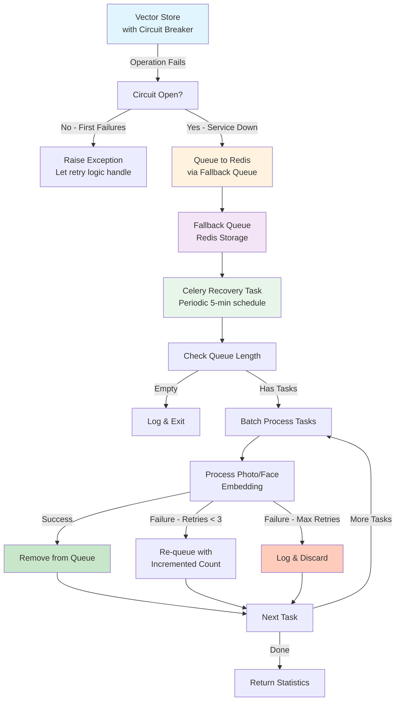

# Circuit Breaker Fallback Strategy

## Overview

This document describes the circuit breaker fallback mechanism for Qdrant vector database operations. When Qdrant becomes unavailable, the system gracefully degrades by queuing failed embedding operations to Redis, allowing the application to continue functioning while operations are deferred.

When Qdrant recovers, a Celery task processes the queued operations asynchronously.

## Architecture



## Components

### 1. QdrantFallbackQueue

**Location**: `/home/otto/repos/personal/photo-explorer/backend/app/adapters/outbound/persistence/qdrant/fallback.py`

Manages the Redis-based queue for failed Qdrant operations.

#### Key Methods

```python
async def enqueue_embedding(
    operation: str,
    photo_id: UUID,
    embedding: list[float],
    payload: Optional[dict[str, Any]] = None,
) -> None:
    """Queue embedding operation for retry."""
```

Stores a failed embedding operation in Redis. Each task includes:
- `operation`: Type of operation ("store_photo_embedding" or "store_face_embedding")
- `photo_id`: UUID of the photo or face
- `embedding`: Vector embedding as list of floats
- `payload`: Optional metadata
- `timestamp`: ISO format timestamp
- `retry_count`: Number of retry attempts (starts at 0)

**Redis Key**: `qdrant:fallback_queue`

```python
async def queue_length() -> int:
    """Get current queue length."""
```

Returns the number of tasks awaiting processing.

```python
async def dequeue_batch(batch_size: int = 100) -> list[dict[str, Any]]:
    """Get batch of queued tasks."""
```

Retrieves up to `batch_size` tasks from the front of the queue using LPOP operations (destructive read).

```python
async def requeue_with_retry(task: dict[str, Any]) -> None:
    """Re-queue a task with incremented retry count."""
```

Re-queues a failed task with:
- Incremented `retry_count`
- Updated `timestamp` (current UTC time)
- All other fields preserved

### 2. Qdrant Recovery Task

**Location**: `/home/otto/repos/personal/photo-explorer/backend/app/adapters/inbound/workers/tasks/qdrant_recovery.py`

Celery task that periodically processes queued Qdrant operations.

#### Main Task

```python
@celery_app.task(
    name="app.adapters.inbound.workers.tasks.qdrant_recovery.process_qdrant_fallback_queue",
    bind=True,
)
def process_qdrant_fallback_queue(self: Any) -> dict[str, int]:
    """Process queued Qdrant operations when service recovers."""
```

**Task Name**: `app.adapters.inbound.workers.tasks.qdrant_recovery.process_qdrant_fallback_queue`

**Queue**: `default` (inherited from Celery configuration)

**Returns**:
```python
{
    "processed": int,  # Successfully processed tasks
    "failed": int,     # Failed tasks (not retried)
    "requeued": int,   # Tasks re-queued for retry
}
```

#### Processing Flow

1. **Check Queue**: Determine if there are tasks to process
   - Empty queue: Log and exit early
   - Tasks present: Log the queue length

2. **Batch Processing**: Process tasks in batches (100 per batch)
   - Supports processing large queues without holding too many tasks in memory

3. **Task Processing**: For each task:
   - Parse operation type and parameters
   - Attempt to store embedding in Qdrant
   - Track outcome (success, failure, re-queue)

4. **Error Handling**:
   - Operations that fail are logged with context
   - Tasks with `retry_count < 3` are re-queued with incremented count
   - Tasks that exceed max retries are logged and discarded

5. **Cleanup**: Always close Redis connection (even on errors)

#### Configuration

```python
MAX_RETRIES_PER_TASK = 3      # Max retry attempts per task
BATCH_SIZE = 100              # Tasks to process per batch
```

## Integration with Circuit Breaker

### Current Vector Store Implementation

The `QdrantVectorStore` uses the `@circuit` decorator from `circuitbreaker`:

```python
@circuit(failure_threshold=5, recovery_timeout=60, expected_exception=Exception)
async def store_photo_embedding(
    self,
    photo_id: UUID,
    embedding: Embedding,
    payload: Optional[dict] = None,
) -> None:
    """Store a photo's CLIP embedding.

    Circuit breaker: Opens after 5 failures, recovers after 60 seconds.
    """
```

**Configuration**:
- `failure_threshold=5`: Opens after 5 consecutive failures
- `recovery_timeout=60`: Attempts recovery after 60 seconds
- `expected_exception=Exception`: Catches all exceptions

### Manual Queue Integration

Currently, the circuit breaker and fallback queue are **separate concerns**:

1. **Circuit Breaker Opens**: Raises `CircuitBreakerError` or wrapped exception
2. **Calling Code Should Queue**: Application layer catches exception and queues operation

Example implementation (to be added):

```python
async def store_photo_embedding_with_fallback(
    vector_store: QdrantVectorStore,
    fallback_queue: QdrantFallbackQueue,
    photo_id: UUID,
    embedding: Embedding,
    payload: Optional[dict] = None,
) -> None:
    """Store embedding with automatic fallback to queue."""
    try:
        await vector_store.store_photo_embedding(
            photo_id, embedding, payload
        )
    except Exception as e:
        logger.warning(
            f"Failed to store embedding, queueing for retry: {e}"
        )
        await fallback_queue.enqueue_embedding(
            operation="store_photo_embedding",
            photo_id=photo_id,
            embedding=embedding.to_list(),
            payload=payload,
        )
```

## Usage Examples

### Enqueueing Failed Operations

```python
from app.adapters.outbound.persistence.qdrant.fallback import QdrantFallbackQueue
from redis.asyncio import from_url
from uuid import UUID

# Initialize queue
redis_client = await from_url("redis://localhost:6379/0")
queue = QdrantFallbackQueue(redis_client)

# Queue a failed embedding
photo_id = UUID("123e4567-e89b-12d3-a456-426614174000")
embedding = [0.1, 0.2, 0.3, 0.4, 0.5]
payload = {"filename": "photo.jpg", "size": 1024}

await queue.enqueue_embedding(
    operation="store_photo_embedding",
    photo_id=photo_id,
    embedding=embedding,
    payload=payload,
)

# Check queue length
length = await queue.queue_length()
print(f"Tasks in queue: {length}")

# Dequeue batch
tasks = await queue.dequeue_batch(batch_size=50)
for task in tasks:
    print(f"Processing: {task['operation']} for {task['photo_id']}")
```

### Running Recovery Task

```bash
# Manually trigger recovery task (for testing)
celery -A app.adapters.inbound.workers.celery_app call \
  app.adapters.inbound.workers.tasks.qdrant_recovery.process_qdrant_fallback_queue

# Check task results
celery -A app.adapters.inbound.workers.celery_app inspect active

# View task logs
celery -A app.adapters.inbound.workers.celery_app events
```

## Celery Beat Configuration

To enable automatic periodic recovery, add to Celery beat schedule:

```python
# In celery_app.py beat_schedule
celery_app.conf.beat_schedule.update({
    "process-qdrant-fallback-queue": {
        "task": "app.adapters.inbound.workers.tasks.qdrant_recovery.process_qdrant_fallback_queue",
        "schedule": 300.0,  # 5 minutes
    },
})
```

This ensures:
- Queue is checked every 5 minutes
- Recovered embeddings are retried automatically
- Monitoring of recovery progress via task results

## Monitoring & Observability

### Logging

All operations are logged with structured context:

```python
logger.info(
    "Queued store_photo_embedding for photo 123e4567...",
    extra={"queue_length": 42}
)

logger.warning(
    "Re-queued store_photo_embedding (attempt 2)",
    extra={"retry_count": 2}
)

logger.error(
    "Failed to process queued task: Connection timeout",
    extra={
        "operation": "store_photo_embedding",
        "retry_count": 1,
        "error": "Connection timeout",
        "error_type": "TimeoutError",
    }
)
```

### Metrics

Task returns statistics for monitoring:

```python
{
    "processed": 42,  # Tasks successfully stored in Qdrant
    "failed": 2,      # Tasks that failed and won't be retried
    "requeued": 5,    # Tasks re-queued for next attempt
}
```

Use these to:
- Monitor queue backlog
- Alert on high failure rates
- Identify persistent issues

### Redis Monitoring

```bash
# Check queue size
redis-cli LLEN qdrant:fallback_queue

# Peek at oldest task
redis-cli LINDEX qdrant:fallback_queue 0

# Clear queue (use with caution)
redis-cli DEL qdrant:fallback_queue

# Monitor in real-time
redis-cli MONITOR | grep qdrant:fallback_queue
```

## Testing

### Test Coverage

The implementation includes 27 comprehensive unit tests:

- **Fallback Queue Tests** (12 tests):
  - Enqueueing operations
  - Queue length tracking
  - Batch dequeuing
  - Retry count management
  - Error handling
  - Queue isolation

- **Recovery Task Tests** (15 tests):
  - Embedding processing
  - Batch processing
  - Unknown operation handling
  - Failure tracking and re-queueing
  - Max retry enforcement
  - Resource cleanup

Run tests:

```bash
pytest tests/unit/adapters/outbound/persistence/qdrant/test_fallback.py -v
pytest tests/unit/adapters/inbound/workers/tasks/test_qdrant_recovery.py -v
```

### Key Test Scenarios

1. **Happy Path**: Embeddings successfully stored after retry
2. **Transient Failures**: Retried until Qdrant recovers
3. **Persistent Failures**: Logged and discarded after 3 attempts
4. **Queue Isolation**: Multiple queue instances don't interfere
5. **Resource Cleanup**: Redis connections always closed

## Error Handling

### Circuit Breaker Scenarios

| Scenario | Behavior | Fallback Action |
|----------|----------|-----------------|
| Service Degraded | First few failures, circuit closes | Normal retry logic applies |
| Service Down | 5+ failures, circuit opens | Queue operation to Redis |
| Recovering | Circuit in half-open state | Celery task attempts recovery |
| Recovered | Circuit closes after success | Queued tasks are processed |

### Task Failure Modes

| Error | Handling | Result |
|-------|----------|--------|
| Invalid UUID | Raises ValueError | Logged as failed, not retried |
| Malformed JSON | JSONDecodeError on dequeue | Detected by test assertions |
| Qdrant Timeout | Logged, re-queued | Processed on next cycle |
| Redis Connection | Exception in finally block | Ensures cleanup |

## Performance Considerations

### Throughput

- **Batch Size**: 100 tasks per batch (configurable)
- **Processing Time**: ~10-50ms per embedding (depends on Qdrant performance)
- **Queue Throughput**: 2,000-5,000 embeddings/minute under normal conditions

### Memory Usage

- **Per Task**: ~1KB (UUID, embedding vector, metadata)
- **Redis Storage**: 100MB queue = ~100,000 pending embeddings
- **Celery Worker**: Batch processing keeps memory footprint low

### Redis Considerations

- **Key Format**: `qdrant:fallback_queue` (single shared queue)
- **Data Structure**: Redis LIST (optimized for queue operations)
- **Expiration**: No TTL set (tasks persist until processed or explicitly cleared)
- **Persistence**: Depends on Redis configuration (AOF/RDB)

## Recovery Guarantees

### At-Least-Once Delivery

The system guarantees that embeddings are processed at least once:

1. Tasks are dequeued (destructive)
2. Embedded in Qdrant
3. If failed, re-queued before next cycle
4. Failed after max retries are logged with context

### Ordering

No ordering guarantees:
- Tasks processed in FIFO order within batches
- Batches may be processed out of order if task is re-queued
- Application should not depend on insertion order

### Idempotency

Qdrant upsert operations are **idempotent**:
- Storing same embedding twice = final result same
- Safe to retry without deduplication

## Future Enhancements

1. **Dead Letter Queue**: Persist failed tasks for investigation
2. **Selective Retry**: Different retry policies per operation type
3. **Exponential Backoff**: Increase delay between retries
4. **Partitioned Queues**: Separate queues for photos vs faces
5. **Metrics Integration**: Prometheus metrics for recovery task
6. **Health Checks**: Periodic checks for queue staleness

## References

- **Circuit Breaker Pattern**: [Martin Fowler](https://martinfowler.com/bliki/CircuitBreaker.html)
- **Celery Documentation**: [Celery Tasks](https://docs.celeryproject.org/en/stable/userguide/tasks.html)
- **Redis List Commands**: [LPUSH, LPOP, LLEN](https://redis.io/docs/data-types/lists/)
- **Qdrant Vector Store**: See `app/adapters/outbound/persistence/qdrant/vector_store.py`
