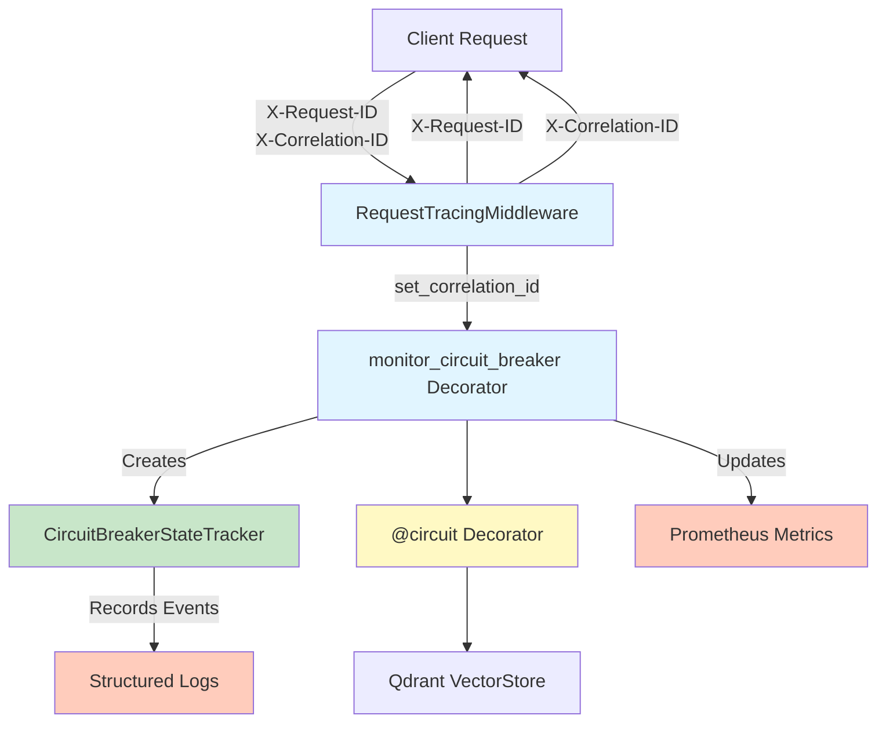

# Circuit Breaker Monitoring and Logging Guide

This document describes the comprehensive monitoring and logging infrastructure for circuit breaker implementations in Photo Explorer's Qdrant vector store adapter.

## Overview

The circuit breaker monitoring system provides:
- **Structured Logging**: Detailed event logging with correlation IDs for distributed tracing
- **Prometheus Metrics**: Real-time metrics for monitoring and alerting
- **State Tracking**: Detailed tracking of circuit breaker state transitions
- **Correlation IDs**: End-to-end request tracing through distributed systems

## Architecture



## Correlation IDs and Distributed Tracing

Correlation IDs enable end-to-end request tracing through microservices and async operations.

### How Correlation IDs Flow

1. **Client sends correlation ID** via `X-Correlation-ID` header
2. **RequestTracingMiddleware** captures or generates it
3. **set_correlation_id()** stores in context variable
4. **All circuit breaker operations** include the correlation ID in logs and metrics
5. **Response headers** include the correlation ID for client tracking

### Using Correlation IDs in Requests

```bash
# Include correlation ID in request
curl -X POST http://api.example.com/api/photos \
  -H "X-Correlation-ID: my-trace-123" \
  -F "file=@photo.jpg"

# Response will include the correlation ID
# X-Correlation-ID: my-trace-123
```

### Programmatic Access

```python
from app.infrastructure.monitoring import (
    get_correlation_id,
    set_correlation_id,
    generate_correlation_id,
)

# In your application code
async def upload_photo(photo_id):
    # Automatically set by middleware, but you can check it
    correlation_id = get_correlation_id()
    logger.info("Processing photo", extra={
        "photo_id": photo_id,
        "correlation_id": correlation_id,
    })
```

## Monitoring Components

### 1. CircuitBreakerStateTracker

Tracks state transitions and detailed metrics for a single circuit breaker.

**Methods:**

```python
tracker = CircuitBreakerStateTracker(
    operation_name="store_photo",           # Logical operation name
    service_name="QdrantVectorStore",       # Service/class name
    method_name="store_photo_embedding"     # Method name
)

# Record state transitions
event = tracker.record_state_change(
    new_state=CircuitBreakerStateEnum.OPEN,
    error_type="ConnectionError",
    error_message="Failed to connect to Qdrant",
    failure_count=5,
    failure_threshold=5,
)

# Get time circuit has been open (for alerts/metrics)
time_open = tracker.get_time_open()  # Returns seconds or None
```

**State Enum:**

```python
class CircuitBreakerStateEnum(str, Enum):
    CLOSED = "closed"          # Normal operation
    HALF_OPEN = "half_open"    # Recovery attempt in progress
    OPEN = "open"              # Circuit breaker blocking requests
```

### 2. CircuitBreakerEvent

Represents a single circuit breaker event with full context.

**Fields:**

```python
@dataclass
class CircuitBreakerEvent:
    timestamp: datetime                          # When the event occurred
    operation_name: str                          # e.g., "store_photo"
    service_name: str                            # e.g., "QdrantVectorStore"
    method_name: str                             # e.g., "store_photo_embedding"
    state: CircuitBreakerStateEnum               # Current state
    previous_state: CircuitBreakerStateEnum | None = None  # Previous state
    error_type: str | None = None                # Type of error that caused transition
    error_message: str | None = None             # Error details
    failure_count: int = 0                       # Current failure count
    failure_threshold: int = 0                   # Threshold for opening
    duration_seconds: float = 0.0                # Operation duration
    correlation_id: str = ""                     # For distributed tracing
```

**Methods:**

```python
event = CircuitBreakerEvent(...)

# Convert to dictionary for structured logging
log_dict = event.to_log_dict()
# Result: {
#   "timestamp": "2024-01-01T12:00:00+00:00",
#   "operation": "store_photo",
#   "service": "QdrantVectorStore",
#   "method": "store_photo_embedding",
#   "state": "open",
#   "previous_state": "closed",
#   "error_type": "ConnectionError",
#   "error_message": "Failed to connect",
#   "failure_count": 5,
#   "failure_threshold": 5,
#   "correlation_id": "abc-123-def"
# }
```

### 3. Monitor Circuit Breaker Decorator

The main decorator that wraps circuit-protected methods with monitoring.

**Usage:**

```python
from circuitbreaker import circuit
from app.infrastructure.monitoring import monitor_circuit_breaker

class QdrantVectorStore:
    @log_circuit_breaker_events
    @monitor_circuit_breaker("store_photo")
    @circuit(failure_threshold=5, recovery_timeout=60, expected_exception=Exception)
    async def store_photo_embedding(
        self,
        photo_id: UUID,
        embedding: Embedding,
        payload: Optional[dict] = None,
    ) -> None:
        """Store a photo's CLIP embedding."""
        # Circuit breaker automatically wraps this
        await self._client.upsert(
            collection_name=self._photos_collection,
            points=[point],
        )
```

**What the Decorator Does:**

1. **Generates correlation ID** if not present in context
2. **Tracks operation duration** and records to Prometheus histogram
3. **On success**: Logs operation completion, sets state to CLOSED, updates gauge
4. **On failure**: Logs error details, increments failure counter, updates gauge
5. **On CircuitBreakerError**: Logs circuit open, increments opens counter, updates gauge

**Stacking Order:**

```python
# Correct order (from bottom to top):
@log_circuit_breaker_events     # Outermost - logs errors
@monitor_circuit_breaker(...)    # Middle - tracks metrics
@circuit(...)                    # Innermost - the actual breaker
async def my_method():
    pass
```

## Prometheus Metrics

All metrics are prefixed with `circuit_breaker_` or `qdrant_operation_`.

### Available Metrics

#### circuit_breaker_state (Gauge)
Current state of circuit breaker (0=closed, 1=half_open, 2=open)

```python
# Query: Get current state of all circuit breakers
circuit_breaker_state{service="QdrantVectorStore", method="store_photo_embedding"}
```

**Alert Example:**
```yaml
alert: CircuitBreakerOpen
expr: circuit_breaker_state{service="QdrantVectorStore"} == 2
for: 1m
annotations:
  summary: "Qdrant circuit breaker is open"
```

#### circuit_breaker_failures_total (Counter)
Total failures by error type

```python
# Query: Get total ConnectionError failures
circuit_breaker_failures_total{
  service="QdrantVectorStore",
  method="store_photo_embedding",
  error_type="ConnectionError"
}
```

#### circuit_breaker_opens_total (Counter)
Total times circuit breaker opened

```python
# Query: How often has the circuit opened?
circuit_breaker_opens_total{
  service="QdrantVectorStore",
  method="store_photo_embedding"
}
```

#### circuit_breaker_recoveries_total (Counter)
Total recovery attempts (transitions to half-open)

```python
# Query: How many recovery attempts?
circuit_breaker_recoveries_total{
  service="QdrantVectorStore",
  method="store_photo_embedding"
}
```

#### qdrant_operation_duration_seconds (Histogram)
Operation latency distribution

```python
# Query: P95 latency for store_photo operations
histogram_quantile(0.95, qdrant_operation_duration_seconds_bucket{operation="store_photo"})

# Query: Average latency
qdrant_operation_duration_seconds{operation="store_photo", le="0.5"}
```

### Prometheus Configuration

Add to your `prometheus.yml`:

```yaml
global:
  scrape_interval: 15s
  evaluation_interval: 15s

scrape_configs:
  - job_name: 'photo-explorer'
    static_configs:
      - targets: ['localhost:8000']
    metrics_path: '/metrics'
    scrape_interval: 10s
```

### Useful Queries

```promql
# Circuit breaker health
sum by (service) (circuit_breaker_state)

# Failure rate in last 5 minutes
rate(circuit_breaker_failures_total[5m])

# Most common error types
topk(5, sum by (error_type) (circuit_breaker_failures_total))

# Circuit breaker availability (% time not open)
100 * (1 - avg by (service, method) (circuit_breaker_state / 2))

# P99 latency
histogram_quantile(0.99, qdrant_operation_duration_seconds_bucket)
```

## Structured Logging

All circuit breaker events are logged as structured JSON for easy parsing.

### Log Format

```json
{
  "timestamp": "2024-01-01T12:00:00+00:00",
  "level": "ERROR",
  "logger": "app.infrastructure.monitoring.circuit_breaker",
  "message": "Circuit breaker open: QdrantVectorStore.store_photo_embedding (operation=store_photo, time_open=0.00s)",
  "location": {
    "file": "/app/infrastructure/monitoring/circuit_breaker.py",
    "line": 380,
    "function": "async_wrapper"
  },
  "context": {
    "operation": "store_photo",
    "service": "QdrantVectorStore",
    "method": "store_photo_embedding",
    "state": "open",
    "previous_state": "closed",
    "error_type": "CircuitBreakerError",
    "error_message": "Circuit breaker is open, request blocked",
    "failure_count": 5,
    "failure_threshold": 5,
    "correlation_id": "550e8400-e29b-41d4-a716-446655440000",
    "duration_seconds": 0.001
  }
}
```

### Log Levels

- **DEBUG**: Successful operations
- **INFO**: State transitions (closed → open, open → half-open, etc.)
- **WARNING**: Failures that haven't exceeded threshold yet
- **ERROR**: Circuit breaker open or other failures
- **CRITICAL**: Catastrophic failures (connection refused, etc.)

### Log Parsing Examples

#### ELK Stack (Elasticsearch, Logstash, Kibana)

```json
{
  "filter": {
    "json": {
      "source": "message"
    }
  }
}
```

#### Loki (Grafana Loki)

```logql
{job="photo-explorer"} | json | state="open"
```

#### CloudWatch Logs

```
fields @timestamp, context.correlation_id, context.error_type
| filter context.state = "open"
| stats count() by context.service
```

### Useful Log Searches

```bash
# Find all circuit breaker open events
grep '"state": "open"' logs/*.jsonl

# Find errors for specific correlation ID
grep '"correlation_id": "550e8400-e29b-41d4-a716-446655440000"' logs/*.jsonl

# Get failure summary
grep '"error_type"' logs/*.jsonl | jq '.context.error_type' | sort | uniq -c

# Timeline of circuit breaker state changes
grep 'circuit_breaker' logs/*.jsonl | jq '[.timestamp, .context.service, .context.state]'
```

## Alerting Examples

### Prometheus Alerts

```yaml
groups:
  - name: circuit_breaker_alerts
    rules:
      # Circuit breaker is open
      - alert: CircuitBreakerOpen
        expr: circuit_breaker_state == 2
        for: 1m
        annotations:
          summary: "Circuit breaker is open for {{ $labels.service }}.{{ $labels.method }}"
          description: "Circuit breaker has been open for more than 1 minute"

      # High failure rate
      - alert: HighCircuitBreakerFailureRate
        expr: rate(circuit_breaker_failures_total[5m]) > 0.1
        for: 5m
        annotations:
          summary: "High failure rate in {{ $labels.service }}"
          description: "Failure rate is {{ $value }} failures/sec"

      # Multiple open circuits (systemic issue)
      - alert: MultipleCircuitBreakersOpen
        expr: sum(circuit_breaker_state == 2) > 2
        for: 2m
        annotations:
          summary: "Multiple circuit breakers are open"
          description: "{{ $value }} circuit breakers are currently open"

      # Slow operations
      - alert: SlowQdrantOperations
        expr: histogram_quantile(0.95, qdrant_operation_duration_seconds_bucket) > 5
        for: 5m
        annotations:
          summary: "Qdrant operations are slow"
          description: "P95 latency is {{ $value }} seconds"

      # Circuit breaker flapping (opening/closing repeatedly)
      - alert: CircuitBreakerFlapping
        expr: rate(circuit_breaker_opens_total[5m]) > 0.5
        for: 5m
        annotations:
          summary: "Circuit breaker is flapping for {{ $labels.service }}"
          description: "Circuit breaker is opening {{ $value }} times per second"
```

### Grafana Dashboard Example

```json
{
  "dashboard": {
    "title": "Circuit Breaker Monitoring",
    "panels": [
      {
        "title": "Circuit Breaker States",
        "targets": [{
          "expr": "circuit_breaker_state"
        }]
      },
      {
        "title": "Failures by Type",
        "targets": [{
          "expr": "sum by (error_type) (rate(circuit_breaker_failures_total[5m]))"
        }]
      },
      {
        "title": "Operation Duration (P95)",
        "targets": [{
          "expr": "histogram_quantile(0.95, qdrant_operation_duration_seconds_bucket)"
        }]
      },
      {
        "title": "Recovery Attempts",
        "targets": [{
          "expr": "rate(circuit_breaker_recoveries_total[1h])"
        }]
      }
    ]
  }
}
```

## Debugging with Correlation IDs

Correlation IDs make debugging distributed systems much easier.

### Example: Tracing a Failed Operation

1. **Client sends request with correlation ID:**
   ```bash
   curl -X POST http://api.example.com/api/photos \
     -H "X-Correlation-ID: trace-abc-123"
   ```

2. **Check logs for the correlation ID:**
   ```bash
   # Find all logs for this request
   grep '"correlation_id": "trace-abc-123"' logs/*.jsonl | jq .
   ```

3. **Follow the request through services:**
   - API logs show request arrival
   - Circuit breaker logs show Qdrant communication
   - Any async task logs show processing

4. **Identify the failure point:**
   ```json
   {
     "timestamp": "2024-01-01T12:00:05+00:00",
     "message": "Circuit breaker open: QdrantVectorStore.store_photo_embedding",
     "context": {
       "correlation_id": "trace-abc-123",
       "error_type": "ConnectionError",
       "error_message": "Failed to connect to Qdrant"
     }
   }
   ```

## Best Practices

### 1. Always Use Correlation IDs

```python
# Good: Include correlation ID in all logging
async def process_photo(photo_id, correlation_id=None):
    if not correlation_id:
        correlation_id = generate_correlation_id()
    set_correlation_id(correlation_id)

    logger.info("Processing photo", extra={
        "photo_id": photo_id,
        "correlation_id": correlation_id,
    })
```

### 2. Monitor Alert on Circuit Breaker State Changes

```python
# Create a gauge that tracks state changes over time
circuit_breaker_state_duration_seconds = Gauge(
    "circuit_breaker_state_duration_seconds",
    "Time circuit breaker has been in current state",
    ["service", "method", "state"],
)
```

### 3. Set Appropriate Timeouts and Thresholds

```python
# Qdrant operations should fail fast
@circuit(
    failure_threshold=5,           # Open after 5 failures
    recovery_timeout=60,           # Try recovery after 60 seconds
    expected_exception=Exception,  # Catch all exceptions
)
async def store_photo_embedding(self, ...):
    pass
```

### 4. Handle Circuit Breaker Errors Gracefully

```python
try:
    await vector_store.store_photo_embedding(photo_id, embedding)
except CircuitBreakerError:
    # Vector store is temporarily unavailable
    # Queue for retry or return graceful error to client
    await retry_queue.enqueue(photo_id, embedding)
    logger.warning(
        "Qdrant unavailable, queued for retry",
        extra={"photo_id": photo_id, "correlation_id": get_correlation_id()},
    )
except Exception as e:
    logger.error(
        "Failed to store embedding",
        extra={
            "photo_id": photo_id,
            "error": str(e),
            "correlation_id": get_correlation_id(),
        },
    )
    raise
```

### 5. Regularly Review Metrics

- **Weekly**: Check failure trends and error types
- **Daily**: Monitor circuit breaker state changes
- **Real-time**: Alert on multiple open circuits or high failure rates

## Troubleshooting

### Circuit Breaker Won't Close

**Symptoms:**
- `circuit_breaker_state == 2` for extended time
- `circuit_breaker_recoveries_total` not increasing

**Causes:**
- Qdrant service is still unhealthy
- Network connectivity issue
- DNS resolution failing

**Solution:**
```bash
# Check Qdrant health
curl http://qdrant:6333/health

# Check network connectivity
ping qdrant
telnet qdrant 6333

# View recent error logs
grep '"state": "open"' logs/*.jsonl | tail -20
```

### High Failure Rate

**Symptoms:**
- `circuit_breaker_failures_total` increasing rapidly
- Multiple error types in logs

**Causes:**
- Qdrant under high load
- Resource exhaustion (memory, CPU)
- Misconfigured embedding dimensions

**Solution:**
```python
# Reduce concurrent requests
# Increase failure threshold temporarily
# Add backpressure/rate limiting
```

### Logs Not Appearing

**Symptoms:**
- No circuit breaker logs in output
- Metrics not updating

**Causes:**
- Logging level set too high
- Correlation ID context not initialized

**Solution:**
```python
# Ensure logging is configured
setup_logging(level="DEBUG")

# Ensure correlation ID is set
set_correlation_id(generate_correlation_id())
```

## See Also

- [Circuit Breaker Pattern](https://martinfowler.com/bliki/CircuitBreaker.html)
- [Prometheus Documentation](https://prometheus.io/docs/)
- [Distributed Tracing with Correlation IDs](https://www.w3.org/TR/trace-context/)
