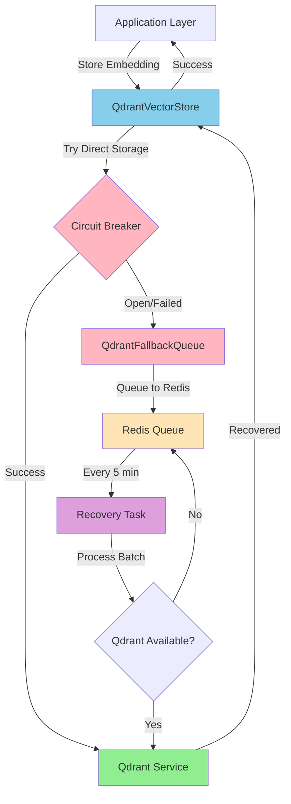
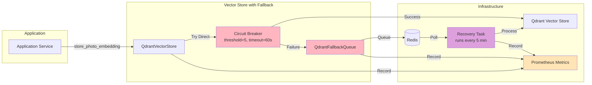

# Qdrant Circuit Breaker Fallback Strategy

## Overview

This document describes the comprehensive fallback strategy for handling Qdrant vector store outages in the Photo Explorer backend. The strategy ensures the application remains functional when Qdrant is unavailable, with automatic recovery when service is restored.

## Architecture

### High-Level Flow



### Component Architecture



## Components

### 1. QdrantVectorStore with Fallback Support

Location: `/app/adapters/outbound/persistence/qdrant/vector_store.py`

#### Key Methods

**`store_photo_embedding(photo_id, embedding, payload)`**
- Stores CLIP embeddings for photo semantic search
- Circuit breaker wraps the actual storage call
- On failure: queues operation to fallback queue instead of raising
- Returns successfully whether stored directly or queued

**`store_face_embedding(face_id, embedding, payload)`**
- Stores InsightFace embeddings for face clustering
- Same fallback behavior as photo embeddings
- Ensures face detection continues even when Qdrant is down

#### Circuit Breaker Configuration

```python
@circuit(
    failure_threshold=5,        # Opens after 5 consecutive failures
    recovery_timeout=60,        # Tries recovery after 60 seconds
    expected_exception=QDRANT_CIRCUIT_EXCEPTIONS,
)
```

#### Fallback Strategy

```python
try:
    await self._store_photo_embedding_circuit_breaker(photo_id, embedding, payload)
except Exception as e:
    # Circuit breaker is open - queue the operation
    if self._fallback_queue is not None:
        await self._fallback_queue.enqueue_embedding(
            operation="store_photo_embedding",
            photo_id=photo_id,
            embedding=embedding.to_list(),
            payload=payload,
        )
    else:
        # No fallback queue configured - log warning
        logger.warning("Qdrant unavailable and no fallback queue configured")
```

### 2. QdrantFallbackQueue

Location: `/app/adapters/outbound/persistence/qdrant/fallback.py`

Manages Redis queue for failed operations with retry support.

#### Core Methods

**`enqueue_embedding(operation, photo_id, embedding, payload)`**
- Queues operation to Redis list `qdrant:fallback_queue`
- Task structure includes:
  - `operation`: Type of operation (store_photo_embedding, store_face_embedding)
  - `photo_id`: UUID of photo or face
  - `embedding`: Vector as list of floats
  - `payload`: Optional metadata
  - `timestamp`: ISO timestamp
  - `retry_count`: Number of retry attempts (starts at 0)

**`dequeue_batch(batch_size=100)`**
- Retrieves up to `batch_size` tasks from queue
- Uses LPOP for atomic dequeue
- Parses JSON and returns list of task dictionaries

**`requeue_with_retry(task)`**
- Increments `retry_count`
- Updates `timestamp` to current time
- Re-queues for next processing attempt
- Max retries configured in recovery task

#### Metrics

- `qdrant_fallback_queue_length`: Current queue length
- `qdrant_fallback_queue_enqueued_total`: Total operations queued (by operation_type)
- `qdrant_fallback_queue_requeued_total`: Total re-queues (by operation_type)

### 3. Recovery Task

Location: `/app/adapters/inbound/workers/tasks/qdrant_recovery.py`

Celery task that processes queued operations when Qdrant recovers.

#### Task Configuration

```python
# Runs every 5 minutes via Celery Beat
beat_schedule={
    "process-qdrant-fallback-queue": {
        "task": "app.adapters.inbound.workers.tasks.qdrant_recovery.process_qdrant_fallback_queue",
        "schedule": 300.0,  # 5 minutes
    },
}
```

#### Processing Algorithm

```python
async def _process_queue_async():
    # 1. Connect to Redis and get queue length
    queue_length = await queue.queue_length()

    if queue_length == 0:
        return  # Nothing to process

    # 2. Process in batches of 100
    while tasks_remaining:
        tasks = await queue.dequeue_batch(100)

        for task in tasks:
            try:
                # 3. Route to appropriate handler
                if task["operation"] == "store_photo_embedding":
                    await _process_photo_embedding(vector_store, task)
                    metrics.processed += 1

                # 4. On success, record metrics
                fallback_queue_processed_total[operation_type].inc()

            except Exception as e:
                metrics.failed += 1
                fallback_queue_failed_total[operation_type].inc()

                # 5. Re-queue if retries available
                if task["retry_count"] < MAX_RETRIES_PER_TASK:  # Default: 3
                    await queue.requeue_with_retry(task)
                    metrics.requeued += 1

    # 6. Record final queue length and duration
    fallback_queue_length_metric.set(final_queue_length)
    fallback_queue_recovery_duration.observe(duration)
```

#### Return Value

```python
{
    "processed": int,  # Successfully processed
    "failed": int,     # Failed to process
    "requeued": int,   # Re-queued for retry
}
```

### 4. Prometheus Monitoring

Location: `/app/infrastructure/monitoring/circuit_breaker.py`

#### Fallback Queue Metrics

| Metric | Type | Labels | Description |
|--------|------|--------|-------------|
| `qdrant_fallback_queue_length` | Gauge | - | Current queue length |
| `qdrant_fallback_queue_enqueued_total` | Counter | operation_type | Operations queued |
| `qdrant_fallback_queue_processed_total` | Counter | operation_type | Successfully processed |
| `qdrant_fallback_queue_failed_total` | Counter | operation_type | Failed to process |
| `qdrant_fallback_queue_requeued_total` | Counter | operation_type | Re-queued |
| `qdrant_fallback_queue_recovery_duration_seconds` | Histogram | - | Recovery task duration |

#### Example Prometheus Queries

```promql
# Current queue depth
qdrant_fallback_queue_length

# Operations queued per minute
rate(qdrant_fallback_queue_enqueued_total[1m])

# Recovery success rate
rate(qdrant_fallback_queue_processed_total[5m]) / (rate(qdrant_fallback_queue_processed_total[5m]) + rate(qdrant_fallback_queue_failed_total[5m]))

# Average recovery time
histogram_quantile(0.95, qdrant_fallback_queue_recovery_duration_seconds_bucket)
```

## Operational Flow

### Normal Operation (Qdrant Available)

```
1. Application calls store_photo_embedding()
2. Circuit breaker is CLOSED
3. Direct upsert to Qdrant succeeds
4. Returns immediately
5. No queue involvement
```

### Circuit Breaker Transition

```
Closed → Open (5 consecutive failures)
├── Failure count increments
├── Logger records each failure
├── After 5 failures: Circuit OPENS
└── Circuit remains open for 60 seconds

Open → Half-Open (timeout expires)
├── Circuit automatically attempts recovery
├── Sends request to Qdrant
└── If succeeds → Closed, If fails → stays Open
```

### Qdrant Outage Scenario

```
1. store_photo_embedding() called
2. Circuit breaker detects failure
3. Exception caught by store_photo_embedding()
4. Operation queued to Redis:
   {
       "operation": "store_photo_embedding",
       "photo_id": "...",
       "embedding": [...],
       "payload": {...},
       "timestamp": "2024-12-01T12:00:00Z",
       "retry_count": 0
   }
5. Metrics recorded
6. Method returns successfully
7. Application continues, photos uploaded successfully
```

### Recovery Scenario

```
Every 5 minutes, recovery task runs:

1. Connect to Redis
2. Check queue length (e.g., 150 items)
3. Process batches of 100
   - Batch 1: 100 items processed
   - Batch 2: 50 items processed
4. For each task:
   - Recreate UUID from string
   - Recreate Embedding from list
   - Call vector_store.store_photo_embedding()
   - If succeeds: increment "processed", record metric
   - If fails: increment "failed", record metric
     - If retries < 3: requeue with retry_count++
5. Update queue length metric
6. Record processing duration
7. Return statistics
```

## Guarantees & Limitations

### What We Guarantee

✅ **Durability**: Operations are persisted in Redis with timestamp and retry count
✅ **Eventual Consistency**: All queued operations eventually reach Qdrant
✅ **Graceful Degradation**: Application continues during Qdrant outages
✅ **Automatic Recovery**: No manual intervention needed when Qdrant recovers
✅ **Observability**: Complete metrics for monitoring and alerting

### What We Don't Guarantee

❌ **Order Preservation**: Queued operations may be processed in different order
❌ **Exactly-Once Semantics**: Failed recovery might process operation twice (idempotent by ID)
❌ **Search Availability**: Semantic search disabled during Qdrant outage
❌ **Immediate Sync**: Recovery takes up to 5 minutes (configurable via beat schedule)

### Limitations

**Max Retries**: Default 3 retries (configurable in recovery task)
```python
MAX_RETRIES_PER_TASK = 3
```

**Batch Size**: Process 100 items per recovery run (configurable)
```python
BATCH_SIZE = 100
```

**Recovery Interval**: Process queue every 5 minutes (configurable in beat schedule)
```python
"schedule": 300.0,  # 5 minutes
```

## Configuration

### Environment Variables

```bash
# Qdrant settings
QDRANT_URL=http://qdrant:6333
QDRANT_COLLECTION_PHOTOS=photos
QDRANT_COLLECTION_FACES=faces

# Redis for fallback queue
REDIS_URL=redis://redis:6379/0

# Celery beat for recovery task
CELERY_BROKER_URL=amqp://rabbitmq:5672//
CELERY_RESULT_BACKEND=redis://redis:6379/1
```

### Circuit Breaker Parameters

Adjust in `vector_store.py`:

```python
@circuit(
    failure_threshold=5,        # Failures before opening
    recovery_timeout=60,        # Seconds before attempting recovery
    expected_exception=QDRANT_CIRCUIT_EXCEPTIONS,
)
```

### Recovery Task Parameters

Adjust in `qdrant_recovery.py`:

```python
MAX_RETRIES_PER_TASK = 3      # Max retry attempts
BATCH_SIZE = 100               # Items processed per run

# In celery_app.py
"schedule": 300.0,            # Run every 5 minutes
```

## Monitoring & Alerting

### Key Metrics to Monitor

1. **Queue Depth**
   - Metric: `qdrant_fallback_queue_length`
   - Alert: Length > 1000 indicates Qdrant outage
   - Alert: Length > 10000 indicates recovery issue

2. **Enqueue Rate**
   - Metric: `rate(qdrant_fallback_queue_enqueued_total[1m])`
   - Alert: > 10 ops/sec indicates failures

3. **Processing Rate**
   - Metric: `rate(qdrant_fallback_queue_processed_total[1m])`
   - Alert: 0 for > 5 minutes with non-empty queue

4. **Failure Rate**
   - Metric: `rate(qdrant_fallback_queue_failed_total[1m])`
   - Alert: > 1 failure/sec needs investigation

5. **Recovery Duration**
   - Metric: `histogram_quantile(0.95, qdrant_fallback_queue_recovery_duration_seconds_bucket)`
   - Alert: > 30 seconds indicates performance issues

### Example Alert Rules

```yaml
groups:
  - name: qdrant_fallback
    rules:
      - alert: QdrantFallbackQueueBacklog
        expr: qdrant_fallback_queue_length > 1000
        for: 5m
        annotations:
          summary: "Qdrant fallback queue backlog"

      - alert: QdrantFallbackProcessingStalled
        expr: rate(qdrant_fallback_queue_processed_total[5m]) == 0
        for: 10m
        annotations:
          summary: "Qdrant recovery processing stalled"

      - alert: QdrantHighFailureRate
        expr: rate(qdrant_fallback_queue_failed_total[1m]) > 1
        for: 2m
        annotations:
          summary: "High Qdrant fallback failure rate"
```

## Testing

### Unit Tests

Located in:
- `/tests/unit/adapters/outbound/persistence/qdrant/test_fallback.py`
- `/tests/unit/adapters/inbound/workers/tasks/test_qdrant_recovery.py`

Run tests:

```bash
cd backend
pytest tests/unit/adapters/outbound/persistence/qdrant/test_fallback.py -v
pytest tests/unit/adapters/inbound/workers/tasks/test_qdrant_recovery.py -v
```

### Integration Testing

Simulate Qdrant outage:

```bash
# Stop Qdrant
docker-compose down qdrant

# Upload photos - should succeed and queue operations
curl -X POST http://localhost:8000/api/photos -F "file=@photo.jpg"

# Check queue depth
# curl http://localhost:8000/metrics | grep fallback_queue_length

# Restart Qdrant
docker-compose up -d qdrant

# Wait 5 minutes for recovery task
# Verify queue processes successfully
```

### Manual Testing

```python
# 1. Test queueing
photo_id = UUID("...")
embedding = Embedding([...])
redis_client = await from_url("redis://localhost:6379")
queue = QdrantFallbackQueue(redis_client)
await queue.enqueue_embedding("store_photo_embedding", photo_id, [...])

# 2. Check queue
length = await queue.queue_length()
print(f"Queue length: {length}")

# 3. Dequeue batch
tasks = await queue.dequeue_batch(10)
for task in tasks:
    print(task)

# 4. Run recovery task manually
from app.adapters.inbound.workers.tasks.qdrant_recovery import process_qdrant_fallback_queue
result = process_qdrant_fallback_queue()
print(f"Processed: {result['processed']}, Failed: {result['failed']}, Requeued: {result['requeued']}")
```

## Troubleshooting

### Queue Growing Indefinitely

**Symptoms**: `qdrant_fallback_queue_length` constantly increases

**Causes**:
1. Qdrant not recovering
2. Recovery task not running
3. Persistent failures in recovered Qdrant

**Solutions**:
```bash
# Check Qdrant health
curl http://qdrant:6333/health

# Check recovery task is running
celery -A app.adapters.inbound.workers.celery_app inspect active

# Check Qdrant logs
docker logs qdrant

# Manually trigger recovery
celery -A app.adapters.inbound.workers.celery_app call app.adapters.inbound.workers.tasks.qdrant_recovery.process_qdrant_fallback_queue
```

### High Recovery Duration

**Symptoms**: Recovery task taking > 30 seconds

**Causes**:
1. Large queue (>10k items)
2. Qdrant slow or unreachable
3. Network issues

**Solutions**:
- Increase `BATCH_SIZE` if queue is stable
- Check Qdrant performance: `curl http://qdrant:6333/health`
- Check network latency

### Recovery Task Not Running

**Symptoms**: Queue not decreasing despite no errors

**Causes**:
1. Celery beat not running
2. Celery worker not running
3. Task not registered

**Solutions**:
```bash
# Check celery beat is running
docker logs photo-explorer-beat

# Check celery workers
celery -A app.adapters.inbound.workers.celery_app inspect active_queues

# Check task is registered
celery -A app.adapters.inbound.workers.celery_app inspect registered | grep qdrant_recovery
```

## Performance Considerations

### Memory Usage

- Redis queue: ~500 bytes per queued operation
- For 100k operations: ~50 MB
- For 1M operations: ~500 MB

### Processing Throughput

- Batch size: 100 items
- Typical per-item time: 50-200 ms
- Throughput: 5-20 items/sec per worker
- With 4 workers: 20-80 items/sec

### Latency Impact

When circuit breaker is open:
- Store operation: ~5-10 ms (queue only, no Qdrant call)
- Search operation: immediate empty result (no queue, no call)

## Future Enhancements

1. **Dead Letter Queue**: Move max-retry-exceeded items to DLQ
2. **Adaptive Scheduling**: Run recovery task more frequently when queue > threshold
3. **Persistence**: Optionally persist queue to disk for crash recovery
4. **Metrics Export**: Expose recovery metrics in Prometheus format
5. **Manual Recovery Trigger**: API endpoint to manually trigger recovery
6. **Queue Prioritization**: High-priority items processed first

## References

- Circuit Breaker Pattern: https://martinfowler.com/bliki/CircuitBreaker.html
- Bulkhead Pattern: https://microservices.io/patterns/resilience/bulkhead.html
- Fallback Pattern: https://microservices.io/patterns/resilience/fallback.html
- Celery Documentation: https://docs.celeryproject.io/
- Qdrant Documentation: https://qdrant.tech/documentation/
