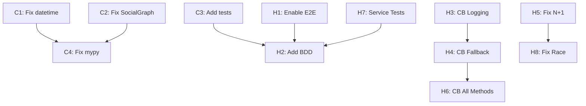

# Photo Explorer Backend - Comprehensive Improvement Plan

**Date**: 2025-11-28
**Status**: Ready for Implementation
**Based On**: Complete code review + test review + circuit breaker investigation
**Current Test Status**: 394/394 unit tests passing (100%)

---

## Table of Contents

1. [Executive Summary](#executive-summary)
2. [Critical Issues (Immediate Action Required)](#critical-issues-immediate-action-required)
3. [High Priority Issues](#high-priority-issues)
4. [Medium Priority Issues](#medium-priority-issues)
5. [Implementation Roadmap](#implementation-roadmap)
6. [Success Criteria](#success-criteria)
7. [Risk Assessment](#risk-assessment)

---

## Executive Summary

### Overall Assessment

The Photo Explorer backend demonstrates **excellent architectural discipline** with well-implemented hexagonal architecture, pure domain layer isolation, and comprehensive type safety. The codebase scores **7.5/10** for both code quality and test coverage, indicating a **production-ready** state with specific areas requiring attention.

### Key Findings

**Strengths:**
- Perfect hexagonal architecture implementation (domain layer has zero infrastructure dependencies)
- Comprehensive type hints with modern Python 3.12+ syntax
- Strong security practices (no SQL injection, path traversal prevention, token encryption)
- Excellent domain test coverage (90%+)
- Modern async/await patterns throughout

**Critical Concerns:**
- 3 code architecture violations (datetime API, domain mutability, missing validation)
- 3 test coverage gaps (missing entity tests, skipped E2E tests, no BDD scenarios)
- 5 circuit breaker implementation issues (no logging, no fallback, incomplete protection)

**Recommended Action:** Complete IMMEDIATE fixes (15-19 hours) before production deployment, then tackle HIGH PRIORITY items (71 hours) in next 2-3 sprints.

### Effort Summary

| Priority Level | Issues | Estimated Effort | Timeline |
|---------------|--------|-----------------|----------|
| **IMMEDIATE** | 4 items | 15-19 hours | 2-3 days |
| **HIGH** | 12 items | 71 hours | 2-3 sprints |
| **MEDIUM** | 10 items | 46 hours | 1-2 sprints |
| **LOW** | 5 items | 20 hours | Backlog |
| **TOTAL** | 31 items | 152-156 hours | ~4-6 sprints |

---

## Critical Issues (Immediate Action Required)

### C1: Deprecated datetime.utcnow() Throughout Codebase

**Severity**: CRITICAL - Will break in Python 3.12+
**Effort**: 2-3 hours
**Risk**: HIGH - Runtime deprecation warnings in Python 3.11, complete failure in 3.12+

**Impact:**
- Affects 10+ files across domain, adapter, and worker layers
- Will cause deprecation warnings in current Python 3.11
- **Will break completely in Python 3.12+** (already released)
- Timezone handling inconsistencies

**Affected Files:**
- `app/domain/entities/photo.py:89, 228`
- `app/domain/entities/face.py:50`
- `app/domain/entities/face_cluster.py:38`
- `app/adapters/inbound/workers/tasks/google_photos_sync.py` (multiple locations)
- `app/adapters/outbound/connectors/google_photos.py` (multiple locations)
- `app/adapters/inbound/workers/idempotency.py` (multiple locations)

**Solution:**
```python
# Replace ALL instances:
from datetime import datetime, timezone

# OLD (deprecated):
datetime.utcnow()

# NEW (Python 3.12+):
datetime.now(timezone.utc)
```

**Implementation Steps:**
1. Run global search: `rg "datetime\.utcnow\(\)"` to find all instances
2. Replace with `datetime.now(timezone.utc)` systematically
3. Ensure all files import `timezone` from datetime
4. Run full test suite to verify no regressions
5. Test with both Python 3.11 and 3.12 if available

**Testing:**
- All existing tests should pass
- No deprecation warnings should appear
- Verify timezone-aware datetime objects throughout

---

### C2: Domain Layer Architecture Violation - Mutable Entities in Value Object

**Severity**: CRITICAL - Violates hexagonal architecture + DDD principles
**Effort**: 3-4 hours
**Risk**: MEDIUM - Potential state mutation bugs

**Location**: `app/domain/value_objects/social_graph.py`

**Issue:**
The `SocialGraph` value object (frozen dataclass) contains `list[FaceCluster]` as nodes. This creates mutable entity references within an immutable value object, violating the value object contract.

```python
@dataclass(frozen=True)
class SocialGraph:
    """Social graph value object."""
    nodes: list[FaceCluster]  # ❌ Mutable entities in frozen VO
    edges: list[FaceRelationship]
```

**Impact:**
- Violates value object immutability contract
- Can lead to unexpected state mutations
- Breaks architectural boundaries (value object depends on entity)
- Potential bugs when graph is passed between layers

**Solution Options:**

**Option 1 (Recommended): Store Immutable Metadata**
```python
@dataclass(frozen=True)
class ClusterNode:
    """Immutable cluster metadata for graph."""
    id: UUID
    name: str | None
    face_count: int
    representative_face_id: UUID | None

@dataclass(frozen=True)
class SocialGraph:
    """Social graph of face clusters."""
    nodes: list[ClusterNode]  # ✅ Immutable value objects
    edges: list[FaceRelationship]

    def find_node(self, cluster_id: UUID) -> ClusterNode | None:
        """Find node by cluster ID."""
        return next((n for n in self.nodes if n.id == cluster_id), None)
```

**Option 2: Make SocialGraph a Regular Entity**
```python
@dataclass  # Remove frozen=True
class SocialGraph:
    """Social graph entity (not a value object)."""
    nodes: list[FaceCluster]
    edges: list[FaceRelationship]
```

**Implementation Steps:**
1. Review how `SocialGraph` is used in the codebase
2. If only metadata is needed, implement Option 1 (recommended)
3. Update all usages of `SocialGraph.nodes` to use `ClusterNode`
4. Update tests in `tests/unit/domain/value_objects/test_social_graph.py`
5. Verify immutability with tests

**Testing:**
- All social graph tests must pass
- Add test for immutability: attempt to mutate nodes should fail
- Verify graph operations work with new structure

---

### C3: Add Missing Tests for task_execution Entity

**Severity**: CRITICAL - Business logic untested
**Effort**: 4 hours
**Risk**: HIGH - Async task orchestration has zero test coverage

**Issue:**
The `app/domain/entities/task_execution.py` entity exists and contains critical business logic for async task orchestration and idempotency, but has **0% test coverage**. This is a critical gap for production reliability.

**Impact:**
- Task execution state transitions untested
- Idempotency logic unverified
- Error handling untested
- Could lead to duplicate task execution or lost tasks

**Solution:**

Create comprehensive test file: `tests/unit/domain/test_task_execution.py`

**Test Coverage Required:**
```python
"""Tests for TaskExecution entity."""

import pytest
from datetime import datetime, timezone
from uuid import uuid4

from app.domain.entities.task_execution import TaskExecution, TaskStatus


class TestTaskExecutionCreation:
    """Test task execution creation."""

    def test_create_new_task_execution(self):
        """New task execution starts in PENDING state."""
        # Test factory method

    def test_task_execution_has_unique_id(self):
        """Each task execution has unique ID."""
        # Test ID generation


class TestTaskExecutionStateTransitions:
    """Test state machine transitions."""

    def test_start_task_transitions_to_running(self):
        """Starting task transitions PENDING -> RUNNING."""

    def test_complete_task_transitions_to_completed(self):
        """Completing task transitions RUNNING -> COMPLETED."""

    def test_fail_task_transitions_to_failed(self):
        """Failing task transitions RUNNING -> FAILED."""

    def test_cannot_start_completed_task(self):
        """Cannot restart completed task."""

    def test_retry_failed_task(self):
        """Can retry failed task."""


class TestTaskExecutionIdempotency:
    """Test idempotency key handling."""

    def test_same_idempotency_key_identifies_duplicate(self):
        """Tasks with same idempotency key are duplicates."""

    def test_different_idempotency_keys_are_unique(self):
        """Tasks with different idempotency keys are unique."""


class TestTaskExecutionErrorHandling:
    """Test error recording."""

    def test_record_error_message(self):
        """Error message is recorded on failure."""

    def test_record_retry_count(self):
        """Retry count increments on each retry."""
```

**Implementation Steps:**
1. Create test file with comprehensive coverage
2. Test all state transitions (PENDING → RUNNING → COMPLETED/FAILED)
3. Test idempotency key logic
4. Test error handling and retry logic
5. Aim for 100% coverage of entity methods

---

### C4: Resolve Mypy Type Safety Violations

**Severity**: CRITICAL - Type safety compromised
**Effort**: 4-6 hours
**Risk**: MEDIUM - Runtime errors from type mismatches

**Issue:**
25+ type safety violations detected by mypy strict mode. Most common issues:
- Missing type parameters for `dict` (should be `dict[str, Any]`)
- Explicit `Any` types where forbidden by strict mode
- Missing type annotations

**Affected Files:**
- `app/application/ports/outbound/config_storage.py:12, 24`
- `app/domain/value_objects/face_relationship.py:63`
- `app/domain/entities/connector.py:46, 156`
- `app/adapters/inbound/api/schemas/settings_schemas.py` (multiple)
- `app/adapters/inbound/api/schemas/search_schemas.py` (multiple)

**Common Violations:**

```python
# ❌ BAD - Missing type parameters
def to_dict(self) -> dict:
    return {"key": "value"}

def get_config(self) -> dict:
    return self._config

# ✅ GOOD - Proper type parameters
def to_dict(self) -> dict[str, Any]:
    return {"key": "value"}

def get_config(self) -> dict[str, str]:
    return self._config
```

**Implementation Steps:**
1. Run `poetry run mypy .` to get full list of violations
2. Fix each violation systematically by file
3. Use `dict[str, Any]` for heterogeneous dicts
4. Use specific types when possible: `dict[str, str]`, `dict[UUID, Photo]`
5. Document any remaining `Any` types with inline comments
6. Re-run mypy until clean

**Testing:**
- Run `poetry run mypy .` - should report 0 errors
- All existing tests should pass
- No new runtime errors

---

## High Priority Issues

### H1: Enable Skipped E2E Tests for Critical Flows

**Severity**: HIGH - Critical flows untested end-to-end
**Effort**: 8 hours
**Risk**: HIGH - Face detection and thumbnail generation unverified

**Location:**
- `tests/e2e/test_photo_upload_flow.py:245` - Face detection test skipped
- `tests/e2e/test_photo_upload_flow.py:288` - Thumbnail generation test skipped

**Issue:**
Per `CLAUDE.md`: "ALL critical user flows MUST have 100% E2E coverage". Face detection and thumbnail generation are critical features but currently skipped due to worker infrastructure complexity.

**Solution:**

1. **Set up worker infrastructure for E2E tests:**
```python
# tests/e2e/conftest.py
@pytest.fixture(scope="session")
async def worker_for_e2e():
    """Start Celery worker for E2E tests."""
    # Start worker process
    # Yield for test execution
    # Teardown worker
```

2. **Enable and enhance tests:**
```python
@pytest.mark.e2e
async def test_photo_upload_triggers_face_detection(client, test_image):
    """When photo is uploaded, faces should be detected."""
    # Upload photo
    response = await client.post("/photos", files={"file": test_image})
    photo_id = response.json()["id"]

    # Wait for face detection task to complete
    await wait_for_task_completion(photo_id, task_type="face_detection")

    # Verify faces detected
    faces_response = await client.get(f"/photos/{photo_id}/faces")
    assert len(faces_response.json()) > 0
```

**Implementation Steps:**
1. Create worker fixture for E2E tests
2. Implement `wait_for_task_completion()` helper
3. Enable face detection test
4. Enable thumbnail generation test
5. Add additional assertions for quality checks
6. Document E2E test infrastructure setup

---

### H2: Add BDD Feature Files for All Critical Flows

**Severity**: HIGH - Missing executable acceptance criteria
**Effort**: 12 hours
**Risk**: MEDIUM - No stakeholder-readable specifications

**Issue:**
Per `CLAUDE.md`, ALL critical user flows require Gherkin BDD scenarios. Currently `tests/features/` directory is minimal.

**Required Feature Files:**

**1. Photo Upload Flow** (`tests/features/photo_upload.feature`)
```gherkin
Feature: Photo Upload
  As a user
  I want to upload photos to the system
  So that I can organize and search my photo library

  Scenario: Upload single photo successfully
    Given I am authenticated
    When I upload a photo "beach.jpg"
    Then the photo should be stored
    And the photo should be indexed for search
    And a thumbnail should be generated
    And faces should be detected

  Scenario: Upload multiple photos in batch
    Given I am authenticated
    When I upload 50 photos
    Then all photos should be stored
    And all photos should be searchable
```

**2. Semantic Search Flow** (`tests/features/semantic_search.feature`)
```gherkin
Feature: Semantic Photo Search
  As a user
  I want to search photos using natural language
  So that I can find photos by content, not just filename

  Scenario: Search by text query
    Given I have 100 indexed photos
    When I search for "beach sunset"
    Then I should see relevant photos ranked by similarity
    And the top result should have similarity > 0.7
```

**3. Face Tagging Flow** (`tests/features/face_tagging.feature`)
```gherkin
Feature: Face Detection and Tagging
  As a user
  I want to automatically detect and tag faces
  So that I can find photos of specific people

  Scenario: Automatic face detection
    Given I upload a photo with 3 faces
    Then 3 faces should be detected
    And each face should have a bounding box
    And each face should be in "unassigned" cluster

  Scenario: Manual face clustering
    Given I have 10 unassigned faces
    When I merge 5 faces into a cluster named "Alice"
    Then the cluster should contain 5 faces
    And I can search for photos of "Alice"
```

**4. Album Management** (`tests/features/albums.feature`)
**5. Folder Sync** (`tests/features/folder_sync.feature`)

**Implementation Steps:**
1. Create `.feature` files for each critical flow
2. Implement step definitions in `tests/features/steps/`
3. Run with pytest-bdd: `pytest tests/features/`
4. Ensure 100% scenario pass rate
5. Document BDD workflow for team

---

### H3: Circuit Breaker - Add Logging and Monitoring

**Severity**: HIGH - No operational visibility
**Effort**: 8 hours
**Risk**: HIGH - Cannot detect or debug Qdrant outages

**Issue:**
Circuit breakers are implemented on 4 critical methods, but there's **zero visibility** when circuits open/close. No logging, no metrics, no alerts.

**Current State:**
```python
@circuit(failure_threshold=5, recovery_timeout=60, expected_exception=Exception)
async def store_photo_embedding(...):
    # No logging when circuit opens
    # No metrics tracking
```

**Solution:**

**1. Add Circuit Breaker Event Logging:**
```python
# app/adapters/outbound/persistence/qdrant/monitoring.py
import logging
from circuitbreaker import CircuitBreakerError
from functools import wraps

logger = logging.getLogger(__name__)

def log_circuit_breaker_events(func):
    """Decorator to log circuit breaker state changes."""

    @wraps(func)
    async def wrapper(*args, **kwargs):
        method_name = func.__name__
        try:
            result = await func(*args, **kwargs)
            return result
        except CircuitBreakerError as e:
            # Circuit is OPEN - Qdrant is down
            logger.error(
                f"Circuit breaker OPEN for {method_name}",
                extra={
                    "service": "qdrant",
                    "method": method_name,
                    "failure_threshold": 5,
                    "recovery_timeout": 60,
                    "state": "OPEN",
                },
                exc_info=True
            )
            raise
        except Exception as e:
            # Potential circuit breaker trigger
            logger.warning(
                f"Circuit breaker failure for {method_name}",
                extra={
                    "service": "qdrant",
                    "method": method_name,
                    "error": str(e),
                },
                exc_info=True
            )
            raise

    return wrapper


# Apply to all circuit-protected methods
@circuit(failure_threshold=5, recovery_timeout=60)
@log_circuit_breaker_events
async def store_photo_embedding(...):
    ...
```

**2. Add Prometheus Metrics:**
```python
# app/infrastructure/monitoring/metrics.py
from prometheus_client import Counter, Gauge, Histogram

# Circuit breaker state (0=closed, 1=half_open, 2=open)
circuit_breaker_state = Gauge(
    'circuit_breaker_state',
    'Current circuit breaker state',
    ['service', 'method']
)

# Total failures
circuit_breaker_failures = Counter(
    'circuit_breaker_failures_total',
    'Total number of circuit breaker failures',
    ['service', 'method', 'error_type']
)

# Circuit opens count
circuit_breaker_opens = Counter(
    'circuit_breaker_opens_total',
    'Total number of times circuit opened',
    ['service', 'method']
)

# Operation duration
qdrant_operation_duration = Histogram(
    'qdrant_operation_duration_seconds',
    'Qdrant operation duration',
    ['operation'],
    buckets=[0.01, 0.05, 0.1, 0.5, 1.0, 5.0, 10.0]
)
```

**3. Instrument Circuit-Protected Methods:**
```python
@circuit(failure_threshold=5, recovery_timeout=60)
@log_circuit_breaker_events
async def store_photo_embedding(
    self,
    photo_id: UUID,
    embedding: Embedding,
    payload: dict[str, Any] | None = None,
) -> None:
    """Store photo embedding with monitoring."""

    with qdrant_operation_duration.labels(operation="store_photo").time():
        try:
            point = qdrant_models.PointStruct(...)
            await self._client.upsert(...)
            logger.debug(f"Stored embedding for photo {photo_id}")

        except CircuitBreakerError:
            circuit_breaker_state.labels(
                service="qdrant",
                method="store_photo_embedding"
            ).set(2)  # OPEN
            circuit_breaker_opens.labels(
                service="qdrant",
                method="store_photo_embedding"
            ).inc()
            raise

        except Exception as e:
            circuit_breaker_failures.labels(
                service="qdrant",
                method="store_photo_embedding",
                error_type=type(e).__name__
            ).inc()
            raise
```

**Implementation Steps:**
1. Create `app/infrastructure/monitoring/` module
2. Implement Prometheus metrics
3. Create logging decorator
4. Apply to all 4 circuit-protected methods
5. Expose metrics endpoint at `/metrics`
6. Set up Grafana dashboard (optional)
7. Configure alerts for circuit opens

---

### H4: Circuit Breaker - Implement Fallback Strategy

**Severity**: HIGH - Poor user experience during outages
**Effort**: 12 hours
**Risk**: HIGH - Features completely break when Qdrant is down

**Issue:**
When Qdrant is unavailable and circuit breaker opens, operations fail immediately with no graceful degradation. This results in:
- Photo uploads failing completely
- Search returning errors instead of graceful message
- Face clustering completely broken

**Solution:**

**1. Implement Retry Queue for Failed Operations:**
```python
# app/adapters/outbound/persistence/qdrant/fallback.py
from typing import Any
from uuid import UUID
from datetime import datetime, timezone
import json

class QdrantFallbackQueue:
    """Queue for failed Qdrant operations."""

    def __init__(self, redis_client):
        self._redis = redis_client
        self._queue_key = "qdrant:fallback_queue"

    async def enqueue_embedding(
        self,
        operation: str,
        photo_id: UUID,
        embedding: list[float],
        payload: dict[str, Any] | None = None,
    ) -> None:
        """Queue embedding operation for retry."""
        task = {
            "operation": operation,
            "photo_id": str(photo_id),
            "embedding": embedding,
            "payload": payload,
            "timestamp": datetime.now(timezone.utc).isoformat(),
            "retry_count": 0,
        }
        await self._redis.rpush(self._queue_key, json.dumps(task))
        logger.info(
            f"Queued {operation} for photo {photo_id}",
            extra={"queue_length": await self.queue_length()}
        )

    async def queue_length(self) -> int:
        """Get current queue length."""
        return await self._redis.llen(self._queue_key)
```

**2. Wrap Vector Store with Fallback:**
```python
# app/adapters/outbound/persistence/qdrant/vector_store.py

class QdrantVectorStoreWithFallback:
    """Vector store with circuit breaker fallback."""

    def __init__(self, client, fallback_queue: QdrantFallbackQueue):
        self._client = client
        self._queue = fallback_queue

    @circuit(failure_threshold=5, recovery_timeout=60)
    @log_circuit_breaker_events
    async def store_photo_embedding(
        self,
        photo_id: UUID,
        embedding: Embedding,
        payload: dict[str, Any] | None = None,
    ) -> None:
        """Store embedding with fallback to queue."""
        try:
            # Try normal storage
            point = qdrant_models.PointStruct(...)
            await self._client.upsert(...)
            logger.debug(f"Stored embedding for photo {photo_id}")

        except CircuitBreakerError:
            # Circuit is OPEN - Qdrant is down
            logger.warning(
                f"Circuit breaker open, queueing embedding for photo {photo_id}",
                extra={"photo_id": str(photo_id)}
            )
            # Queue for later retry - don't fail the upload
            await self._queue.enqueue_embedding(
                operation="store_photo_embedding",
                photo_id=photo_id,
                embedding=embedding.to_list(),
                payload=payload,
            )
            # DO NOT raise - allow photo upload to succeed

    @circuit(failure_threshold=5, recovery_timeout=60)
    @log_circuit_breaker_events
    async def search_photos(
        self,
        query_embedding: Embedding,
        limit: int = 20,
        **kwargs
    ) -> list[VectorSearchResult]:
        """Search with fallback to empty results."""
        try:
            # Try normal search
            return await self._search_photos_impl(query_embedding, limit, **kwargs)

        except CircuitBreakerError:
            logger.warning(
                "Circuit breaker open, returning empty search results",
                extra={"query_limit": limit}
            )
            # Return empty results with clear indication
            # Frontend should display: "Search temporarily unavailable"
            return []
```

**3. Background Worker to Process Queue:**
```python
# app/adapters/inbound/workers/tasks/qdrant_recovery.py

@celery_app.task(name="process_qdrant_fallback_queue")
async def process_qdrant_fallback_queue():
    """Process queued Qdrant operations when service recovers."""

    queue = get_fallback_queue()
    vector_store = get_vector_store()

    queue_length = await queue.queue_length()
    if queue_length == 0:
        return

    logger.info(f"Processing {queue_length} queued Qdrant operations")

    processed = 0
    failed = 0

    # Process in batches
    batch_size = 100
    while processed < queue_length:
        tasks = await queue.get_batch(batch_size)

        for task in tasks:
            try:
                # Retry the operation
                if task["operation"] == "store_photo_embedding":
                    await vector_store.store_photo_embedding_direct(
                        UUID(task["photo_id"]),
                        Embedding.from_list(task["embedding"]),
                        task["payload"]
                    )
                processed += 1
                await queue.remove_task(task["id"])

            except Exception as e:
                logger.error(f"Failed to process queued task: {e}")
                failed += 1
                # Re-queue with incremented retry count
                await queue.requeue_with_retry(task)

    logger.info(
        f"Processed fallback queue: {processed} succeeded, {failed} failed"
    )
```

**Implementation Steps:**
1. Implement `QdrantFallbackQueue` using Redis
2. Wrap vector store methods with fallback logic
3. Update dependency injection to use fallback version
4. Create background worker for queue processing
5. Schedule worker to run every 5 minutes
6. Add monitoring for queue length
7. Test with simulated Qdrant outage

---

### H5: Fix N+1 Query in Face Clustering

**Severity**: HIGH - Performance bottleneck
**Effort**: 2 hours
**Risk**: MEDIUM - Slow API responses with many clusters

**Location**: `app/adapters/inbound/api/routes/faces.py:156-162`

**Issue:**
```python
cluster_data_list = []
for cluster in clusters:
    # ❌ N+1: Separate query for EACH cluster's photo count
    photo_count = await face_repo.count_photos_by_cluster(cluster.id.value)
    cluster_data_list.append(_build_cluster_data(cluster, photo_count))
```

**Impact:** With 50 clusters, this generates 51 database queries (1 for clusters + 50 for counts).

**Solution:**

**1. Add Batch Method to Repository:**
```python
# app/application/ports/outbound/face_repository.py

class FaceRepository(ABC):
    """Face repository port."""

    @abstractmethod
    async def count_photos_by_clusters_batch(
        self, cluster_ids: list[UUID]
    ) -> dict[UUID, int]:
        """Count photos for multiple clusters in single query.

        Args:
            cluster_ids: List of cluster IDs to count

        Returns:
            Dictionary mapping cluster_id -> photo_count
        """
        ...
```

**2. Implement in PostgreSQL Adapter:**
```python
# app/adapters/outbound/persistence/postgres/repositories/face_repository.py

async def count_photos_by_clusters_batch(
    self, cluster_ids: list[UUID]
) -> dict[UUID, int]:
    """Count photos for multiple clusters in single query."""

    if not cluster_ids:
        return {}

    stmt = (
        select(
            FaceModel.cluster_id,
            func.count(func.distinct(FaceModel.photo_id))
        )
        .where(FaceModel.cluster_id.in_(cluster_ids))
        .group_by(FaceModel.cluster_id)
    )

    result = await self._session.execute(stmt)
    counts = {row[0]: row[1] for row in result}

    # Ensure all cluster_ids are in result (with 0 if no photos)
    return {cid: counts.get(cid, 0) for cid in cluster_ids}
```

**3. Update Route to Use Batch Method:**
```python
# app/adapters/inbound/api/routes/faces.py

# ✅ GOOD: Single query for all counts
cluster_ids = [c.id.value for c in clusters]
photo_counts = await face_repo.count_photos_by_clusters_batch(cluster_ids)

cluster_data_list = [
    _build_cluster_data(cluster, photo_counts[cluster.id.value])
    for cluster in clusters
]
```

**Implementation Steps:**
1. Add method to `FaceRepository` port
2. Implement in PostgreSQL adapter
3. Update route to use batch method
4. Add unit tests for batch method
5. Add integration test for route performance
6. Verify query count reduced (use SQLAlchemy logging)

---

### H6: Circuit Breaker - Protect All Vector Store Methods

**Severity**: HIGH - Inconsistent resilience
**Effort**: 4 hours
**Risk**: MEDIUM - Some operations bypass circuit protection

**Issue:**
Only 4 of 12 vector store methods have circuit breaker protection. The remaining 8 methods will block/timeout when Qdrant is down instead of failing fast.

**Protected Methods (4):**
- `store_photo_embedding`
- `search_photos`
- `store_face_embedding`
- `find_similar_faces`

**Unprotected Methods (8):**
- `delete_photo_embedding` (line 153)
- `get_photo_embedding` (line 168)
- `search_faces` (line 210)
- `delete_face_embedding` (line 237)
- `get_face_embedding` (line 300)
- `store_photo_embeddings_batch` (line 319)
- `store_face_embeddings_batch` (line 341)
- `update_face_payload` (line 363)

**Solution:**

**1. Add Circuit Breakers to Critical Methods:**
```python
@circuit(failure_threshold=5, recovery_timeout=60)
@log_circuit_breaker_events
async def delete_photo_embedding(self, photo_id: UUID) -> None:
    """Delete photo embedding with circuit breaker."""
    # Implementation

@circuit(failure_threshold=5, recovery_timeout=60)
@log_circuit_breaker_events
async def search_faces(
    self,
    query_embedding: Embedding,
    limit: int = 20,
    cluster_id: UUID | None = None,
) -> list[VectorSearchResult]:
    """Search faces with circuit breaker."""
    # Implementation

# ... Apply to all 8 methods
```

**2. Refine Exception Handling:**
```python
from qdrant_client.http.exceptions import (
    UnexpectedResponse,
    ResponseHandlingException,
)

# More specific exception handling
@circuit(
    failure_threshold=5,
    recovery_timeout=60,
    expected_exception=(
        UnexpectedResponse,
        ResponseHandlingException,
        TimeoutError,
        ConnectionError,
    )
)
async def store_photo_embedding(...):
    # Don't trigger circuit for ValueError (bad input)
    # Only trigger for Qdrant connectivity issues
    ...
```

**3. Document Rationale:**
```python
# app/adapters/outbound/persistence/qdrant/vector_store.py

"""
Circuit Breaker Strategy:

All methods are protected with circuit breakers to prevent cascading
failures when Qdrant is unavailable. Circuit configuration:

- failure_threshold=5: Opens after 5 consecutive failures
- recovery_timeout=60: Stays open for 60 seconds before retry
- expected_exception: Qdrant connectivity/timeout errors

Write operations (store, delete, update):
  - On circuit open: Queue for retry via fallback queue
  - User operation succeeds, indexing deferred

Read operations (search, get):
  - On circuit open: Return empty results or cached data
  - Graceful degradation for user experience
"""
```

**Implementation Steps:**
1. Add circuit breaker to all 8 unprotected methods
2. Refine `expected_exception` to be more specific
3. Add fallback behavior to critical write methods
4. Document circuit breaker strategy
5. Test circuit opens correctly for each method
6. Verify fallback behavior

---

### H7: Add Service Layer Unit Tests

**Severity**: HIGH - Service layer under-tested
**Effort**: 10 hours
**Risk**: MEDIUM - Business logic bugs

**Issue:**
- `FaceService`: Only integration tests, no unit tests with mocked ports
- `SearchService`: No dedicated unit tests
- Service orchestration logic not tested in isolation

**Solution:**

**1. Create FaceService Unit Tests:**
```python
# tests/unit/application/services/test_face_service.py

import pytest
from unittest.mock import AsyncMock, Mock
from uuid import uuid4

from app.application.services.face_service import FaceService
from app.domain.entities.face_cluster import FaceCluster


class TestFaceServiceClustering:
    """Test face clustering logic with mocked ports."""

    @pytest.fixture
    def mock_face_repo(self):
        """Mock face repository."""
        return AsyncMock()

    @pytest.fixture
    def mock_vector_store(self):
        """Mock vector store."""
        return AsyncMock()

    @pytest.fixture
    def face_service(self, mock_face_repo, mock_vector_store):
        """Create service with mocks."""
        return FaceService(
            face_repo=mock_face_repo,
            vector_store=mock_vector_store,
        )

    async def test_create_cluster_delegates_to_repository(
        self, face_service, mock_face_repo
    ):
        """Creating cluster delegates to repository."""
        # Arrange
        cluster_id = uuid4()
        mock_face_repo.save_cluster.return_value = FaceCluster.create(...)

        # Act
        result = await face_service.create_cluster("Alice")

        # Assert
        mock_face_repo.save_cluster.assert_called_once()
        assert result.name == "Alice"

    async def test_merge_clusters_updates_vector_store(
        self, face_service, mock_face_repo, mock_vector_store
    ):
        """Merging clusters updates both DB and vector store."""
        # Test merge orchestration
        # Verify both repo and vector store are updated
        # Test transaction-like behavior
```

**2. Create SearchService Unit Tests:**
```python
# tests/unit/application/services/test_search_service.py

class TestSearchService:
    """Test search service logic."""

    async def test_search_with_no_results_returns_empty(self):
        """Search with no matches returns empty list."""

    async def test_search_filters_by_date_range(self):
        """Search filters by date range."""

    async def test_search_applies_similarity_threshold(self):
        """Results below threshold are filtered."""
```

**Implementation Steps:**
1. Create unit test files for each service
2. Mock all outbound ports (repositories, vector store)
3. Test service orchestration logic in isolation
4. Test error handling and edge cases
5. Aim for 80% service layer coverage
6. Keep integration tests for E2E verification

---

### H8: Fix Race Condition in Cluster Merge

**Severity**: HIGH - Data consistency risk
**Effort**: 6 hours
**Risk**: HIGH - Inconsistent state between DB and vector store

**Location**: `app/application/services/face_service.py:99-111`

**Issue:**
```python
# Merge operation updates in a loop
for face in faces:
    face.assign_to_cluster(target_cluster_id)
    # Vector store update - NO transaction with DB
    await self._vector_store.update_face_payload(
        face.id.value,
        {"cluster_id": str(target_cluster_id)},
    )
# If this fails mid-way, DB and vector store are inconsistent
```

**Impact:**
- Database might be updated but vector store fails
- Partial updates leave system in inconsistent state
- No rollback mechanism for vector store
- Search results won't match database

**Solution:**

**1. Collect Updates and Apply in Batches:**
```python
async def merge_clusters(
    self,
    source_cluster_id: UUID,
    target_cluster_id: UUID,
) -> FaceCluster:
    """Merge source cluster into target cluster."""

    # Fetch clusters
    source = await self._face_repo.find_cluster_by_id(source_cluster_id)
    target = await self._face_repo.find_cluster_by_id(target_cluster_id)

    if not source or not target:
        raise ClusterNotFoundException(...)

    # Get all faces from source cluster
    faces = await self._face_repo.find_by_cluster(source_cluster_id)

    # Collect vector store updates (don't apply yet)
    vector_updates = []
    for face in faces:
        face.assign_to_cluster(target_cluster_id)
        vector_updates.append({
            "face_id": face.id.value,
            "cluster_id": str(target_cluster_id),
        })

    try:
        # Phase 1: Update database (within transaction)
        await self._face_repo.save_faces_batch(faces)

        # Phase 2: Update vector store in batch
        await self._vector_store.update_face_payloads_batch(vector_updates)

        # Phase 3: Delete source cluster
        await self._face_repo.delete_cluster(source_cluster_id)

        return target

    except Exception as e:
        # Implement compensating transaction
        logger.error(f"Cluster merge failed: {e}")
        await self._compensate_merge_failure(
            faces, source_cluster_id, target_cluster_id
        )
        raise
```

**2. Add Batch Update Method:**
```python
# app/application/ports/outbound/vector_store.py

class VectorStore(ABC):
    @abstractmethod
    async def update_face_payloads_batch(
        self, updates: list[dict[str, Any]]
    ) -> None:
        """Update multiple face payloads in single operation."""
        ...
```

**3. Implement Compensating Transaction:**
```python
async def _compensate_merge_failure(
    self,
    faces: list[Face],
    original_cluster_id: UUID,
    failed_target_id: UUID,
) -> None:
    """Rollback faces to original cluster on merge failure."""

    logger.warning(
        f"Compensating merge failure: rolling back {len(faces)} faces"
    )

    # Reassign faces back to original cluster
    for face in faces:
        face.assign_to_cluster(original_cluster_id)

    try:
        # Restore database state
        await self._face_repo.save_faces_batch(faces)

        # Restore vector store state
        updates = [
            {"face_id": f.id.value, "cluster_id": str(original_cluster_id)}
            for f in faces
        ]
        await self._vector_store.update_face_payloads_batch(updates)

    except Exception as compensation_error:
        # Critical: compensation failed
        logger.critical(
            f"Compensation failed: {compensation_error}. "
            f"Manual intervention required for cluster {original_cluster_id}"
        )
        # TODO: Send alert to ops team
```

**Implementation Steps:**
1. Add batch update method to vector store port
2. Implement batch update in Qdrant adapter
3. Refactor merge to collect updates first
4. Implement compensating transaction
5. Add tests for failure scenarios
6. Add logging and monitoring for merge operations

---

### H9: Add Missing Error Handling in Photo Upload

**Severity**: HIGH - Resource cleanup
**Effort**: 3 hours
**Risk**: MEDIUM - Orphaned files on partial failure

**Location**: `app/adapters/inbound/api/routes/photos.py:104-133`

**Issue:**
If exception occurs after some photos uploaded but before all processed, partial uploads remain in system with no cleanup.

**Solution:**
```python
@router.post("/photos/batch", response_model=list[PhotoSchema])
async def upload_photos_batch(
    files: list[UploadFile],
    photo_service: PhotoService = Depends(get_photo_service),
) -> list[PhotoSchema]:
    """Upload multiple photos with cleanup on partial failure."""

    uploaded_photo_ids: list[UUID] = []

    try:
        results = []

        for file in files:
            # Validate file
            _validate_upload_file(file)

            # Upload
            photo = await photo_service.upload_photo(
                filename=file.filename,
                content=await file.read(),
                content_type=file.content_type,
            )

            uploaded_photo_ids.append(photo.id.value)
            results.append(photo)

        return results

    except Exception as e:
        # Cleanup partial uploads
        logger.error(
            f"Batch upload failed after {len(uploaded_photo_ids)} photos: {e}",
            extra={"uploaded_count": len(uploaded_photo_ids)}
        )

        # Delete uploaded photos
        for photo_id in uploaded_photo_ids:
            try:
                await photo_service.delete_photo(photo_id)
            except Exception as cleanup_error:
                logger.error(
                    f"Failed to cleanup photo {photo_id}: {cleanup_error}"
                )

        raise HTTPException(
            status_code=500,
            detail=f"Batch upload failed. Uploaded {len(uploaded_photo_ids)} "
                   f"of {len(files)} photos before error. Changes rolled back."
        )
```

**Implementation Steps:**
1. Add cleanup logic to batch upload endpoint
2. Track uploaded photo IDs
3. On exception, delete all uploaded photos
4. Add test for partial upload failure
5. Verify cleanup works correctly

---

### H10: Verify FileStorage Path Security

**Severity**: HIGH - Security verification
**Effort**: 2 hours
**Risk**: MEDIUM - Potential path traversal

**Location**: `app/adapters/inbound/api/routes/faces.py:475-501`

**Issue:**
Face crop endpoint uses `face.crop_path` without explicit validation. Need to verify `FileStorage` implementation prevents path traversal.

**Tasks:**
1. Review `FileStorage.get_file()` implementation
2. Verify path validation logic exists
3. Add explicit bounds checking if missing
4. Add security test for path traversal attempts
5. Document security assumptions

**Implementation:**
```python
# app/adapters/outbound/storage/file_storage.py

class FileStorage:
    def __init__(self, base_path: Path):
        self._base_path = base_path.resolve()  # Canonical path

    async def get_file(self, file_path: str) -> bytes:
        """Get file with path traversal protection."""

        # Resolve to canonical path
        requested_path = (self._base_path / file_path).resolve()

        # Verify path is within allowed base
        if not requested_path.is_relative_to(self._base_path):
            raise SecurityException(
                f"Path traversal attempt: {file_path}"
            )

        # Verify file exists
        if not requested_path.is_file():
            raise FileNotFoundException(file_path)

        return requested_path.read_bytes()
```

**Security Tests:**
```python
async def test_file_storage_prevents_path_traversal():
    """File storage prevents path traversal attacks."""
    storage = FileStorage(base_path=Path("/data/photos"))

    # Attempt traversal
    with pytest.raises(SecurityException):
        await storage.get_file("../../etc/passwd")

    with pytest.raises(SecurityException):
        await storage.get_file("/etc/passwd")
```

---

### H11: Split Integration Test File

**Severity**: MEDIUM - Test organization
**Effort**: 3 hours
**Risk**: LOW - Test maintenance

**Location**: `tests/integration/test_photo_api.py`

**Issue:**
Single test file mixes multiple concerns (upload, list, detail, health check).

**Solution:**
Split into focused test files:
- `tests/integration/api/test_photo_upload_api.py`
- `tests/integration/api/test_photo_list_api.py`
- `tests/integration/api/test_photo_detail_api.py`
- `tests/integration/api/test_health_api.py` (or move to separate category)

---

### H12: Improve Domain Exception Messages

**Severity**: MEDIUM - Developer experience
**Effort**: 2 hours
**Risk**: LOW - Debugging difficulty

**Location**: `app/domain/exceptions.py`

**Solution:**
```python
class InvalidOperationException(DomainException):
    """Raised when an operation is not valid in the current state."""

    def __init__(
        self,
        message: str,
        entity_type: str | None = None,
        entity_id: UUID | None = None,
        current_state: str | None = None,
    ) -> None:
        self.entity_type = entity_type
        self.entity_id = entity_id
        self.current_state = current_state

        # Build detailed message
        parts = [message]
        if entity_type:
            parts.append(f"entity={entity_type}")
        if entity_id:
            parts.append(f"id={entity_id}")
        if current_state:
            parts.append(f"state={current_state}")

        full_message = " | ".join(parts)
        super().__init__(full_message)
```

---

## Medium Priority Issues

### M1: Circuit Breaker - Add Metrics Dashboard

**Effort**: 6 hours

Create Grafana dashboard for circuit breaker monitoring:
- Circuit state over time
- Failure rate trends
- Queue length
- Recovery success rate

---

### M2: Fix Time-Based Test Dependencies

**Effort**: 2 hours

**Location**: `tests/unit/domain/test_connector.py:179, 264, 298`

Replace `time.sleep()` with controlled time injection:
```python
@pytest.fixture
def mock_now():
    """Mock datetime.now() for deterministic tests."""
    with freeze_time("2025-01-15 12:00:00") as frozen:
        yield frozen

def test_sync_timestamps_are_ordered(mock_now):
    """Sync timestamps use controlled time."""
    connector = Connector.create_local(...)

    # Advance time
    mock_now.tick(delta=timedelta(hours=1))

    # Assertions with deterministic time
```

---

### M3: Centralize Test Fixtures

**Effort**: 1 hour

**Issue:** `sample_image_bytes` fixture duplicated in 3 places.

**Solution:** Centralize in root `conftest.py`, remove duplicates.

---

### M4: Add Integration Tests for Over-Mocked Units

**Effort**: 4 hours

**Location**: `tests/unit/application/services/test_connector_service.py`

Keep unit tests, but add integration tests with real filesystem to complement.

---

### M5: Add Missing Negative Test Coverage

**Effort**: 4 hours

Add tests for error scenarios:
- Database connection failures
- Qdrant unavailability
- Storage service outages
- ML model failures
- Partial batch failures

---

### M6: Centralize Repository Mappers

**Effort**: 3 hours

**Location**: `app/adapters/outbound/persistence/postgres/repositories/face_repository.py:30-39`

Replace direct field updates with centralized mapper:
```python
# app/adapters/outbound/persistence/postgres/mappers/face_mapper.py

class FaceMapper:
    @staticmethod
    def update_model_from_entity(model: FaceModel, entity: Face) -> None:
        """Update SQLAlchemy model from domain entity."""
        model.photo_id = entity.photo_id
        model.cluster_id = entity.cluster_id
        model.bbox_x = entity.bbox.x
        # ... all fields

# Use in repository
mapper.update_model_from_entity(existing, face)
```

---

### M7: Add Transaction Compensation Logic

**Effort**: 4 hours

**Location**: `app/adapters/inbound/workers/tasks/photo_processing.py:404-499`

Add compensation for phase 4 failures:
```python
try:
    # Phase 4: Update database
    await photo_repo.save(photo)
except Exception as e:
    # Compensate: Remove embedding from Qdrant
    await vector_store.delete_photo_embedding(photo_id)
    raise
```

---

### M8: Standardize Async Test Patterns

**Effort**: 2 hours

Ensure all async tests use `AsyncMock` instead of `Mock` for async methods.

---

### M9: Add Test Data Checksums

**Effort**: 2 hours

Add checksums for downloaded test images to detect corruption.

---

### M10: Document Circuit Breaker Runbook

**Effort**: 2 hours

Create operational runbook for Qdrant outages:
```markdown
# Qdrant Circuit Breaker Runbook

## Detection
Alert: "Qdrant circuit breaker open"

## Investigation
1. Check Qdrant health: `curl http://qdrant:6333/health`
2. Check Grafana dashboard for circuit state
3. Check logs for error patterns

## Resolution
1. If Qdrant down: restart service
2. If network issue: investigate connectivity
3. Monitor queue length for backlog

## Recovery
1. Circuit auto-recovers after 60 seconds
2. Monitor success rate in half-open state
3. Process queued embeddings
```

---

## Low Priority Issues

### L1: Minor Code Quality Issues (m1-m12)

**Effort**: 8 hours total

- Inconsistent return type documentation
- Magic numbers in configuration
- Logging levels inconsistency
- Missing docstrings for complex algorithms
- Global singleton in vector store

---

### L2: Add Performance Benchmarks

**Effort**: 6 hours

Create performance test suite:
- Measure search latency
- Measure batch upload throughput
- Measure face detection time
- Track N+1 query elimination

---

### L3: Add Load Tests

**Effort**: 4 hours

Use Locust or k6 to load test:
- Concurrent uploads
- Concurrent searches
- Sustained load

---

### L4: Improve Test Organization

**Effort**: 2 hours

Further split integration tests by domain area.

---

### L5: Add Accessibility Tests

**Effort**: 2 hours (Frontend)

While this is a backend plan, note frontend should add a11y tests.

---

## Implementation Roadmap

### Phase 1: Critical Fixes (Week 1) - 15-19 hours

**Goal:** Fix production-blocking issues

1. **Day 1-2**: C1 - Fix datetime.utcnow() deprecation (2-3 hours)
2. **Day 2-3**: C4 - Resolve mypy type violations (4-6 hours)
3. **Day 3-4**: C2 - Fix SocialGraph mutability (3-4 hours)
4. **Day 4-5**: C3 - Add task_execution tests (4 hours)
5. **Day 5**: Verify all tests pass, deploy to staging

**Deliverables:**
- Zero deprecation warnings
- Zero mypy errors
- 100% task_execution test coverage
- Fixed architecture violation

**Success Criteria:**
- All tests passing
- Mypy strict mode clean
- No Python 3.12 compatibility issues

---

### Phase 2: High Priority - Circuit Breaker & Resilience (Week 2-3) - 36 hours

**Goal:** Add production resilience and observability

**Week 2:**
1. H3 - Circuit breaker logging & monitoring (8 hours)
2. H4 - Circuit breaker fallback strategy (12 hours)
3. H6 - Protect all vector store methods (4 hours)

**Week 3:**
4. H5 - Fix N+1 query (2 hours)
5. H8 - Fix cluster merge race condition (6 hours)
6. H10 - Verify FileStorage security (2 hours)
7. H9 - Add upload error handling (3 hours)

**Deliverables:**
- Circuit breaker logging active
- Prometheus metrics exposed
- Fallback queue implemented
- All vector store methods protected
- N+1 query eliminated
- Race conditions fixed

**Success Criteria:**
- Circuit breaker state visible in logs
- Metrics available at `/metrics`
- Photo uploads succeed even when Qdrant is down
- Cluster merge is atomic
- Security verified with tests

---

### Phase 3: High Priority - Test Coverage (Week 4-5) - 35 hours

**Goal:** Achieve comprehensive test coverage

**Week 4:**
1. H1 - Enable skipped E2E tests (8 hours)
2. H7 - Add service unit tests (10 hours)
3. H11 - Split integration test file (3 hours)

**Week 5:**
4. H2 - Add BDD feature files (12 hours)
5. H12 - Improve exception messages (2 hours)

**Deliverables:**
- All E2E tests enabled and passing
- Service layer unit tests (80% coverage)
- 5 BDD feature files with scenarios
- Better exception messages

**Success Criteria:**
- 100% critical flow E2E coverage
- Service layer 80%+ unit test coverage
- BDD scenarios executable and passing

---

### Phase 4: Medium Priority - Technical Debt (Week 6-7) - 26 hours

**Goal:** Clean up technical debt

1. M2 - Fix time-based tests (2 hours)
2. M3 - Centralize fixtures (1 hour)
3. M4 - Add integration tests (4 hours)
4. M5 - Add negative test coverage (4 hours)
5. M6 - Centralize mappers (3 hours)
6. M7 - Add transaction compensation (4 hours)
7. M8 - Standardize async patterns (2 hours)
8. M9 - Add test checksums (2 hours)
9. M10 - Document runbook (2 hours)
10. M1 - Metrics dashboard (6 hours)

**Deliverables:**
- Deterministic time-based tests
- Centralized test fixtures
- Comprehensive error coverage
- Grafana dashboard

---

### Phase 5: Low Priority - Polish (Week 8+) - 20 hours

**Goal:** Final polish and optimization

1. L1 - Minor code quality (8 hours)
2. L2 - Performance benchmarks (6 hours)
3. L3 - Load tests (4 hours)
4. L4 - Test organization (2 hours)

---

## Success Criteria

### Code Quality
- ✅ Zero mypy errors (strict mode)
- ✅ Zero deprecation warnings
- ✅ All domain entities have 90%+ test coverage
- ✅ All services have 80%+ unit test coverage
- ✅ Security tests passing

### Test Quality
- ✅ 394/394 unit tests passing (CURRENT STATUS)
- ✅ All E2E tests enabled (no skipped tests)
- ✅ BDD scenarios for all 5 critical flows
- ✅ Service layer unit tests added
- ✅ Integration test organization improved

### Resilience & Operations
- ✅ Circuit breaker logging active
- ✅ Prometheus metrics exposed
- ✅ Fallback queue implemented
- ✅ All vector store methods protected
- ✅ Operational runbook documented
- ✅ Grafana dashboard created

### Performance
- ✅ N+1 queries eliminated
- ✅ Batch operations for clusters
- ✅ Race conditions resolved
- ✅ Transaction boundaries clear

### Architecture
- ✅ Domain purity maintained
- ✅ Value object immutability enforced
- ✅ Port/adapter pattern consistent
- ✅ No infrastructure leaks to domain

---

## Risk Assessment

### High Risk Items

**1. Circuit Breaker Fallback (H4)**
- **Risk**: Complex distributed state management
- **Mitigation**: Implement queue incrementally, start with logging only
- **Rollback**: Can disable fallback, keep logging

**2. Cluster Merge Race Condition (H8)**
- **Risk**: Breaking existing functionality
- **Mitigation**: Comprehensive tests before deployment
- **Rollback**: Keep old implementation as `merge_clusters_legacy()`

**3. Datetime Migration (C1)**
- **Risk**: Subtle timezone bugs
- **Mitigation**: Extensive testing, verify all timestamps
- **Rollback**: Low risk, but test thoroughly

### Medium Risk Items

**1. BDD Feature Files (H2)**
- **Risk**: Time-consuming without immediate value
- **Mitigation**: Focus on critical flows first, iterate
- **Rollback**: Optional, can defer

**2. E2E Test Infrastructure (H1)**
- **Risk**: Worker infrastructure complexity
- **Mitigation**: Use Docker Compose, document setup
- **Rollback**: Can skip E2E tests in CI if unstable

### Low Risk Items

- Mypy fixes (C4) - Low risk, high value
- Test organization - Zero production risk
- Documentation - Zero risk

---

## Dependencies

### External Dependencies
- None required (all fixes use existing infrastructure)

### Internal Dependencies

**Critical Path:**


**No Blocking Dependencies:**
- H10 (Security verification) - Independent
- H9 (Upload error handling) - Independent
- H11 (Split test file) - Independent
- H12 (Exception messages) - Independent

---

## Monitoring & Alerts

### Metrics to Track

**During Implementation:**
- Test pass rate (maintain 100%)
- Mypy error count (target: 0)
- Code coverage % (target: 80%+)

**Post-Implementation:**
- Circuit breaker state (Prometheus)
- Queue length (Prometheus)
- Search latency (Prometheus)
- Upload success rate (Prometheus)

### Recommended Alerts

**Critical:**
- Circuit breaker open > 5 minutes
- Queue length > 1000
- Test pass rate < 100%

**Warning:**
- Circuit opens (immediate notification)
- Queue length > 100
- Search latency > 1s (p95)

---

## Communication Plan

### Stakeholder Updates

**Weekly Status Report:**
- Phase completion %
- Issues completed
- Blockers encountered
- Next week's focus

### Documentation Updates

**After Each Phase:**
- Update `spec/09-implementation-status.md`
- Update architecture diagrams if changed
- Document new patterns

---

## Conclusion

This improvement plan addresses **31 identified issues** across code quality, test coverage, and operational resilience. The plan is structured into 5 phases over approximately 8 weeks, with clear success criteria and risk mitigation strategies.

**Recommended Start:** Begin with Phase 1 (Critical Fixes) immediately. These 15-19 hours of work will eliminate production-blocking issues and establish a solid foundation for subsequent improvements.

**Key Benefits:**
- **Production readiness**: Critical fixes ensure Python 3.12 compatibility and architectural integrity
- **Operational resilience**: Circuit breaker improvements prevent cascading failures
- **Test confidence**: Comprehensive coverage ensures safe refactoring
- **Technical debt reduction**: Systematic cleanup improves maintainability

**Total Effort:** 152-156 hours (approximately 4-6 two-week sprints)

**Risk Level:** LOW - Most changes are additive or low-impact refactorings

**ROI:** HIGH - Prevents production issues, improves developer productivity, enables safe iteration

---

**Status**: Ready for Implementation
**Next Action**: Review with team, prioritize Phase 1 items, begin C1 (datetime fixes)
