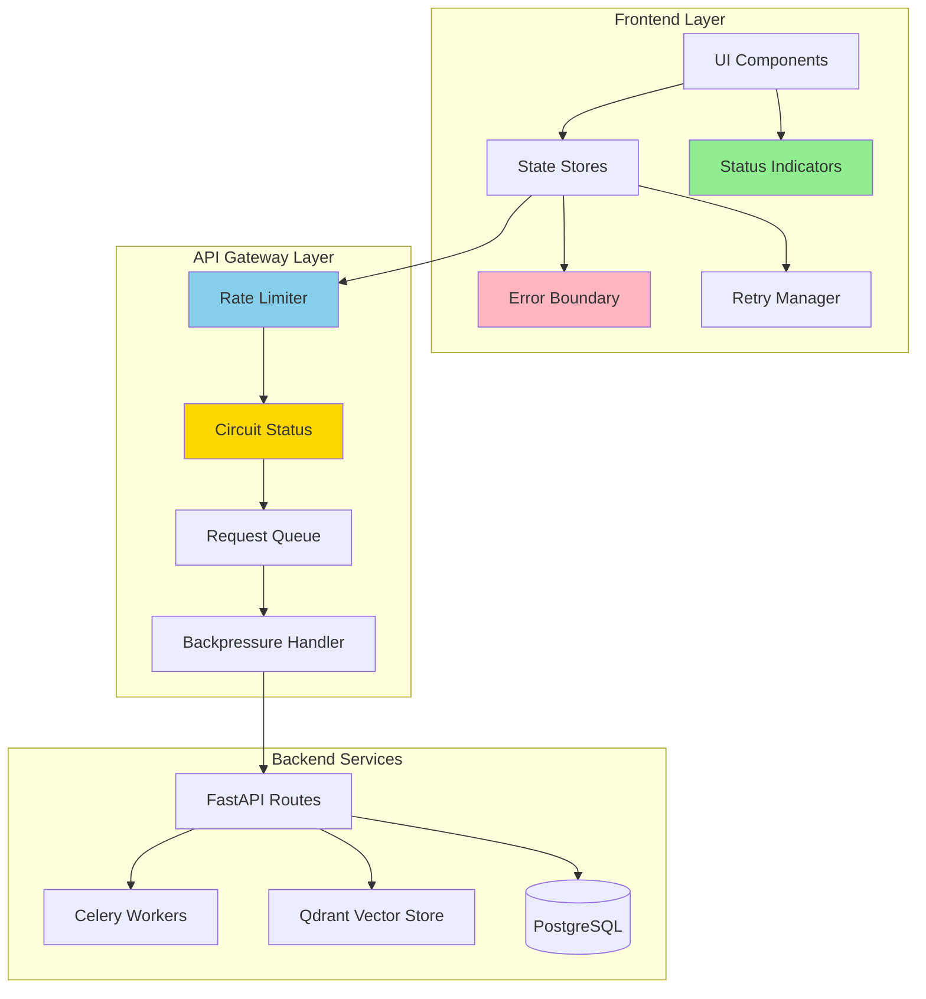

# Phase 3: Frontend Integration Specification

## Executive Summary

Phase 3 focuses on creating a robust, user-facing experience that gracefully handles backend failures, provides real-time feedback, and maintains usability during degraded conditions. This phase builds resilient frontend components that communicate clearly with users when backend services are unavailable.

**Duration**: 24-30 hours (frontend only)
**Priority**: High
**Dependencies**: Phase 1 & 2 completion

## Objectives

1. **Graceful Degradation**: Frontend gracefully handles backend service outages
2. **User Visibility**: Real-time status indicators for all async operations
3. **Clear Communication**: User-friendly error messages and fallback states
4. **Resilient Experience**: Application remains usable during partial outages

## Architecture Overview



## User Stories

### US1: Search During Qdrant Outage
**As a** user
**I want to** see my photos even when search is unavailable
**So that** I can still browse my library during partial outages

**Acceptance Criteria**:
- Gallery view remains functional
- Search bar shows "Search temporarily unavailable" message
- Recently viewed photos are still accessible
- Clear indicator when search is restored

### US2: Upload Progress Visibility
**As a** user uploading photos
**I want to** see real-time progress and status
**So that** I know what's happening with my uploads

**Acceptance Criteria**:
- Progress bar for each uploading photo
- Clear status: uploading, processing, indexing, complete
- Retry button for failed uploads
- Batch upload shows overall progress

### US3: Rate Limit Feedback
**As a** power user
**I want to** understand when I'm being rate limited
**So that** I can adjust my usage patterns

**Acceptance Criteria**:
- Clear "Rate limit exceeded" message
- Time until limit resets
- Queue position if applicable
- Suggestion to space out requests

### US4: Sync Status Monitoring
**As a** user with connected sources
**I want to** see the sync status of my connectors
**So that** I know if new photos are being imported

**Acceptance Criteria**:
- Real-time sync progress indicators
- Last successful sync timestamp
- Error states with clear explanations
- Manual retry option

## Technical Requirements

### TR1: Frontend Error Handling

**Error Boundary Component**:
```typescript
interface ErrorState {
    error: Error | null;
    isRecoverable: boolean;
    retryCount: number;
    fallbackUI: ComponentType | null;
}

class ErrorBoundary {
    // Catches all unhandled errors
    // Determines if error is recoverable
    // Shows appropriate fallback UI
    // Implements exponential backoff retry
}
```

**Error Categories**:
1. **Network Errors**: Retry with exponential backoff
2. **Rate Limits**: Queue and retry after reset
3. **Service Unavailable**: Show degraded UI
4. **Validation Errors**: Show form feedback
5. **Critical Errors**: Full error page with support contact

**Retry Strategy**:
```typescript
class RetryManager {
    private retryDelays = [1000, 2000, 4000, 8000, 16000];

    async retryWithBackoff<T>(
        operation: () => Promise<T>,
        options: RetryOptions
    ): Promise<T> {
        // Exponential backoff with jitter
        // Circuit breaker integration
        // Cancel on user navigation
    }
}
```

### TR3: Real-time Status System

**WebSocket Connection**:
```typescript
interface StatusUpdate {
    type: 'upload' | 'sync' | 'processing' | 'search';
    id: string;
    status: 'pending' | 'active' | 'completed' | 'failed';
    progress?: number;  // 0-100
    message?: string;
    metadata?: Record<string, any>;
}

class StatusWebSocket {
    private ws: WebSocket;
    private reconnectAttempts = 0;

    connect(): void {
        // Auto-reconnect with backoff
        // Heartbeat for connection health
        // Queue messages during disconnect
    }
}
```

**Status Store**:
```typescript
interface StatusStore {
    uploads: Map<string, UploadStatus>;
    syncs: Map<string, SyncStatus>;
    searchAvailable: boolean;
    systemHealth: SystemHealth;

    subscribe(callback: (update: StatusUpdate) => void): Unsubscribe;
    getStatus(type: string, id: string): Status | null;
}
```

**UI Components**:
1. **Global Status Bar**: System-wide health indicator
2. **Operation Progress**: Individual operation tracking
3. **Queue Visualizer**: Show pending operations
4. **Health Dashboard**: Detailed system status page

### TR4: Fallback Messaging System

**Message Types**:
```typescript
enum MessageSeverity {
    INFO = 'info',
    WARNING = 'warning',
    ERROR = 'error',
    SUCCESS = 'success'
}

interface UserMessage {
    id: string;
    severity: MessageSeverity;
    title: string;
    description: string;
    actions?: Action[];
    dismissible: boolean;
    duration?: number;  // Auto-dismiss after ms
}
```

**Fallback Scenarios**:

| Service | Failure Mode | User Message | Fallback Behavior |
|---------|--------------|--------------|-------------------|
| Qdrant | Circuit Open | "Search is temporarily unavailable. You can still browse your photos." | Disable search, show recent/favorites |
| Upload Processing | Queue Full | "Upload processing is delayed. Your photos are safe and will be processed soon." | Accept uploads, queue for later |
| Face Detection | Service Down | "Face detection is currently offline. Photos will be analyzed when service resumes." | Skip face detection, mark for retry |
| Google Photos Sync | Auth Failed | "Google Photos connection lost. Please re-authenticate to resume syncing." | Pause sync, show re-auth button |
| Database | Connection Lost | "Connection issue detected. Some features may be limited." | Use cached data, disable writes |

**Message Display Rules**:
1. Most severe message shown prominently
2. Aggregate similar messages (e.g., "3 uploads failed")
3. Provide actionable next steps
4. Auto-dismiss success messages after 5 seconds
5. Persist error messages until resolved

## Frontend Components

### 1. ServiceStatusIndicator
```svelte
<!-- src/lib/features/status/components/ServiceStatusIndicator.svelte -->
<script lang="ts">
    import { statusStore } from '../stores/status.svelte.ts';
    import type { ServiceName } from '../types';

    export let service: ServiceName;

    $: status = $statusStore.services[service];
    $: icon = getStatusIcon(status);
    $: color = getStatusColor(status);
</script>

<div class="service-indicator">
    <Icon {icon} {color} />
    <span>{service}</span>
    {#if status === 'degraded'}
        <Tooltip>Limited functionality available</Tooltip>
    {/if}
</div>
```

### 2. UploadProgress
```svelte
<!-- src/lib/features/upload/components/UploadProgress.svelte -->
<script lang="ts">
    import { uploadStore } from '../stores/upload.svelte.ts';

    $: activeUploads = $uploadStore.active;
    $: queuedUploads = $uploadStore.queued;
    $: failedUploads = $uploadStore.failed;
</script>

<div class="upload-manager">
    {#each activeUploads as upload}
        <UploadItem {upload} />
    {/each}

    {#if queuedUploads.length > 0}
        <QueuedSection count={queuedUploads.length} />
    {/if}

    {#if failedUploads.length > 0}
        <FailedSection
            uploads={failedUploads}
            on:retry={handleRetry}
            on:dismiss={handleDismiss}
        />
    {/if}
</div>
```

### 3. RateLimitWarning
```svelte
<!-- src/lib/features/common/components/RateLimitWarning.svelte -->
<script lang="ts">
    export let resetTime: Date;
    export let queuePosition?: number;

    $: timeRemaining = getTimeRemaining(resetTime);
</script>

<Alert severity="warning">
    <h4>Rate limit reached</h4>
    <p>You've made too many requests. Please wait {timeRemaining}.</p>
    {#if queuePosition}
        <p>Queue position: {queuePosition}</p>
    {/if}
    <ProgressBar value={getProgress()} />
</Alert>
```

### 4. GlobalErrorBoundary
```svelte
<!-- src/lib/shared/components/GlobalErrorBoundary.svelte -->
<script lang="ts">
    import { errorStore } from '../stores/error.svelte.ts';
    import { retryManager } from '../utils/retry';

    $: currentError = $errorStore.current;
    $: isRecoverable = currentError?.isRecoverable ?? false;

    async function handleRetry() {
        await retryManager.retry(currentError.operation);
    }
</script>

{#if currentError}
    <ErrorModal>
        <h3>{currentError.title}</h3>
        <p>{currentError.message}</p>

        {#if isRecoverable}
            <Button on:click={handleRetry}>Retry</Button>
        {:else}
            <Button on:click={refreshPage}>Refresh Page</Button>
        {/if}

        <details>
            <summary>Technical details</summary>
            <pre>{currentError.stack}</pre>
        </details>
    </ErrorModal>
{/if}
```

## State Management

### Status Store (Svelte 5)
```typescript
// src/lib/features/status/stores/status.svelte.ts
class StatusStore {
    services = $state<ServiceStatuses>({});
    operations = $state<Map<string, Operation>>(new Map());

    private ws: StatusWebSocket;

    constructor() {
        this.ws = new StatusWebSocket();
        this.ws.on('update', this.handleUpdate.bind(this));
    }

    private handleUpdate(update: StatusUpdate) {
        // Update relevant state
        // Trigger UI updates via reactivity
    }

    async checkStatus(): Promise<SystemStatus> {
        const response = await api.get('/status');
        this.services = response.services;
        return response;
    }
}

export const statusStore = new StatusStore();
```

### Error Store
```typescript
// src/lib/shared/stores/error.svelte.ts
class ErrorStore {
    errors = $state<UserError[]>([]);

    get current() {
        return $derived(this.errors[0]);
    }

    get hasErrors() {
        return $derived(this.errors.length > 0);
    }

    push(error: UserError) {
        this.errors.push(error);
        if (error.duration) {
            setTimeout(() => this.dismiss(error.id), error.duration);
        }
    }

    dismiss(id: string) {
        this.errors = this.errors.filter(e => e.id !== id);
    }

    clear() {
        this.errors = [];
    }
}

export const errorStore = new ErrorStore();
```

## Implementation Plan

### Task Breakdown

#### T1: Frontend Error Handling (8-10 hours)
1. Create ErrorBoundary component (2h)
2. Implement RetryManager with exponential backoff (2h)
3. Add error categorization logic (1h)
4. Create fallback UI components (2h)
5. Integrate with existing stores (1h)
6. Write tests (2h)

#### T2: Real-time Status System (8-10 hours)
1. Set up WebSocket endpoint (2h)
2. Implement status broadcasting from workers (2h)
3. Create StatusWebSocket client (2h)
4. Build status UI components (2h)
5. Add progress tracking to operations (1h)
6. Write tests (2h)

#### T3: Fallback Messaging (6-8 hours)
1. Define message types and severity levels (1h)
2. Create message display component (2h)
3. Implement message aggregation logic (1h)
4. Add fallback behaviors for each service (2h)
5. Create user-friendly error messages (1h)
6. Write tests (1h)

#### T4: Integration Testing (2-4 hours)
1. End-to-end failure scenario testing (2h)
2. Performance testing with rate limits (1h)
3. WebSocket connection resilience (1h)

### Dependencies
- Redis for rate limiting (existing)
- WebSocket support in FastAPI
- Frontend WebSocket client library

## Test Scenarios

### TS1: Qdrant Outage
```gherkin
Feature: Search during Qdrant outage

Scenario: User searches when Qdrant is down
    Given Qdrant service is unavailable
    When user enters a search query
    Then search bar shows "Search temporarily unavailable"
    And gallery remains functional
    And recent photos are displayed
```

### TS2: Rate Limiting
```gherkin
Feature: Rate limit enforcement

Scenario: User exceeds search rate limit
    Given user has made 100 searches in 60 seconds
    When user attempts another search
    Then request returns 429 status
    And error message shows time to reset
    And X-RateLimit-Remaining header shows 0
```

### TS3: Upload with Failures
```gherkin
Feature: Resilient upload process

Scenario: Batch upload with partial failures
    Given user uploads 10 photos
    And photo 5 fails processing
    When upload completes
    Then 9 photos show as successful
    And 1 photo shows retry option
    And error details are available
```

### TS4: Connection Recovery
```gherkin
Feature: WebSocket reconnection

Scenario: WebSocket connection drops and recovers
    Given user is monitoring upload progress
    When network connection is lost
    Then status shows "Reconnecting..."
    When connection is restored
    Then status updates resume
    And no updates were lost
```

## Success Criteria

### Performance Metrics
- API response time p95 < 200ms under rate limits
- WebSocket reconnection < 5 seconds
- Error boundary recovery < 1 second
- Status update latency < 100ms

### User Experience Metrics
- Zero data loss during failures
- 100% of errors have user-friendly messages
- Retry success rate > 80% for transient failures
- Degraded mode maintains 60% functionality

### Technical Metrics
- 100% test coverage for error paths
- Zero unhandled promise rejections
- All errors logged with correlation IDs
- Rate limiter accuracy > 99%

## Security Considerations

### Rate Limiting Security
- Implement per-IP and per-user limits
- Use CAPTCHA for repeated limit violations
- Log potential DDoS attempts
- Implement gradual backoff for repeat offenders

### Error Message Security
- Never expose internal system details
- Sanitize user input in error messages
- Log security-relevant errors separately
- Implement error message rate limiting

## Monitoring & Observability

### Metrics to Track
```yaml
# Prometheus metrics
api_rate_limit_exceeded_total{endpoint, user_type}
frontend_errors_total{component, severity}
websocket_connections_active
operation_duration_seconds{type, status}
fallback_ui_shown_total{feature}
retry_attempts_total{operation, success}
```

### Dashboards
1. **API Health**: Rate limits, response times, error rates
2. **User Experience**: Error frequency, retry success, degraded mode usage
3. **WebSocket Status**: Connections, disconnections, message throughput
4. **Operation Tracking**: Upload progress, sync status, processing queues

### Alerts
- Rate limit exceeded > 100/minute
- WebSocket connections drop > 50%
- Error rate > 5% for any endpoint
- Fallback mode active > 10 minutes
- Queue depth > 1000 items

## Migration & Rollout Strategy

### Phase 3.1: Rate Limiting (Week 1)
1. Deploy rate limiting to staging
2. Monitor for false positives
3. Tune limits based on usage patterns
4. Gradual rollout: 10% → 50% → 100%

### Phase 3.2: Error Handling (Week 2)
1. Deploy error boundaries
2. Add retry logic progressively
3. Monitor error recovery rates
4. A/B test error messages

### Phase 3.3: Status System (Week 3)
1. Deploy WebSocket infrastructure
2. Add status indicators to UI
3. Enable real-time updates gradually
4. Monitor WebSocket stability

### Phase 3.4: Fallback Messaging (Week 4)
1. Define all fallback scenarios
2. Implement message system
3. Test with simulated outages
4. Full production deployment

## Documentation Requirements

### User Documentation
- FAQ: "What does 'rate limited' mean?"
- Guide: "Understanding system status indicators"
- Troubleshooting: Common error resolutions

### Developer Documentation
- Error handling best practices
- Adding new status indicators
- WebSocket message protocol
- Rate limit configuration

## Appendix

### A. Error Code Reference
```typescript
enum ErrorCode {
    RATE_LIMIT_EXCEEDED = 'E001',
    SERVICE_UNAVAILABLE = 'E002',
    INVALID_REQUEST = 'E003',
    AUTHENTICATION_REQUIRED = 'E004',
    INSUFFICIENT_PERMISSIONS = 'E005',
    RESOURCE_NOT_FOUND = 'E006',
    CONFLICT = 'E007',
    INTERNAL_ERROR = 'E500'
}
```

### B. WebSocket Message Protocol
```typescript
// Client → Server
interface ClientMessage {
    type: 'subscribe' | 'unsubscribe' | 'ping';
    channel?: string;
    id?: string;
}

// Server → Client
interface ServerMessage {
    type: 'update' | 'error' | 'pong';
    channel: string;
    data: any;
    timestamp: string;
}
```

### C. Rate Limit Configuration
```python
# config/rate_limits.py
RATE_LIMIT_STORAGE_URL = "redis://localhost:6379/1"

RATE_LIMIT_GROUPS = {
    "anonymous": {
        "search": "5/second, 30/minute",
        "upload": "1/second, 10/minute",
        "read": "50/second, 500/minute",
    },
    "authenticated": {
        "search": "10/second, 100/minute",
        "upload": "5/second, 50/minute",
        "read": "100/second, 1000/minute",
    },
    "premium": {
        "search": "20/second, 500/minute",
        "upload": "10/second, 200/minute",
        "read": "200/second, 5000/minute",
    }
}
```

---

**Document Status**: READY FOR REVIEW
**Version**: 1.0
**Created**: 2025-11-29
**Author**: Phase 3 Implementation Team