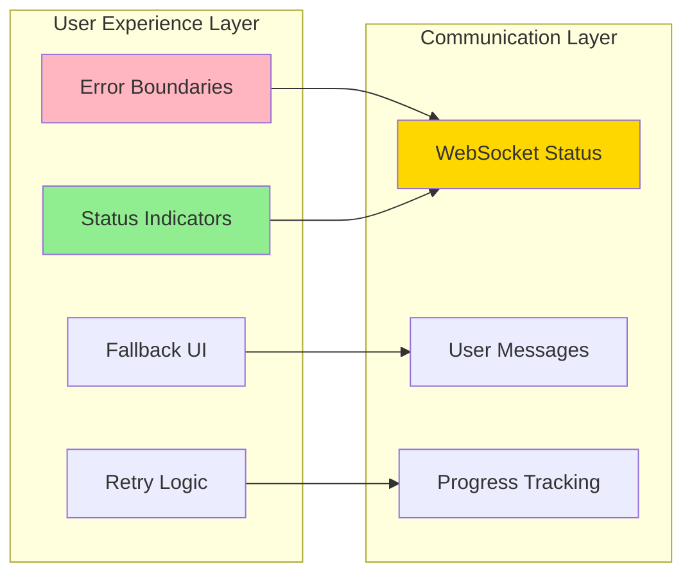
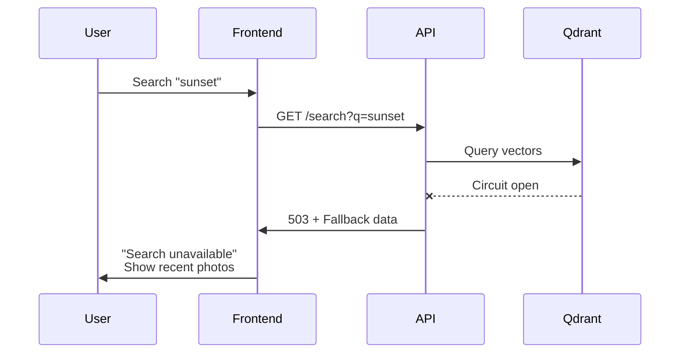
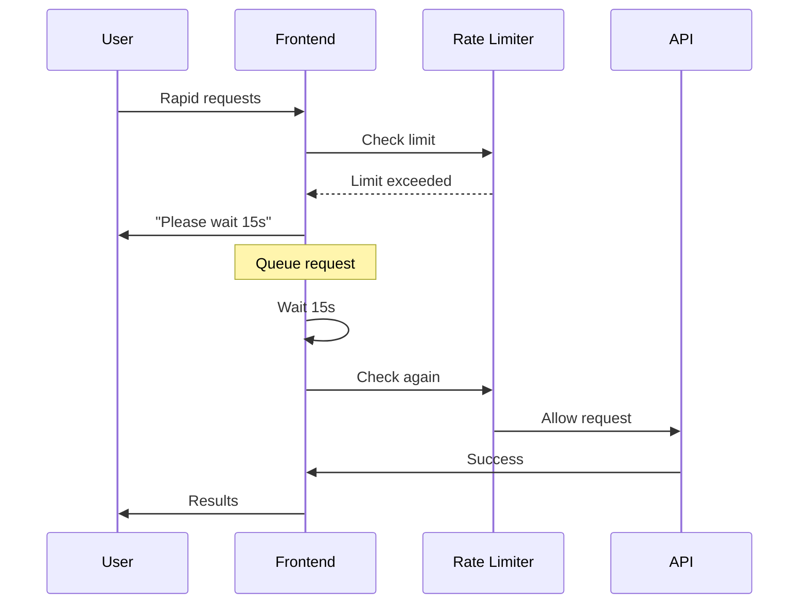

# Phase 3: Frontend Integration - Executive Summary

## Overview
Phase 3 creates a resilient user experience by implementing frontend error handling, real-time status indicators, and graceful degradation when backend services are unavailable.

**Duration**: 24-30 hours | **Priority**: High | **Dependencies**: Phase 1 & 2 complete

## Core Components



## Key Features

### 1. Graceful Degradation 🛡️
When backend services fail, the application remains usable:
- **Qdrant down** → Browse photos without search
- **Upload processing delayed** → Queue uploads for later
- **Face detection offline** → Skip and retry later
- **Database issues** → Use cached data

### 2. Rate Limiting 🚦
Protect the API from overload:
- Token bucket algorithm with Redis
- Per-endpoint configurable limits
- User-friendly rate limit messages
- Request queuing for premium features

### 3. Real-time Status 📊
WebSocket-based status updates:
- Upload progress with stages
- Sync status for connectors
- Service health indicators
- Operation queue visualization

### 4. Smart Error Handling 🔄
Intelligent error recovery:
- Automatic retry with exponential backoff
- Circuit breaker integration
- Error categorization and appropriate responses
- User-friendly error messages

## Implementation Tasks

| Task | Description | Hours | Priority |
|------|-------------|-------|----------|
| **T1** | API Rate Limiting with Redis | 8-10h | Critical |
| **T2** | Frontend Error Handling System | 8-10h | Critical |
| **T3** | WebSocket Status System | 8-10h | High |
| **T4** | Fallback Messaging | 6-8h | High |
| **T5** | Integration Testing | 2-4h | Critical |

## User Impact

### Before Phase 3 ❌
- Cryptic error messages
- No visibility into operations
- Complete feature loss on service failure
- No protection against overload

### After Phase 3 ✅
- Clear, actionable error messages
- Real-time progress tracking
- Graceful degradation
- Protected, stable API

## Technical Highlights

### New API Endpoints
- `GET /api/v1/status` - System health check
- `GET /api/v1/rate-limits` - Current rate limit status
- `GET /api/v1/operations/{id}/status` - Operation tracking

### Frontend Components
- `ServiceStatusIndicator` - Service health display
- `UploadProgress` - Multi-stage upload tracking
- `RateLimitWarning` - Rate limit feedback
- `GlobalErrorBoundary` - Application-wide error handling

### State Management (Svelte 5)
```typescript
// Modern reactive stores with runes
class StatusStore {
    services = $state<ServiceStatuses>({});
    operations = $state<Map<string, Operation>>(new Map());

    get systemHealth() {
        return $derived(calculateHealth(this.services));
    }
}
```

## Success Metrics

### Performance
- API p95 response time < 200ms under load
- WebSocket reconnection < 5 seconds
- Error recovery < 1 second

### Reliability
- Zero data loss during failures
- 80% retry success rate
- 60% functionality in degraded mode

### User Experience
- 100% errors have friendly messages
- All async operations show progress
- Clear service status indicators

## Example Scenarios

### Scenario 1: Search Outage


### Scenario 2: Rate Limiting


## Rollout Strategy

### Week 1: Foundation
- Deploy rate limiting
- Monitor and tune limits

### Week 2: Error Handling
- Deploy error boundaries
- Add retry logic

### Week 3: Status System
- Deploy WebSocket infrastructure
- Add status indicators

### Week 4: Complete Integration
- Enable all fallback scenarios
- Full production deployment

## Risk Mitigation

| Risk | Impact | Mitigation |
|------|--------|------------|
| WebSocket instability | Status updates fail | Fallback to polling |
| Rate limits too strict | User frustration | Dynamic adjustment |
| Error messages confusing | Poor UX | A/B testing messages |
| Retry storms | System overload | Exponential backoff + jitter |

## Next Steps

1. **Review specification** with team
2. **Set up WebSocket infrastructure** in development
3. **Begin T1** (Rate Limiting) implementation
4. **Create UI mockups** for status indicators
5. **Plan load testing** scenarios

---

## Quick Reference

### Commands
```bash
# Start Phase 3 implementation
cd frontend && npm run dev
cd backend && uvicorn app.main:app --reload

# Run Phase 3 tests
pytest tests/api/test_rate_limiting.py
npm run test:components

# Monitor WebSocket connections
wscat -c ws://localhost:8000/ws/status
```

### Key Files
- Spec: `spec/current/PHASE3_API_FRONTEND_INTEGRATION.md`
- Rate Limits: `backend/app/middleware/rate_limiter.py`
- Status Store: `frontend/src/lib/features/status/stores/status.svelte.ts`
- Error Boundary: `frontend/src/lib/shared/components/ErrorBoundary.svelte`

### Documentation
- [Full Specification](./PHASE3_API_FRONTEND_INTEGRATION.md)
- [Phase 2 Completion](./PHASE2_COMPLETION_REPORT.md)
- [Overall Improvement Plan](./IMPROVEMENT_PLAN.md)

---

**Ready to implement?** Start with T1 (API Rate Limiting) for immediate API protection! 🚀