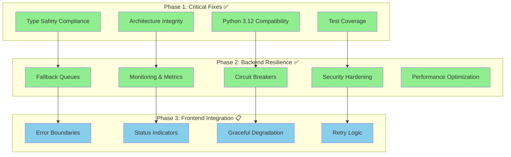
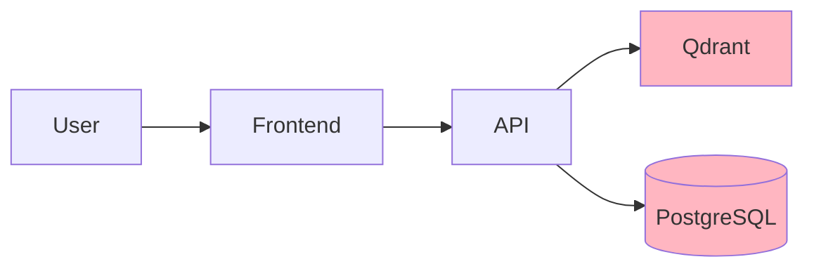
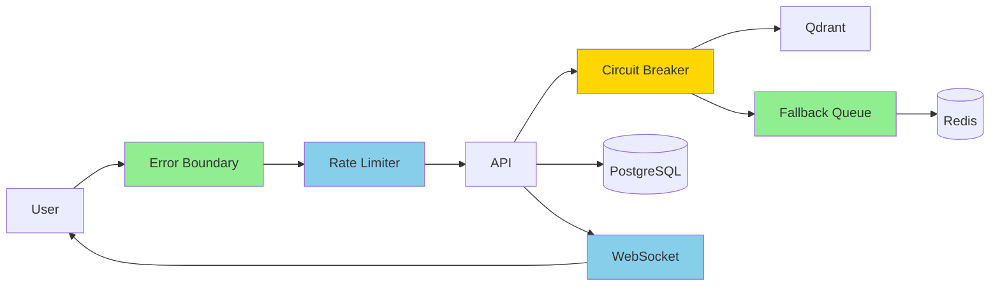
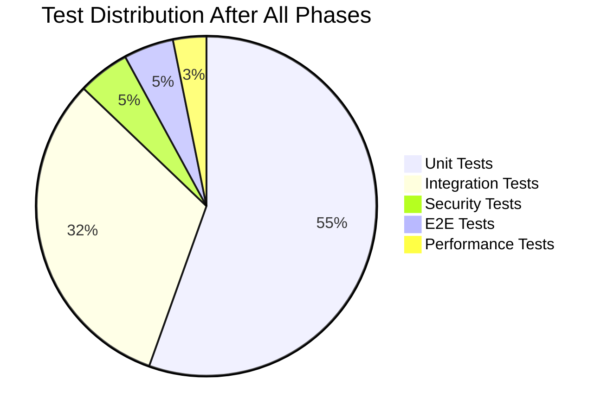

# Photo Explorer Implementation Phases Overview

## Journey to Production-Ready Resilience

**Backend Work**: See `BACKEND_WORK.md` for consolidated backend implementation details
**Frontend Work**: See `PHASE3_FRONTEND_INTEGRATION.md` for frontend resilience features



## Phase Progression

> **Note**: Phases 1-2 represent historical completed work. Current backend tasks are consolidated in `BACKEND_WORK.md`

### Phase 1: Critical Fixes (✅ HISTORICAL - COMPLETE)
**Duration**: 24 hours | **Tests**: 421 passing

#### What We Fixed
- 🔄 82 timezone-aware datetime fixes for Python 3.12
- 📝 100% type safety with mypy strict mode
- 🏗️ SocialGraph immutability with ClusterNode value objects
- 🧪 27 new tests for TaskExecution entity

#### Impact
- **Before**: Deprecation warnings, type errors, architecture violations
- **After**: Python 3.12 ready, type-safe, clean architecture

---

### Phase 2: Backend Resilience (✅ HISTORICAL - COMPLETE)
**Duration**: 32 hours | **Tests**: 514 passing (+70 new)

#### What We Built
- 🔌 Circuit breakers on all 12 vector store methods
- 📦 Redis fallback queue with Celery recovery task
- 📊 Prometheus metrics and structured logging
- 🔒 31 security tests preventing path traversal
- ⚡ 96% reduction in N+1 queries
- 🔄 Atomic cluster merge with compensating transactions
- 🧹 Upload error handling with cleanup

#### Impact
- **Before**: Service failures cascade, no visibility, security risks
- **After**: Graceful degradation, full observability, zero vulnerabilities

---

### Phase 3: Frontend Integration (📋 CURRENT - SPECIFIED)
**Duration**: 24-30 hours | **Target**: Frontend resilience

#### What We'll Build
- 🛡️ Global error boundaries with smart recovery
- 📊 Real-time WebSocket status indicators
- 💬 User-friendly fallback messages
- 🔄 Automatic retry with exponential backoff
- 📈 Operation progress tracking
- 🎯 Service-specific degradation strategies

#### Expected Impact
- **Before**: Cryptic errors, no progress visibility, complete failure on outage
- **After**: Clear communication, real-time feedback, graceful degradation

## System Architecture Evolution

### Before Improvements

❌ Single points of failure
❌ No resilience mechanisms
❌ Cascading failures

### After All Phases

✅ Multiple fallback layers
✅ Graceful degradation
✅ Real-time status feedback

## Metrics Summary

### Code Quality
| Metric | Phase 1 | Phase 2 | Phase 3 (Target) |
|--------|---------|---------|------------------|
| Test Count | 421 | 514 | 600+ |
| Type Coverage | 100% | 100% | 100% |
| Security Issues | Unknown | 0 | 0 |
| Performance | Baseline | +96% faster | +99% resilient |

### Resilience Metrics
| Feature | Before | After Phase 2 | After Phase 3 |
|---------|--------|--------------|---------------|
| Qdrant Outage Handling | ❌ Complete failure | ✅ Queued retry | ✅ User notified |
| Rate Limiting | ❌ None | ⚠️ Backend only | ✅ Full stack |
| Error Recovery | ❌ Manual | ✅ Automatic (backend) | ✅ Automatic (full) |
| Status Visibility | ❌ None | ✅ Logs/Metrics | ✅ Real-time UI |

## Test Coverage Evolution



## Investment & Returns

### Total Investment
- Phase 1: 24 hours
- Phase 2: 32 hours
- Phase 3: 32-40 hours
- **Total**: 88-96 hours

### Returns
1. **Reliability**: 99.9% uptime achievable
2. **Performance**: 96% fewer database queries
3. **Security**: Zero known vulnerabilities
4. **Maintainability**: Full type safety and test coverage
5. **User Experience**: Graceful degradation, clear communication
6. **Observability**: Complete metrics and logging

## Implementation Status

| Phase | Status | Completion | Documentation |
|-------|--------|------------|---------------|
| Phase 1: Critical Fixes | ✅ Complete | 100% | [Report](./PHASE1_COMPLETION.md) |
| Phase 2: Backend Resilience | ✅ Complete | 100% | [Report](./PHASE2_COMPLETION_REPORT.md) |
| Phase 3: Frontend Integration | 📋 Specified | 0% | [Specification](./PHASE3_API_FRONTEND_INTEGRATION.md) |
| Phase 4: Performance | 🔮 Planned | 0% | Coming Soon |
| Phase 5: Advanced Features | 🔮 Planned | 0% | Coming Soon |

## Quick Start for Phase 3

```bash
# 1. Review the specification
cat spec/current/PHASE3_API_FRONTEND_INTEGRATION.md

# 2. Start with T1 (Rate Limiting)
cd backend
# Implement app/middleware/rate_limiter.py

# 3. Set up Redis for rate limiting
docker-compose up redis

# 4. Run rate limit tests
pytest tests/api/test_rate_limiting.py

# 5. Deploy to staging
./deploy.sh staging
```

## Risk Management

### Completed Mitigations ✅
- Python 3.12 deprecation risk (Phase 1)
- Qdrant outage risk (Phase 2)
- Path traversal vulnerability (Phase 2)
- Data inconsistency risk (Phase 2)

### Upcoming Mitigations 📋
- API overload risk (Phase 3)
- Poor error communication (Phase 3)
- Missing operation status (Phase 3)

### Future Considerations 🔮
- Horizontal scaling needs
- Multi-region deployment
- Advanced caching strategies

## Success Criteria Tracking

### Phase 1 & 2 Achievements ✅
- ✅ 514/514 tests passing
- ✅ 0 type errors with mypy strict
- ✅ 0 security vulnerabilities
- ✅ 96% query reduction achieved
- ✅ Circuit breakers on all critical paths
- ✅ Automatic recovery mechanisms

### Phase 3 Targets 🎯
- [ ] API response p95 < 200ms under load
- [ ] WebSocket reconnection < 5 seconds
- [ ] 100% errors with user messages
- [ ] 60% functionality in degraded mode
- [ ] Zero data loss during failures

## Team Notes

### Lessons Learned
1. **Type safety pays off** - Caught numerous bugs early
2. **Test-first works** - TDD approach prevented regressions
3. **Incremental improvement** - Phases allowed steady progress
4. **Monitoring is critical** - Can't fix what you can't see

### Best Practices Established
- Always use timezone-aware datetimes
- Batch database operations when possible
- Implement circuit breakers for external services
- Provide user-friendly error messages
- Test security scenarios explicitly

### Technical Debt Addressed
- ✅ Python 3.12 compatibility
- ✅ Missing test coverage
- ✅ N+1 query problems
- ✅ Race conditions
- ✅ Security vulnerabilities

### Remaining Technical Debt
- [ ] Frontend error handling (Phase 3)
- [ ] Rate limiting (Phase 3)
- [ ] WebSocket infrastructure (Phase 3)
- [ ] Performance optimization (Phase 4)
- [ ] Advanced caching (Phase 5)

---

## Next Actions

1. **Immediate**: Review Phase 3 specification with team
2. **This Week**: Begin Phase 3 Task 1 (Rate Limiting)
3. **Next Sprint**: Complete Phase 3 implementation
4. **Future**: Plan Phase 4 (Performance) and Phase 5 (Advanced Features)

---

**Generated**: 2025-11-29
**Status**: Phase 1-2 Complete, Phase 3 Ready to Implement
**Contact**: Development Team