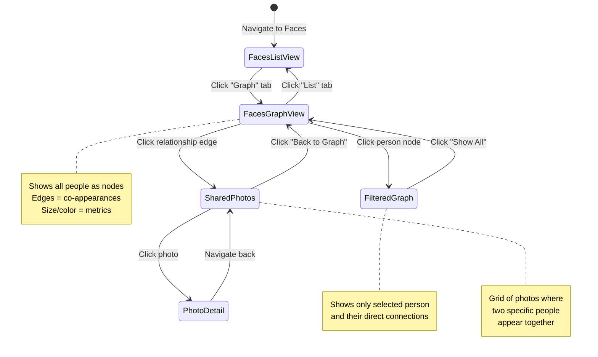
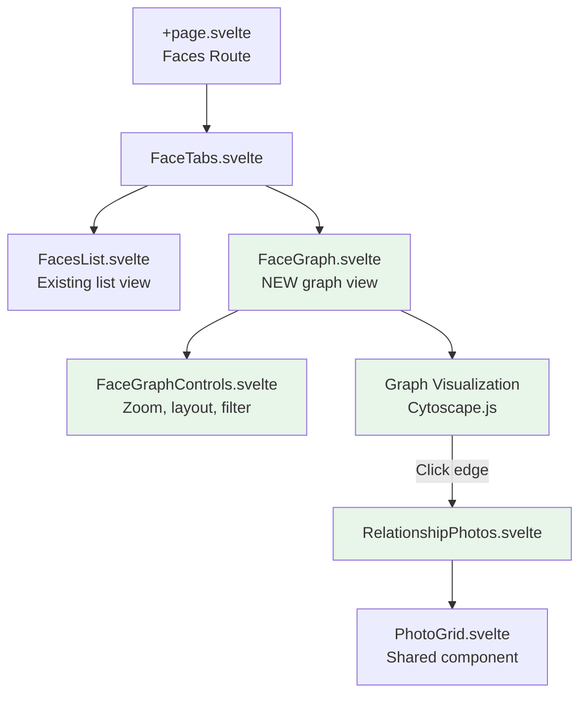

# Face Social Graph - Feature Specification

## Overview

Add a social network graph visualization to the Faces view that shows relationships between people based on photo co-appearances. This provides an intuitive way to explore social connections captured in the photo collection.

## Problem Statement

Currently, users can:
- View faces in a list/grid
- See which photos contain a specific person
- Tag and name people

However, users **cannot**:
- Visualize social connections between people
- Quickly find photos of specific people together
- Discover social patterns (who appears with whom most often)
- Navigate relationships in an intuitive graph interface

## User Stories

### Primary Stories

**US-1**: As a user, I want to see a graph visualization of people in my photos, so that I can understand social relationships in my collection.

**US-2**: As a user, I want to click on a person in the graph to filter and see only their social network, so that I can focus on a specific person's connections.

**US-3**: As a user, I want to click on a connection between two people to view all photos where they appear together, so that I can quickly find photos of specific pairs.

**US-4**: As a user, I want to switch between list view and graph view in the Faces section, so that I can choose the most appropriate visualization for my current task.

### Secondary Stories

**US-5**: As a user, I want to see the strength of relationships (number of shared photos) visualized in the graph, so that I can identify closest connections.

**US-6**: As a user, I want isolated people (with no co-appearances) to still appear in the graph, so that I have a complete view of all detected faces.

## User Experience Flow



## UI Components

### Tabbed Navigation

```
┌─────────────────────────────────────────────┐
│  Faces                                       │
├─────────────────────────────────────────────┤
│  [List View] [Graph View*]                   │
├─────────────────────────────────────────────┤
│                                              │
│  [Graph visualization or list grid here]    │
│                                              │
└─────────────────────────────────────────────┘
```

### Graph View Elements

**Nodes**:
- Represent individual people (FaceClusters)
- Size: Proportional to number of photos they appear in
- Label: Person's name (or "Unknown Person #N")
- Avatar: Sample face thumbnail from cluster

**Edges**:
- Represent co-appearances in photos
- Thickness: Proportional to number of shared photos
- Label (on hover): "X photos together"
- Clickable: Navigate to shared photos

**Controls**:
- "Show All" button (when filtered)
- Search/filter input for finding specific person
- Zoom controls
- Layout algorithm selector (force-directed, hierarchical, circular)

## Technical Architecture

### Database: PostgreSQL (Recommended)

**Decision**: Keep PostgreSQL, do NOT migrate to Neo4j.

**Rationale**:
- PostgreSQL can handle graph queries efficiently via recursive CTEs
- Relationships are implicit (derived from photo co-appearances)
- Adding Neo4j increases infrastructure complexity
- Our graph size is manageable (hundreds of people, not millions)
- Can always migrate later if performance becomes an issue

**Query Strategy**:
```sql
-- Get all relationships (co-appearances)
WITH face_pairs AS (
    SELECT
        f1.cluster_id as person_a,
        f2.cluster_id as person_b,
        f1.photo_id,
        COUNT(*) OVER (PARTITION BY f1.cluster_id, f2.cluster_id) as shared_photos
    FROM faces f1
    JOIN faces f2 ON f1.photo_id = f2.photo_id
        AND f1.cluster_id < f2.cluster_id
    WHERE f1.cluster_id IS NOT NULL
        AND f2.cluster_id IS NOT NULL
)
SELECT DISTINCT ON (person_a, person_b)
    person_a,
    person_b,
    shared_photos
FROM face_pairs
ORDER BY person_a, person_b, shared_photos DESC;
```

### Domain Model

#### New Value Objects

```python
# app/domain/value_objects/face_relationship.py

@dataclass(frozen=True)
class FaceRelationship:
    """Represents a relationship between two people based on co-appearances."""

    person_a_id: UUID
    person_b_id: UUID
    shared_photo_count: int
    sample_photo_ids: list[UUID]  # First 3-5 photos for preview

    def __post_init__(self) -> None:
        if self.person_a_id == self.person_b_id:
            raise ValueError("Cannot create relationship with self")
        if self.shared_photo_count <= 0:
            raise ValueError("Relationship must have at least one shared photo")

@dataclass(frozen=True)
class SocialGraph:
    """Complete social graph structure."""

    nodes: list[FaceCluster]  # All people
    edges: list[FaceRelationship]  # All relationships

    def filter_by_person(self, person_id: UUID) -> 'SocialGraph':
        """Return subgraph containing only direct connections to person."""
        relevant_edges = [
            edge for edge in self.edges
            if edge.person_a_id == person_id or edge.person_b_id == person_id
        ]

        connected_person_ids = set()
        for edge in relevant_edges:
            connected_person_ids.add(edge.person_a_id)
            connected_person_ids.add(edge.person_b_id)

        filtered_nodes = [
            node for node in self.nodes
            if node.id in connected_person_ids
        ]

        return SocialGraph(nodes=filtered_nodes, edges=relevant_edges)
```

#### Domain Service

```python
# app/domain/services/social_graph_service.py

class SocialGraphService:
    """Domain service for building and manipulating social graphs."""

    def build_graph_from_photos(
        self,
        photos: list[Photo]
    ) -> SocialGraph:
        """Build complete social graph from photo collection."""
        # Group faces by cluster_id
        # Find all co-appearances
        # Build relationships
        pass

    def find_mutual_photos(
        self,
        photos: list[Photo],
        person_a_id: UUID,
        person_b_id: UUID
    ) -> list[Photo]:
        """Find all photos where two specific people appear together."""
        pass
```

### Application Layer

#### New Ports

```python
# app/application/ports/outbound/face_repository.py (extend existing)

class FaceRepository(ABC):
    # ... existing methods ...

    @abstractmethod
    async def get_co_appearances(
        self,
        cluster_id: UUID | None = None
    ) -> list[tuple[UUID, UUID, int]]:
        """
        Get all face co-appearances.

        Returns list of (person_a_id, person_b_id, shared_photo_count).
        If cluster_id provided, only return relationships for that person.
        """
        pass

    @abstractmethod
    async def get_shared_photos(
        self,
        person_a_id: UUID,
        person_b_id: UUID
    ) -> list[UUID]:
        """Get IDs of all photos where two people appear together."""
        pass
```

#### New Use Cases

```python
# app/application/services/face_service.py (extend existing)

class FaceService:
    # ... existing methods ...

    async def get_social_graph(
        self,
        filtered_by_person_id: UUID | None = None
    ) -> SocialGraph:
        """
        Get social graph of face relationships.

        If filtered_by_person_id is provided, return only that person's
        immediate network.
        """
        # Get co-appearances from repository
        # Get all relevant clusters
        # Build SocialGraph domain object
        # Optionally filter
        pass

    async def get_relationship_photos(
        self,
        person_a_id: UUID,
        person_b_id: UUID,
        limit: int = 50,
        offset: int = 0
    ) -> tuple[list[Photo], int]:
        """
        Get photos where two specific people appear together.

        Returns (photos, total_count) for pagination.
        """
        pass
```

### API Specification

#### Endpoints

**GET /api/v1/faces/graph**

Get the social graph structure.

Query Parameters:
- `person_id` (optional, UUID): Filter to specific person's network
- `min_shared_photos` (optional, int, default=1): Minimum co-appearances to include edge

Response:
```json
{
  "nodes": [
    {
      "id": "uuid",
      "name": "John Doe",
      "photo_count": 45,
      "sample_face_url": "/api/v1/faces/{face_id}/thumbnail"
    }
  ],
  "edges": [
    {
      "person_a_id": "uuid",
      "person_b_id": "uuid",
      "shared_photo_count": 12,
      "sample_photo_ids": ["uuid1", "uuid2", "uuid3"]
    }
  ]
}
```

**GET /api/v1/faces/relationships/{person_a_id}/{person_b_id}/photos**

Get photos where two people appear together.

Query Parameters:
- `limit` (optional, int, default=50): Page size
- `offset` (optional, int, default=0): Pagination offset

Response:
```json
{
  "photos": [
    {
      "id": "uuid",
      "filename": "beach.jpg",
      "thumbnail_url": "/api/v1/photos/{id}/thumbnail",
      "taken_at": "2024-07-15T14:30:00Z"
    }
  ],
  "total": 12,
  "person_a": {
    "id": "uuid",
    "name": "John Doe"
  },
  "person_b": {
    "id": "uuid",
    "name": "Jane Smith"
  }
}
```

### Frontend Architecture

#### Feature Structure

```
src/lib/features/faces/
├── components/
│   ├── FacesList.svelte           # Existing list view
│   ├── FaceGraph.svelte           # NEW: Graph visualization
│   ├── FaceGraphControls.svelte   # NEW: Zoom, filter controls
│   ├── RelationshipPhotos.svelte  # NEW: Shared photos grid
│   └── FaceTabs.svelte            # NEW: Tab navigation
├── stores/
│   ├── faces.svelte.ts            # Existing store
│   └── face-graph.svelte.ts       # NEW: Graph state management
├── utils/
│   └── graph-layout.ts            # NEW: Graph layout algorithms
└── types.ts
```

#### Graph Visualization Library

**Recommended**: [Cytoscape.js](https://js.cytoscape.org/)

**Rationale**:
- Excellent performance for moderate-sized graphs
- Rich interaction capabilities (click, hover, drag)
- Multiple layout algorithms built-in
- Good TypeScript support
- Active maintenance

**Alternatives Considered**:
- D3.js: More flexible but requires more custom code
- vis.js: Good but less actively maintained
- Sigma.js: Better for very large graphs (overkill for our use case)

#### New Stores

```typescript
// src/lib/features/faces/stores/face-graph.svelte.ts

interface GraphNode {
  id: string;
  name: string;
  photoCount: number;
  sampleFaceUrl: string;
}

interface GraphEdge {
  personAId: string;
  personBId: string;
  sharedPhotoCount: number;
  samplePhotoIds: string[];
}

interface SocialGraphState {
  nodes: GraphNode[];
  edges: GraphEdge[];
  filteredPersonId: string | null;
  loading: boolean;
  error: string | null;
}

class FaceGraphStore {
  // State
  graph = $state<SocialGraphState>({
    nodes: [],
    edges: [],
    filteredPersonId: null,
    loading: false,
    error: null
  });

  // Actions
  async loadGraph(filteredPersonId?: string): Promise<void> {
    this.graph.loading = true;
    try {
      const params = filteredPersonId
        ? { person_id: filteredPersonId }
        : {};
      const response = await client.get('/faces/graph', { params });
      this.graph.nodes = response.data.nodes;
      this.graph.edges = response.data.edges;
      this.graph.filteredPersonId = filteredPersonId ?? null;
    } catch (error) {
      this.graph.error = 'Failed to load social graph';
    } finally {
      this.graph.loading = false;
    }
  }

  filterByPerson(personId: string): void {
    this.loadGraph(personId);
  }

  clearFilter(): void {
    this.loadGraph();
  }
}

export const faceGraphStore = new FaceGraphStore();
```

#### Component Hierarchy



## Test Scenarios

### BDD Scenarios (Gherkin)

```gherkin
# features/face_social_graph.feature

Feature: Face Social Graph
  As a user
  I want to visualize social relationships between people in my photos
  So that I can understand social connections in my collection

  Background:
    Given the following people exist in my photo collection:
      | name        | photo_count |
      | Alice       | 20          |
      | Bob         | 15          |
      | Charlie     | 10          |
      | David       | 5           |
    And the following relationships exist:
      | person_a | person_b | shared_photos |
      | Alice    | Bob      | 8             |
      | Alice    | Charlie  | 5             |
      | Bob      | Charlie  | 3             |
      | David    | Alice    | 0             |

  Scenario: View complete social graph
    When I navigate to the Faces page
    And I click on the "Graph" tab
    Then I should see a graph with 4 nodes
    And I should see 3 relationship edges
    And David should appear as an isolated node

  Scenario: Filter graph by person
    Given I am viewing the face graph
    When I click on the node for "Alice"
    Then the graph should filter to show only Alice's network
    And I should see nodes for: Alice, Bob, Charlie
    And I should NOT see node for: David
    And I should see edges: Alice-Bob, Alice-Charlie
    And I should see a "Show All" button

  Scenario: View relationship edge details
    Given I am viewing the face graph
    When I hover over the edge between Alice and Bob
    Then I should see "8 photos together"

  Scenario: Navigate to shared photos
    Given I am viewing the face graph
    When I click on the edge between Alice and Bob
    Then I should navigate to a page showing photos of Alice and Bob together
    And I should see 8 photos in the grid
    And each photo should contain both Alice and Bob

  Scenario: Return to graph from shared photos
    Given I am viewing shared photos of Alice and Bob
    When I click "Back to Graph"
    Then I should return to the face graph view
    And the previous filter state should be restored

  Scenario: Handle large graph performance
    Given I have 100 people in my photo collection
    And there are 500 relationships
    When I load the face graph
    Then the graph should render within 2 seconds
    And interactions should remain smooth (60 fps)

  Scenario: Switch between list and graph views
    Given I am viewing the Faces page in list view
    When I click the "Graph" tab
    Then I should see the graph visualization
    When I click the "List" tab
    Then I should see the traditional list/grid view
```

### E2E Tests (Playwright)

```typescript
// frontend/tests/e2e/face-graph.spec.ts

test.describe('Face Social Graph', () => {
  test.beforeEach(async ({ page }) => {
    await page.goto('/faces');
  });

  test('displays graph tab and switches views', async ({ page }) => {
    // Should have tab navigation
    await expect(page.getByRole('tab', { name: /Graph/i })).toBeVisible();
    await expect(page.getByRole('tab', { name: /List/i })).toBeVisible();

    // Click graph tab
    await page.getByRole('tab', { name: /Graph/i }).click();

    // Should show graph visualization
    await expect(page.getByTestId('face-graph')).toBeVisible();

    // Should have graph controls
    await expect(page.getByTestId('graph-controls')).toBeVisible();
  });

  test('loads and displays social graph', async ({ page }) => {
    await page.getByRole('tab', { name: /Graph/i }).click();

    // Wait for graph to load
    await page.waitForLoadState('networkidle');

    // Should show nodes
    const nodes = page.locator('[data-testid^="graph-node-"]');
    expect(await nodes.count()).toBeGreaterThan(0);

    // Should show edges if relationships exist
    const hasEdges = await page.locator('[data-testid^="graph-edge-"]').count() > 0;
    const hasNoRelationships = await page
      .getByText(/No relationships found/i)
      .isVisible()
      .catch(() => false);

    expect(hasEdges || hasNoRelationships).toBe(true);
  });

  test('filters graph by clicking person node', async ({ page }) => {
    await page.getByRole('tab', { name: /Graph/i }).click();
    await page.waitForLoadState('networkidle');

    // Click first person node
    const firstNode = page.locator('[data-testid^="graph-node-"]').first();
    await firstNode.click();

    // Should show filtered graph
    await expect(page.getByText(/Showing network for/i)).toBeVisible();
    await expect(page.getByRole('button', { name: /Show All/i })).toBeVisible();
  });

  test('navigates to shared photos when clicking edge', async ({ page }) => {
    await page.getByRole('tab', { name: /Graph/i }).click();
    await page.waitForLoadState('networkidle');

    // Check if any edges exist
    const edges = page.locator('[data-testid^="graph-edge-"]');
    const edgeCount = await edges.count();

    if (edgeCount > 0) {
      await edges.first().click();

      // Should navigate to relationship photos page
      await expect(page).toHaveURL(/\/faces\/relationships\/[a-f0-9-]+\/[a-f0-9-]+/);

      // Should show shared photos
      await expect(page.getByTestId('relationship-photos')).toBeVisible();
      await expect(page.getByRole('heading', { name: /Photos together/i })).toBeVisible();
    } else {
      test.skip();
    }
  });

  test('handles graph with no relationships gracefully', async ({ page }) => {
    // This test would need mocked data or specific test data
    await page.getByRole('tab', { name: /Graph/i }).click();
    await page.waitForLoadState('networkidle');

    // Should either show graph OR empty state
    const hasGraph = await page.getByTestId('face-graph').isVisible();
    const hasEmptyState = await page
      .getByText(/No relationships detected/i)
      .isVisible()
      .catch(() => false);

    expect(hasGraph || hasEmptyState).toBe(true);
  });
});
```

### Integration Tests

```python
# backend/tests/integration/api/test_face_graph.py

class TestFaceGraphAPI:
    async def test_get_social_graph_success(
        self,
        client: AsyncClient,
        sample_photos_with_faces: list[Photo]
    ) -> None:
        """Test retrieving the complete social graph."""
        response = await client.get("/api/v1/faces/graph")

        assert response.status_code == 200
        data = response.json()

        assert "nodes" in data
        assert "edges" in data
        assert isinstance(data["nodes"], list)
        assert isinstance(data["edges"], list)

        # Each node should have required fields
        for node in data["nodes"]:
            assert "id" in node
            assert "name" in node
            assert "photo_count" in node
            assert node["photo_count"] > 0

    async def test_get_filtered_graph_by_person(
        self,
        client: AsyncClient,
        sample_person_id: UUID
    ) -> None:
        """Test filtering graph to specific person's network."""
        response = await client.get(
            f"/api/v1/faces/graph?person_id={sample_person_id}"
        )

        assert response.status_code == 200
        data = response.json()

        # All edges should involve the filtered person
        for edge in data["edges"]:
            assert (
                edge["person_a_id"] == str(sample_person_id) or
                edge["person_b_id"] == str(sample_person_id)
            )

    async def test_get_relationship_photos(
        self,
        client: AsyncClient,
        person_a_id: UUID,
        person_b_id: UUID
    ) -> None:
        """Test getting photos where two people appear together."""
        response = await client.get(
            f"/api/v1/faces/relationships/{person_a_id}/{person_b_id}/photos"
        )

        assert response.status_code == 200
        data = response.json()

        assert "photos" in data
        assert "total" in data
        assert "person_a" in data
        assert "person_b" in data

        # Verify each photo contains both people
        # (Would need to query faces for each photo to verify)
```

## Implementation Phases

### Phase 1: Backend Foundation (Week 1)
- [ ] Add `get_co_appearances()` to FaceRepository
- [ ] Add `get_shared_photos()` to FaceRepository
- [ ] Implement PostgreSQL queries with CTEs
- [ ] Create domain value objects: `FaceRelationship`, `SocialGraph`
- [ ] Create domain service: `SocialGraphService`
- [ ] Write unit tests for domain logic
- [ ] Write integration tests for repository methods

### Phase 2: API Layer (Week 1-2)
- [ ] Create `GET /api/v1/faces/graph` endpoint
- [ ] Create `GET /api/v1/faces/relationships/{a}/{b}/photos` endpoint
- [ ] Add Pydantic schemas for requests/responses
- [ ] Write integration tests for API endpoints
- [ ] Test with real data (performance benchmarks)

### Phase 3: Frontend - Graph Visualization (Week 2-3)
- [ ] Install Cytoscape.js dependency
- [ ] Create `FaceGraphStore` with state management
- [ ] Create `FaceGraph.svelte` component
- [ ] Implement graph layout and rendering
- [ ] Add node click → filter functionality
- [ ] Add zoom/pan controls
- [ ] Write component unit tests

### Phase 4: Frontend - Navigation & Integration (Week 3)
- [ ] Add tabbed navigation to Faces page
- [ ] Create `RelationshipPhotos.svelte` component
- [ ] Implement edge click → shared photos navigation
- [ ] Add "Back to Graph" navigation
- [ ] Integrate with existing PhotoGrid component
- [ ] Write E2E tests (Playwright)

### Phase 5: Polish & Performance (Week 4)
- [ ] Optimize graph queries for large datasets
- [ ] Add loading states and error handling
- [ ] Implement graph search/filter
- [ ] Add layout algorithm selector
- [ ] Test with large datasets (100+ people)
- [ ] Accessibility audit (keyboard navigation, ARIA labels)
- [ ] Mobile responsive design
- [ ] Documentation updates

## Performance Considerations

### Backend Optimizations

**Query Performance**:
- Add composite index: `CREATE INDEX idx_faces_cluster_photo ON faces(cluster_id, photo_id)`
- Cache co-appearance results (Redis) - invalidate on new face detections
- Pagination for relationship photos (default limit: 50)

**Expected Query Times** (with 1000 photos, 100 people):
- Full graph query: < 200ms
- Filtered graph query: < 100ms
- Relationship photos: < 50ms

### Frontend Optimizations

**Graph Rendering**:
- Use Cytoscape.js with canvas renderer (better performance than SVG)
- Lazy load graph: render nodes first, then edges
- Debounce layout recalculation (300ms)
- Limit initial graph size (show top N most-connected people)

**Memory Management**:
- Destroy Cytoscape instance when switching to list view
- Use thumbnail URLs (not full-size images)
- Paginate relationship photos

## Accessibility

- **Keyboard Navigation**: Tab through nodes/edges, Enter to select
- **ARIA Labels**: Each node has `aria-label="Person: {name}, {photoCount} photos"`
- **Screen Reader**: Provide text description of graph structure
- **Focus Management**: Clear focus indicators on nodes/edges
- **Alternative View**: Ensure list view remains accessible alternative

## Security Considerations

- **Authorization**: Ensure users can only see graphs for their own photos
- **Rate Limiting**: Limit graph API calls (expensive queries)
- **Input Validation**: Validate UUID parameters in API endpoints
- **SQL Injection**: Use parameterized queries (SQLAlchemy prevents this)

## Migration Strategy

**No Database Migration Required**: Feature uses existing `faces` and `face_clusters` tables.

**Configuration**:
- Add feature flag: `ENABLE_FACE_GRAPH=true` (default: true)
- Add config: `FACE_GRAPH_CACHE_TTL=3600` (1 hour)

## Open Questions

1. **Graph Layout**: Which default layout algorithm? (Force-directed vs hierarchical)
   - **Recommendation**: Force-directed (shows clusters naturally)

2. **Minimum Relationship Threshold**: Should we hide edges with only 1 shared photo?
   - **Recommendation**: No, show all by default, but allow filtering

3. **Unknown Faces**: How to handle faces not assigned to clusters?
   - **Decision**: Show individual "Unknown Person #N" nodes for each unassigned face cluster

4. **Performance Limit**: At what point do we paginate/limit the graph?
   - **Recommendation**: Show top 100 most-connected people, with search to find others

5. **Mobile Experience**: Should graph be available on mobile?
   - **Recommendation**: Yes, but with simplified controls and touch gestures

## Success Metrics

- **Feature Adoption**: % of users who view graph tab (target: >30%)
- **Engagement**: Avg time spent in graph view (target: >2 minutes)
- **Performance**: Graph load time (target: <500ms for typical collection)
- **Usability**: Users successfully navigate to relationship photos (target: >80%)

## Future Enhancements (Not in Scope)

- Social network metrics (centrality, betweenness, communities)
- Timeline view: Graph evolution over time
- Export graph as image
- 3D graph visualization
- Integration with face naming workflow (name people from graph)
- Suggested relationships ("You might know...")

## References

- **Cytoscape.js Documentation**: https://js.cytoscape.org/
- **PostgreSQL Recursive CTEs**: https://www.postgresql.org/docs/current/queries-with.html
- **Graph Visualization Best Practices**: https://arxiv.org/abs/1708.00379
- **Accessibility for Data Viz**: https://www.w3.org/WAI/tutorials/images/complex/

---

**Status**: 📋 Backlog
**Priority**: Medium
**Estimated Effort**: 3-4 weeks
**Dependencies**: Face detection and clustering must be working
